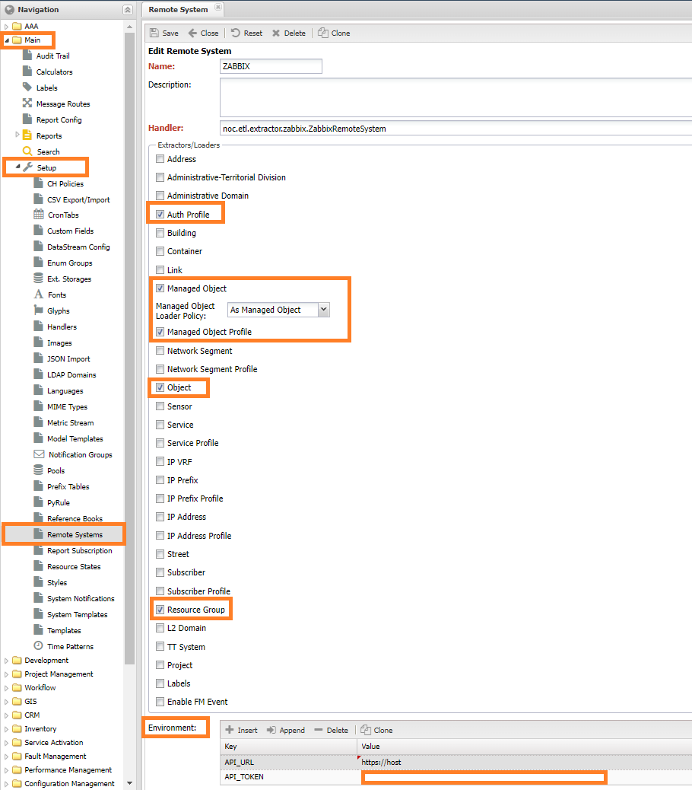

# Connecting Zabbix Remote System as Managed Object Source
 
**Zabbix** is often used as a monitoring system. When collecting data from network equipment,
NOC is frequently integrated, which can lead to situations where the equipment needs to be
entered into two systems, making it quite inconvenient.
In cases where Zabbix is the master system (where equipment is primarily added),
it can be integrated with NOC through an ETL mechanism, adding it as an external
system and synchronizing devices (Managed Object) with it.  

For this scheme, there is an adapter for integration with Zabbix within the NOC, which allows:  
 
* Synchronizing Zabbix Groups with their corresponding Resource Groups in NOC  
* Loading Zabbix Hosts that support SNMP as Managed Objects in NOC  
* If the Host has coordinates filled in, a Point of Presence (PoP) can be created on the map based on it  
* Integrating via the API Key or through a User the following: Managed Object, Object, Resource Group  

In the Environment field, enter the connection details for Zabbix:

* **API_URL** - the name (or IP address) on which Zabbix is installed  
* **API_TOKEN** - the token string for access  
3. We will get a form filled out similarly to the image below  
4. Click the Save button

If everything has gone smoothly, the added entry with the specified name should appear in the list.  

### Configuring Rules

The export creates an **Authentication Profile** (*Auth Profile*) - ZB.AUTO,
which is assigned to the devices. By default, it does not have access credentials assigned.
Therefore, it is necessary to specify them in the 
**Device Management section** (*Service Activation*) -> Settings (Setup) -> Authentication Profile (Auth Profile),
or set up rules for credential matching in `Device Management (Service Activation) -> (Settings) Setup -> Credential Check Rules`.  

For placing export devices, an Administrative Domain is used - holding a geographic address string.
For placing equipment on the map. Used if latitude or longitude are not specified: lan/lot.  

!!! warning  
    The setting **LOCATION_FIELD** is currently not supported.  

## Using the Purgatorium  

By default, devices (Managed Objects) are created from hosts (Host) in Zabbix during the data export process,
but it is possible to use the Purgatorium mechanism to store hosts from Zabbix.
In this case, the results are first registered as discovered addresses (Discovered Objects) and become
available in the Service Activation -> Setup -> Discovered Objects section. Instruction for use (link)  
To send devices to the Purgatorium, it is necessary to change the setting of the Managed Object Loader Policy of the external system to Discovered Object.  

!!! note  
    The functionality of the *Purgatorium* (*Discovered Objects*) is available starting from version *24.1* in experimental mode.  

## Data export  

After adding an external system, it is necessary to initiate the data export procedure. This is done through When transitioning to the adapter out of the box, the following changes will occur during synchronization:
* The Administrative Domain will change to Default
* The Network Segment will change to ALL
* The Point of Presence (PoP) will be removed

To avoid such changes, you can copy the code from the built-in adapter to the current one (from Contrib),
replacing the values of the fields administrative_domain and segment accordingly:

* `administrative_domain` - `zb.root`
* `segment` - `!new`

!!! warning

    If any custom modifications have been made, they must be transferred :)

## Adapter modification
If it is necessary to supplement/change the logic of the adapter or to use your own,
a mechanism for placing system modifications (Custom) is provided for this purpose.
When using it, modifications are placed in a separate folder, allowing the system
to be updated without having to restore your changes after the update. `Instructions for using Custom`
