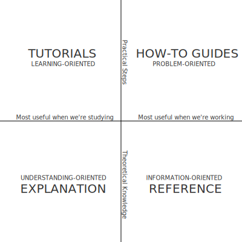

# The NOC Manual

Welcome to the NOC Manual! The NOC is the scalable, high-performance and open-source OSS system for ISP,
service and content providers

## Documentation Structure

Documentation is organized into three sections:

- [User's Guide](user/index.md) - intended for NOC end users.
- [Administrator's Guide](admin/index.md) - intended for NOC administrators. 
- [Developer's Guide](dev/index.md) - intended for developers who wish
  to extend NOC's functionality.
  
Each section is split into four parts:

- Tutorials: Brief introduction for new users.
- How-to guides: Step-by-step guides covering common problems.
- Reference: Technical reference.
- Explanation: Clarification and discussion of key topics.

## Community

Getting involved in the NOC community is a great way to build relationships 
with other talented and like minded engineers, increase awareness
for the interesting work that you are doing, and sharpen your skills.
Join [Telegram channel](https://t.me/nocproject)
and project’s [Gitlab](https://code.getnoc.com/noc/noc/) tracker.

## License
This Manual is licensed under a [Creative Commons Attribution-NonCommercial-ShareAlike 4.0 International License](doc-license.md).