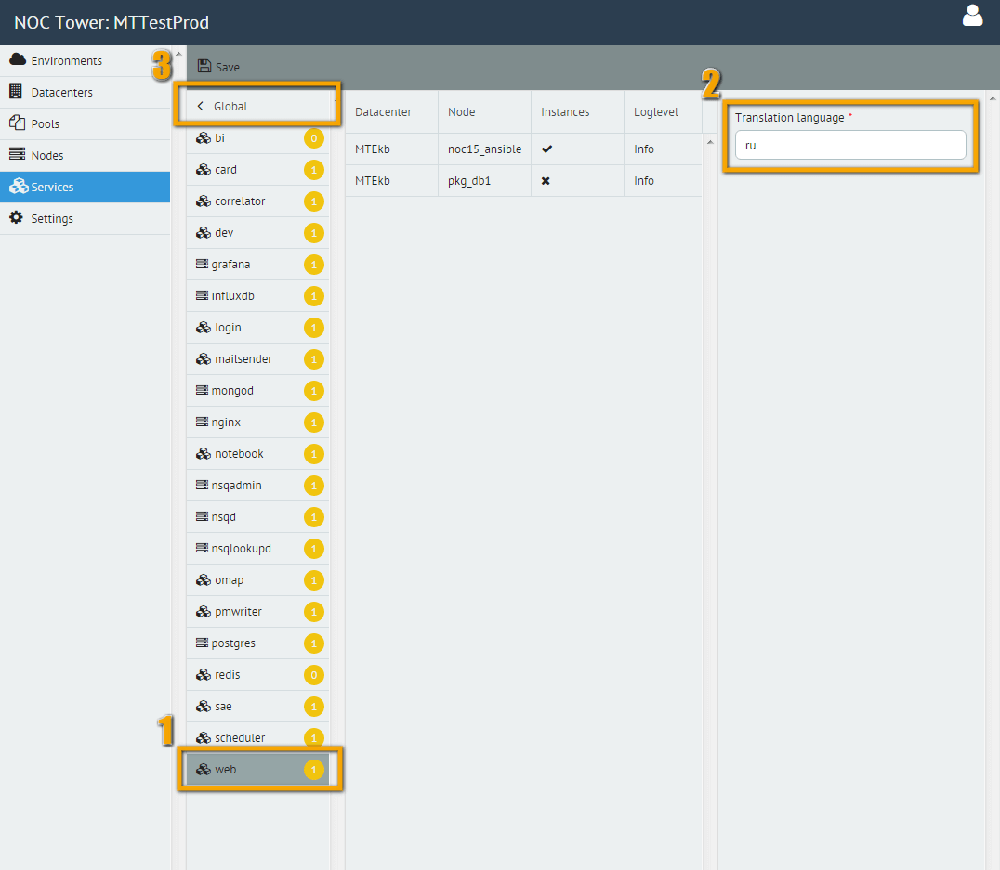
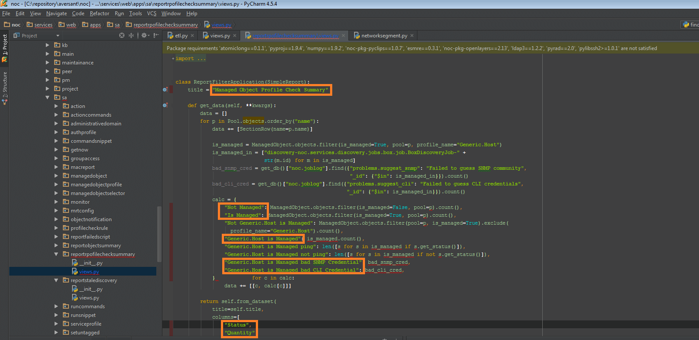
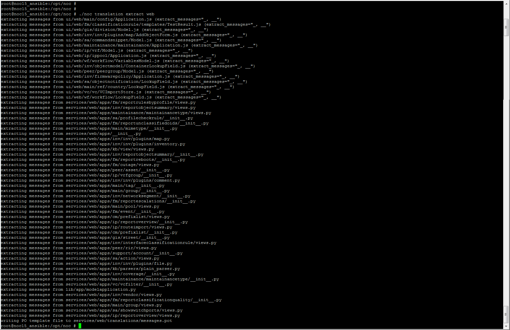

---
tags:
  - how-to
---
# Локализация интерфейса пользователя

Платформа NOC поддерживает локализацию интерфейса на различные языки. В настоящий момент поддерживается локализация следующих сервисов:

* Web
* Card
* Login

Выбор языка осуществляется в настройках соответствующего сервиса через интерфейс Tower:




После изменения языка необходимо выполнить деплой с активированными опциями:

* **Install Everything**

или

* **Update config** and **Restart gentle**

## Структура переводов

Файлы локализации размещаются в следующих каталогах:

* `service/web/translations` - переводы для Web
* `service/card/translations` - переводы для Card
* `service/login/translations` - переводы для Login

Имя каталога перевода должно быть указано в настройках соответствующего сервиса.  
Для создания собственных переводов допускается размещение дополнительных папок рядом с основными.

Для работы с локализацией установите зависимости для разработки:

Также, для перевода потребуется установить пакеты для разработки:
```shell
pip install -r requirements/dev.txt
```

## Этапы локализации

Процесс локализации включает три основных этапа:

1. Разметка переводимых фраз в исходном коде.
2. Извлечение и обновление словарей.
3. Компиляция переводов.

Если необходимо изменить существующий перевод, можно сразу перейти к разделу
[создание или обновление словаря](#создание-или-обновление-словаря-для-перевода)

### Разметка фраз для перевода

Фразы, подлежащие переводу, необходимо пометить в исходном коде.
В зависимости от языка файла применяются разные подходы:

**Python**

Импортируйте функцию:
``` python
from noc.core.translation import ugettext as _
```

Оберните переводимую строку:

``` python
_("Текст для перевода")
```

Пример:




**JavaScript**

Используйте функцию `__()`:

``` javascript
__("Text to translate")
```

Пример:


После завершения разметки необходимо зафиксировать изменения:

``` bash
git commit
```

!!! warning
    
    Важно: команда translation extract не будет работать, если изменения не закоммичены.

###  Создание или обновление словаря для перевода

Извлеките строки для перевода и обновите словарь с помощью команд:

``` bash
./noc translation extract <service>
./noc translation update <service>
```

Параметр `<service>` является необязательным.
При его отсутствии операция выполняется для всех сервисов.




После выполнения команд будет создан или обновлён .po файл со строками для перевода. Примеры путей:

- `translations/ru/LC_MESSAGES/messages.po` — для Python
- `translations/ru/LC_MESSAGES/messages_js.po` — для JavaScript

Редактировать можно в любом текстовом редакторе или в [PoEdit](https://poedit.net/)

``` bash
./noc translation edit <service> <lang>
```

- команда для запуска встроенного редактора (если доступен на ноде).

!!! warning

    Убедитесь, что правите словарь нужного сервиса. Изменения в других можно игнорировать, если в них не добавились новые строки.

### Компиляция переведённого текста

После редактирования выполните компиляцию:

``` bash
./noc translation compile <service>
```


После компиляции необходимо перезапустить процесс нужного сервиса (web, card, login).

### Публикация перевода

Если необходимо отправить перевод вместе с другими изменениями, предоставьте три файла на каждый изменённый сервис:

- `.po` — словарь
- `.mo` — скомпилированный словарь
- `messages_js.json` — перевод для JavaScript


!!! warning

    Важно: отправляйте только изменённые файлы.
    Файлы, где изменена только дата, прикладывать не нужно.  

## Диагностика ошибок

**Проблема**

Ошибка при выполнении команды `./noc translation extract`:

```
ImportError: No module named babel.util
```

**Решение**

Установите зависимости для разработки:

``` bash
pip install -r requirements/dev.txt
```
