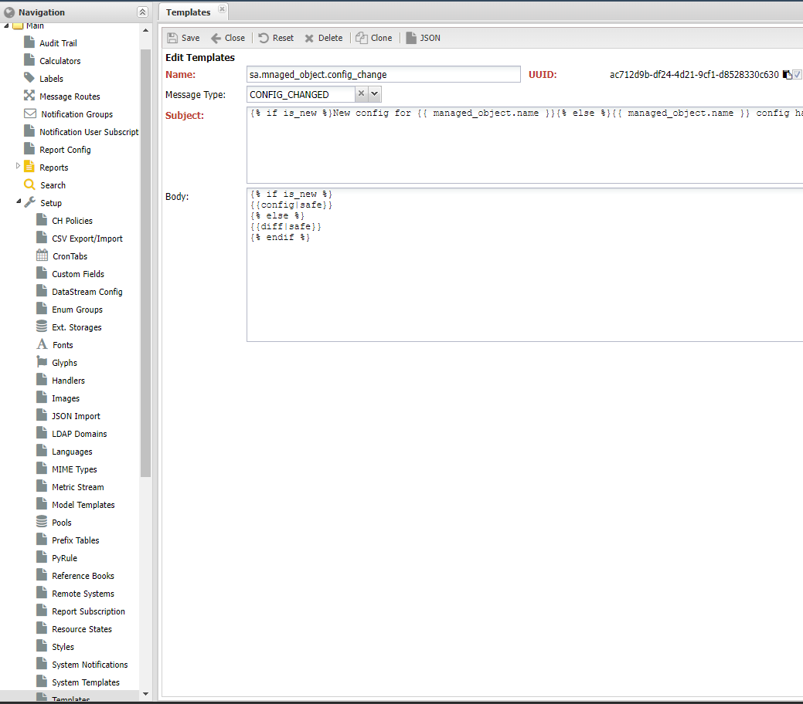

# Уведомления по событиям системы

Для оперативного информирования пользователя (*User*) (или внешней системы) по системным событиям в НОКе используется механизм **Уведомлений** (*Notification*). В состав механизма работы с уведомлениями входят следующие компоненты:

* **Сообщение** (*Message*) - набор сведений о произошедшем событии
* **Группы уведомлений** (*Notification Group*) - списки контактов для получения уведомления. Находятся в меню *Основные (Main) -> Группы уведомлений (Notification Group)*
* **Маршруты доставки** (*Message Route*) - настройки получателей событий системы. Находятся в меню *Основные (Main) -> Маршруты сообщений (Message Route)*
* **Настройки пользователя** (*Notification User Settings*) - настройки доставки уведомлений пользователю. Включают в себя:
  * Список контактов для доставки в *Профиле пользователя* (*User Profile*)
  * Указание времени в рамках которого допустима отправка уведомлений
  * Настройки групп уведомлений (*Notification Group*)
* **Контакты** (*Contacts*) - идентификатор получателя в канале доставки (*Notification Channel*)
* **Подписка на уведомления** (*Notification Subscription*) - список объектов по которым пользователь получает уведомления
* *Маршрутизатор сообщений* (*Message Route*) - компонент системы, отвечающий за доставку сообщений адресату. Находится внутри любого процесса, отправляющего сообщений пользователю.
* **MX**  - сервис, отвечающий за доставку сообщений внешних отправителей (*Remote Sender*)

За доставку уведомлений система использует сервисы-отправители (*Sender*), на текущий момент доступно 2 отправителя:

* *mailsender* - доставка по почте
* *tgsender* - доставка сообщения в телеграмм

### Процедура отправки уведомления

При наступлении события в системе, оно порождает сообщение, заполняя его контекстом (набором данных), в котором событие произошло. Само *сообщение* (*Message*) состоит из 3 частей:

* **тип сообщения** (*Message Type*) - описание содержимого сообщения
* **метаданные отправителя** (*MetaData*) - дополнительная информация по отправителю. Передаются в заголовке
* **тело сообщения** (*Body*) - структура `JSON` содержащая контекст события 
* *вложения* (*Attachments*) - вложения

После создания сообщения (*Message*) передаётся попадает в специальный компонент - *маршрутизатор события* (*Message Router*), которых на базе набора правил выполняет одно или несколько действий:

* **Notification** - зарегистрировать событие в *Группе уведомления* (*Notification Group*)
* **Stream** - передать событие в соответствующий *топик* (*topic*) внутренней шины. Обычно это *kafkasender* для передачи сообщения внешним системам через сервис *Kafka*
* **Dump** - распечатать событие в логе сервиса отправителя
* **Drop** - остановить обработку события

Правила для маршрутизации представляют собой список, отсортированный в порядке возрастания по полю *order*. Поэтому на сообщение может быть выполнено несколько действий. Основной критерий - это тип события **Message Type**, дополнительные это условия по объекту (*Managed Object*) по которому создано уведомление. В системе представлены следующие типы событий:

| Тип сообщения               | Сервис                                                                           | ПРичина                                     | Настройка (раздел message)          | Описание                                                                       |
| --------------------------- |----------------------------------------------------------------------------------| ------------------------------------------- |-------------------------------------|--------------------------------------------------------------------------------|
| **alarm**                   | Correlator                                                                       | Открытие, изменение и закрытие аварии       | enable_alarm                        | [alarm](../mx-messages-reference/alarm.md)                                     |
| **managedobject**           | -                                                                                |                                             | enable_managedobject                | [managedobject](../mx-messages-reference/managedobject.md)                     |
| **reboot**                  | [Uptime Discovery](../discovery-reference/periodic/uptime.md)                    | Переход аптайма устройства через 0          | enable_reboot                       | [reboot](../mx-messages-reference/reboot.md)                                   |
| **snmptrap**                | SNMP Trap Collector                                                              | Получение сообщения SNMP с устройства       | enable_snmptrap                     | [snmptrap](../mx-messages-reference/snmptrap.md)                               |
| **syslog**                  | Syslog Collector                                                                 | Получение Syslog сообщения с устройства     | enable_syslog                       | [syslog](../mx-messages-reference/syslog.md)                                   |
| **event**                   | Classifier                                                                       | Получение нового события из коллектора      | enable_event                        | [event](../mx-messages-reference/event.md)                                     |
| **interface_status_change** | [Interface Status Discovery](../discovery-reference/periodic/interfacestatus.md) | Изменение оперативного состояние интерфейса | -                                   | [interface_status_change](../mx-messages-reference/interface_status_change.md) |
| **config_changed**          | [Config Discovery](../discovery-reference/box/config.md)                         | Изменение текстовой конфигурации устройства | -                                   | [config_changed](../mx-messages-reference/config_changed.md)                   |
| **object_new**              | -                                                                                | Добавление устройства (Managed object)      | -                                   | [object_new](../mx-messages-reference/object_new.md)                           |
| **object_deleted**          | -                                                                                | Удаление устройства (Managed Object)        | -                                   | [object_deleted](../mx-messages-reference/object_deleted.md)                   |
| **version_changed**         | [Version Discovery](../discovery-reference/box/version.md)                       | Изменение версии ПО устройства              | -                                   | [version_changed](../mx-messages-reference/version_changed.md)                 |
| **config_policy_violation** | [Config Discovery](../discovery-reference/box/config.md)                         | Обнаружение проблем в конфигурации          | -                                   | [config_policy_violation](../mx-messages-reference/config_policy_violation.md) |
| **diagnostic_change**       | -                                                                                |                                             | -                                   |                                                                                |
| **notification**            | -                                                                                | Отправка текстового уведомления             | -                                   |                                                                                |
| **metrics**                 | Metrics Service                                                                  | Поступление значений метрик в системе       | enable_metrics,enable_metric_scopes | [metrics](../mx-messages-reference/metrics.md)                                 |

!!! note

    На тип сообщения **metrics**, запрещено настраивать уведомления (*Notification*)

Параметры в колонке **Настройка** указываются в секции **message** глобальной конфигурации:

```shell
./noc config dump message
message:
  ds_limit: 1000
  embedded_router: true
  enable_alarm: false
  enable_diagnostic_change: false
  enable_event: false
  enable_managedobject: false
  enable_metric_scopes: []
  enable_metrics: false
  enable_reboot: false
  enable_snmptrap: false
  enable_syslog: false
```

## Настройка уведомлений

Уведомление формируется на базе *сообщения* (*Message*) путём применения **шаблона** (*Template*). Для настройки их доставки адресатам отвечают **Группы уведомлений** (*Notification Group*). Она объединяет контакты и пользователей, которым необходимо доставить уведомление. Сами сообщения могут попасть в группу тремя способами (регулируется настройкой):

* Указание в настройках источника. Пример: подписка на отчёты, профиль сервиса.  В этом случае сообщения регистрируются в группе и отправляются зарегистрированным контактам.
* Любые сообщения системы. В этом случае в группу попадают все сообщения, регистрируемые в системе
* Указанных типов. В группе попадают сообщения, перечисленные в разделе типов


После попадания в группу, сообщение проверяется на соответствие **критериев** (*Condition*), если таковые указаны. И после этого передаётся для отправки адресатам. Адресатом в группе может быть *пользователь* (*User*) или контакт (*Contact*), также доступны следующие настройки:

* **Имя** (*Name*)
* **Описание** (*Description*)
* **Message Register Policy** - политика регистрации сообщений
  * *Disable* - отключить автоматическую регистрацию сообщений
  * *Any* - любые сообщения
  * *By Types* - только для сообщений, описанных в типах
* **Message Types** - настройки для типов сообщений
  * *Message Type* - тип сообщения
  * *Template* - ссылка на шаблон
* **Адресаты** (*Static Members*) - список адресатов для отправки зарегистрированных сообщений
  * *Notification Method* - канал отправки: почта, tg - telegram
  * *Contact* - адресат
  * *Language* - язык для отправки
  * *Time Pattern* - ссылка на маску времени
* **Настройки подписки** (*Subscription Settings*) - настройки подписки на группу
  * *Пользователь* (*User*) - ссылка на пользователя
  * *Группа* (*Group*) - ссылка на группу пользователей
  * *Разрешить подписку* (*Allow Subscribe*) - разрешить пользователю подписываться на группу
  * *Auto Subscription* - автоматически включить пользователя в рассылку
  * *Notify If Subscribed* - уведомлять при изменениях подписки. Например, если пользователь включается или исключается из группы
* Критерии (*Conditions*) - условия для совпадения сообщений
  * *Labels* - набор меток
  * *Resource Groups* - набор групп
  * *Administrative Domain* - зона ответственности

!!! note

    Если в группе не указаны критерии (*Conditions*) то считается что подходят любые сообщения указанного типа

## Настройка маршрутизации сообщений

Расширенные настройки обработки сообщения доступны в меню **Маршруты Сообщения** (*Main -> Message Routes*). Они предоставляют следующие возможности:

* Модифицировать сообщение
* Зарегистрировать уведомление в группе. При регистрации игнорируются настройки *Message Register Policy* группы
* Переслать сообщение во внешнюю систему (через шину)


Поведение устанавливается

* **Имя** (*Name*) - наименование правила
* **Активно** (*Is Active*) - правило включено в работу
* **Описание** (*Description*)
* **Порядок** (*Order*) - порядок обработки
* **Тип сообщения** (*Type*)
* **Критерии** (*Match*) - критерии совпадения сообщения с правилом. Если не указаны - выполнится для любого
  * *Метки* (*Labels*)
  * *Группы* (*Resource Groups*)
  * *Зоны Ответственности* (*Administrative Domain*)
  * *Headers Match* - совпадение заголовков сообщения
* *Telemetry Sample* - отправка телеметрии по обработке сообщения
* *Преобразователь сообщения* (*Transmute Handler*) - обработчик для сообщения, позволяет изменить заголовки и тело (*body*) передаваемого сообщения. Необходимо регистрация в *Handlers*
* *Шаблон преобразования* (*Transmute Template*) - шаблон (*template*) для тела сообщения
* **Действие** (*Action*)
  * *Notification* - отправить уведомление на группу, указанную в настройке (*Notification Group*)
  * *Stream* - переслать сообщение в топик, указанный в настройке *Stream*
  * *Dump* - распечатать сообщение в логе сервиса
  * *Drop* - остановить обработку сообщения
* *Stream* - название потока во внутренней шине
* *Группа уведомления* (*Notification Group*) - группа, на которую отправить уведомление. Работает при действии *Notification*
* Шаблон уведомления (*Render Template*) - шаблон уведомления. Если не задан будет использоваться по умолчанию для соответствующего типа (*Message Type*)
* Заголовки (*Headers*) - установить заголовки для сообщения

### Изменение шаблона сообщения

Для создания уведомления необходимо к сообщению применить *Шаблон* (*Template*). Таковые настраиваются в меню *Main -> Setup -> Templates*. Для работы с шаблонами используется библиотека [Jinja2](https://jinja.palletsprojects.com), набор доступных переменных можно найти в таблице типов сообщений (колонка *Описание*).



!!! warning

    Поле Тип сообщения **MessageType** задаёт шаблон по умолчанию для типа сообщения. Менять его не желательно

## Проверка работы

В том случае если после выполненных настроек уведомление не приходит необходимо удостовериться в правильности настроек всех компонентов.

Для проверки **Группы уведомления** (*Notification Group*) на панели инструментов списка есть кнопка **Group Action** а в ней пункт **Test Selected Group**. На контакты из выбранных групп должно придти тестовое сообщение. В случае отсутствия такого необходимо проверить правильность указанных контактов и запущены ли соответствующие сервисы: *mailsender* и *tgsender*, выполнена ли их настройка.

Если *тестовое сообщение* **дошло** до указанных контактов (*Contact*).  То возможная причина в том, что сервисы не подхватили настройки. Обновить их можно командой `./noc datastream rebuild --datastream cfgmxroute` и после этого перезапустить НОК.

## Подписка на уведомления

Настройка уведомлений для пользователя

Подписка на уведомления по объекту
