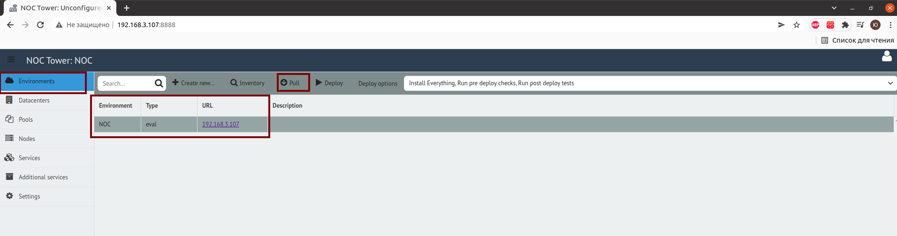
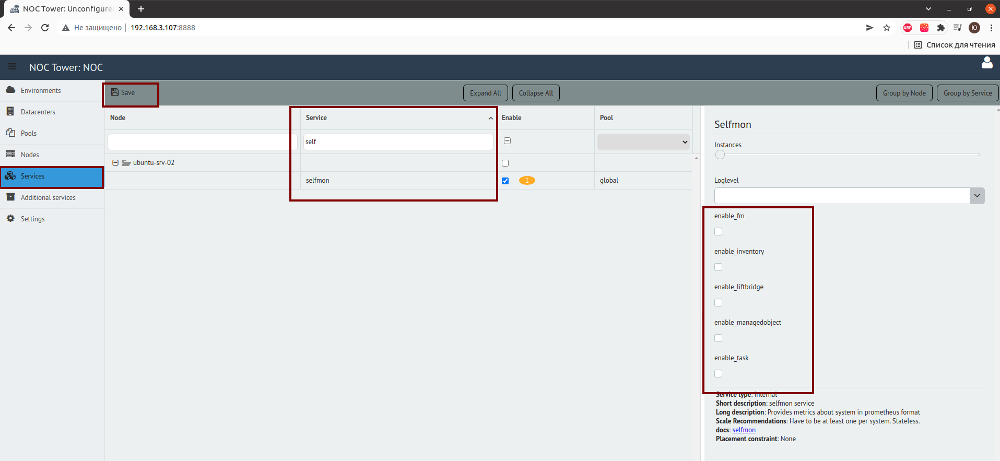
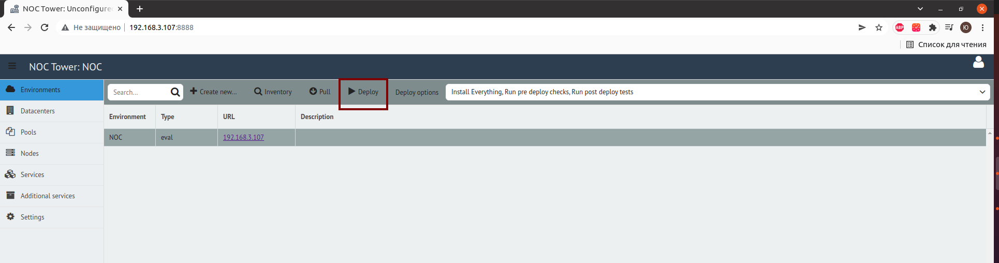

# NOC Monitoring Howto

## Installing Docker and Docker Compose

1. Install Docker: [Docker Installation Guide](https://docs.docker.com/engine/install/)
2. Install Docker Compose: [Docker Compose Installation Guide](https://docs.docker.com/compose/install/)

## Creating docker-compose.yml and Its Environment

(Note: Run all commands as the root user)

1. Create a directory where the `docker-compose.yml` file should be located.
```
mkdir -p /etc/docker-compose/mon/ 
```
and place `docker-compose.yml` file with following content:
``` yaml
version: '3'
services:
 
  grafana:      
    image: grafana/grafana-oss
    restart: always
    ports:
      - 3000:3000
    user: '0'
    volumes:
      - "./grafana/data/:/var/lib/grafana/"
      - "./grafana/grafana-selfmon-dashboards/dashboards/noc/:/var/lib/grafana/dashboards"
      - "./grafana/grafana-selfmon-dashboards/provisioning/datasources/:/etc/grafana/provisioning/datasources/" 
      - "./grafana/grafana-selfmon-dashboards/provisioning/dashboards/:/etc/grafana/provisioning/dashboards/"
    networks:
      - mon

  vmagent:
    image: victoriametrics/vmagent
    depends_on:
      - "vm"
    ports:
      - 8429:8429
    volumes:
      - "./vm/vmagentdata:/vmagentdata"
      - "./vm/vmagent.yml:/etc/prometheus/prometheus.yml"
    command:
      - '--promscrape.config.strictParse=false'
      - '--promscrape.config=/etc/prometheus/prometheus.yml'
      - '--remoteWrite.url=http://vm:8428/api/v1/write'
    restart: always
    networks:
      - mon

  vm:
    image: victoriametrics/victoria-metrics
    ports:
      - 8428:8428
    volumes:        
      - "./vm/vmdata/:/storage"
    command:
      - '--storageDataPath=/storage'
      - '--retentionPeriod=60d'
      - '--httpListenAddr=:8428'
    restart: always
    networks:
      - mon
    
  alertmanager:
    image: prom/alertmanager
    restart: always
    volumes:
      - "./vm:/alertmanager"
    command:
      - --config.file=/alertmanager/alertmanager.yml
      - --web.external-url=https://alertmanager:9093
    networks:
      - mon
  
  prometheus-bot:
    image: tienbm90/prometheus-bot:0.0.1
    volumes:
      - ./telegrambot/config.yaml:/config.yaml
      - ./telegrambot/:/etc/telegrambot/
    networks:
      - mon
    restart: always

  vmalert:
    image: victoriametrics/vmalert
    depends_on:
      - "vm"
      - "alertmanager"
    volumes:
      - "./vm/noc-prometheus-alerts/:/etc/alerts/"
    command:
      - '--datasource.url=http://vm:8428/'
      - '--remoteRead.url=http://vm:8428/'
      - '--remoteWrite.url=http://vm:8428/'
      - '--notifier.url=http://alertmanager:9093/'
      - '--rule=/etc/alerts/*.rules.yml'
    networks:
      - mon
    restart: always

networks:
  mon:  
```
2. Create a directory called **grafana**, and within it, create a directory called **data**.
```
mkdir -p /etc/docker-compose/mon/grafana/data/
```
3. Download dashboards and datasources:
```
git clone https://code.getnoc.com/noc/grafana-selfmon-dashboards.git /etc/docker-compose/mon/grafana/grafana-selfmon-dashboards/
```
4. Create the **vm** and **admdata** directory:
```
mkdir -p /etc/docker-compose/mon/vm/amdata/
chmod 777 /etc/docker-compose/mon/vm/amdata
```
5. In the **vm** directory, create the **vmdata** directory and a file named **vmagent.yml**.
```
mkdir /etc/docker-compose/mon/vm/vmdata/
```
```
touch /etc/docker-compose/mon/vm/vmagent.yml
```
with the following content:
```
# my global config
global:
 
# Alertmanager address
alerting:
  alertmanagers:
    - static_configs:
      - targets:
        - alertmanagers:9093
 
# Metrics collections
scrape_configs:
  # Prometheus self-monitorog
  - job_name: 'vmagent'
    static_configs:
      - targets: ['vmagent:8429']
        labels:
           env: 'infrastructure'

  - job_name : 'victoriametrics'
    static_configs:
      - targets: ['vm:8428']
 
  # Metrics from noc, discovery, and consul
  - job_name: 'noc'
    consul_sd_configs:
      - server: '<ip address of NOC server>:8500' # i.e. 192.168.1.25:8500
    relabel_configs:
      - source_labels: [__meta_consul_tags]
        regex: .*,noc,.*
        action: keep
      - source_labels: [__meta_consul_service]
        target_label: job
      - source_labels: [env]
        target_label: env
        replacement: "dev" # NOC installation type

  # Collect metrics from telegraf
  - job_name: 'telegraf'
    consul_sd_configs:
      - server: '<ip-address of NOC server>:8500' # i.e. 192.168.1.25:8500
    relabel_configs:
      - source_labels: [__meta_consul_tags]
        regex: .*,telegraf,.*
        action: keep
    metric_relabel_configs:
      - source_labels: [topic]
        regex: correlator.dispose.(.+)
        target_label: pool
        replacement: '$1'

  # ClickHouse metrics
  - job_name: 'ch'
    scrape_interval:     30s
    static_configs:
      - targets:
        - <ip-address of  clickhouse>:8001 # You can enable metric export in NOC Tower by configuring the `clickhouse` section.
        labels:
           env: 'dev' # NOC installation type
```
5. Download alerting rules into the **vm** directory.
```
git clone https://code.getnoc.com/noc/noc-prometheus-alerts.git /etc/docker-compose/mon/vm/noc-prometheus-alerts/
```
6. Create a file named **alertmanager.yml** in the **vm** directory.
```
touch /etc/docker-compose/mon/vm/amdata/alertmanager.yml
```
with the following content, replacing with your data:
```
global:
  resolve_timeout: 5m
  smtp_from: alertmanager@prometheus.example.com
  smtp_smarthost: mx1.example.com:25
  smtp_require_tls: false
 
route:
  group_wait: 30s
  group_interval: 5m
  repeat_interval: 8h
  group_by: [env, node]
  receiver: 'prometheus-bot'
  routes:
    - receiver: blackhole
      continue: false
      match:
        alertname: DeadMansSwitch
    - receiver: 'prometheus-bot'
      group_interval: 5m
 
receivers:
- name: blackhole
- name: 'prometheus-bot'
  webhook_configs:
   - url: 'http://prometheus-bot:9087/alert/<id of telegram chat>'
    
    
- name: email
  email_configs:
  - send_resolved: false
    to: XXX@example.com
    headers:
      From: alertmanager@prometheus.example.com
      Subject: '{{ template "email.default.subject" . }}'
      To: XXXXXXX@example.com
    
inhibit_rules:
  - source_match:
      severity: 'critical'
    target_match:
      severity: 'warning'
    equal: ['alertname', 'instance']
```
7. Create a directory called **telegrambot**, and within it, create two files: **config.yaml** and **template.tmpl**, making sure to replace them with your own values.
```
mkdir /etc/docker-compose/mon/telegrambot
```
```
touch /etc/docker-compose/mon/telegrambot/config.yaml
```
```
touch /etc/docker-compose/mon/telegrambot/template.tmpl
```
config.yaml:
```
telegram_token: "<token от бота в telegram>"
template_path: "/etc/telegrambot/template.tmpl"
time_zone: "Europe/Moscow"
split_token: "|"
time_outdata: "02/01/2006 15:04:05"
split_msg_byte: 10000
```

template.tmpl:
```
{{ $length := len .GroupLabels -}} {{ if ne $length 0 }}
<b>Grouped for:</b>
{{ range $key,$val := .GroupLabels -}}
    {{$key}} = <code>{{$val}}</code>
{{ end -}}
{{ end -}}

{{if eq .Status "firing"}}
Status: <b>{{.Status | str_UpperCase}} 🔥</b>
{{end -}}

{{if eq .Status "resolved"}}
Status: <b>{{.Status | str_UpperCase}} ✅</b>
{{end }}
<b>Active Alert List:</b>
{{- range $val := .Alerts }}
  Alert: {{ $val.Labels.alertname }}
  {{if HasKey $val.Annotations "message" -}} 
  Message:{{ $val.Annotations.message }}
  {{end -}}
  {{if HasKey $val.Annotations "summary" -}} 
  Summary:{{ $val.Annotations.summary }}
  {{end -}}
  {{if HasKey $val.Annotations "description" -}} 
  Description:{{ $val.Annotations.description }}
  {{end -}}
  {{if HasKey $val.Labels "name" -}} 
  Name:{{ $val.Labels.name }}
  {{end -}}
  {{if HasKey $val.Labels "partititon" -}} 
  Partition:{{ $val.Labels.partition}}
  {{end -}}
  {{if HasKey $val.Labels "group" -}} 
  Group:{{ $val.Labels.group }}
  {{end -}}
  {{if HasKey $val.Labels "instance" -}} 
  Instance:{{ $val.Labels.instance }}
  {{end -}}
  {{if HasKey $val.Labels "queue" -}} 
  Queue:{{ $val.Labels.queue }}
  {{end -}}
  {{if HasKey $val.Labels "pool" -}} 
  Pool:{{ $val.Labels.pool }}
  {{end -}}
  {{if HasKey $val.Annotations "value" -}} 
  Value:{{ $val.Annotations.value }}
  {{end -}}
  Active from: {{ $val.StartsAt | str_FormatDate }}
  {{ range $key, $value := $val.Annotations -}}
{{- end -}}
{{- end -}}

```
## Configuring selfmon

1. Access the NOC Tower web interface at <server IP address>:8888.
2. Select "Environment" and click on "Pull."

3. Next, go to "Services," choose "selfmon," and select the checkboxes for the items you want to monitor.

4. Deploy the changes.


## Restarting NOC Services

1. Navigate to the directory where NOC is installed (e.g., /opt/noc).
2. Execute the following command:
```
./noc ctl restart all
```


## Starting Monitoring

1. Navigate to the directory where the docker-compose.yml file is located.
```
cd /etc/docker-compose/mon/
```
2. Start the monitoring.
```
docker-compose up -d
```
