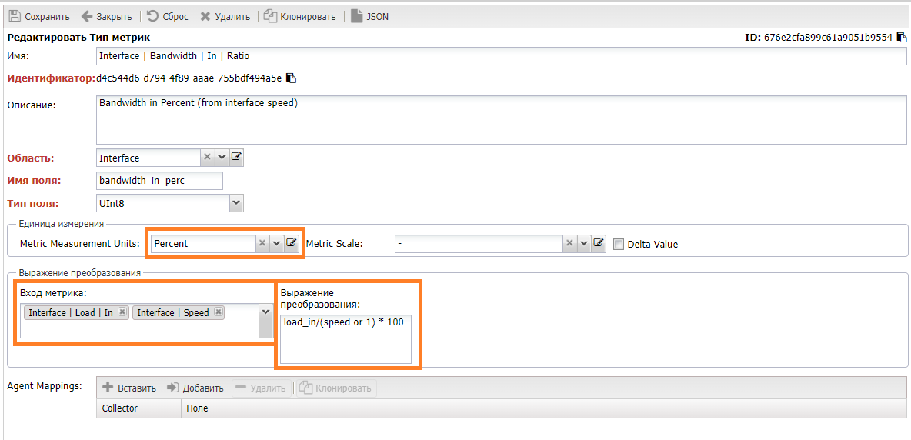
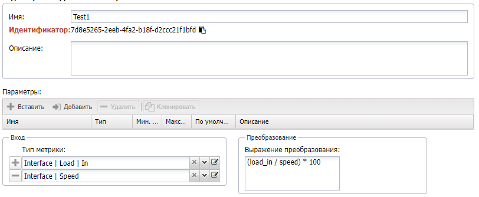
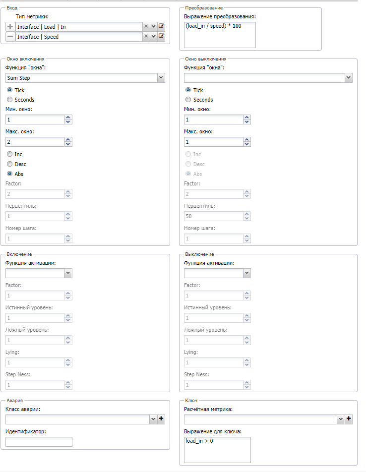
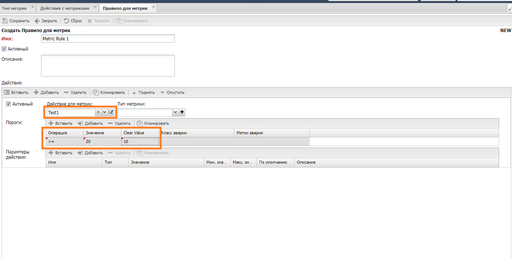

# Использование расчётных метрик

При сборе метрик присутствует известное ограничение: *не всегда источник предоставляет необходимую величину*. Например, в системе удобнее работать с относительными величинами - процентами: использование памяти, заряд батарее, использование пропускной способности порта, при этом источник отдаёт абсолютные значения: число пакетов в секунду, максимальный и текущий ток, объём памяти и сколько занято. В связи с чем возникает необходимость  преобразования исходного значения метрики с использованием математического выражения, их использование доступно на следующих этапах:

1. Во время сбора метрики
2. Во время обработки результатов сбора перед отправкой метрик в базу
3. Во время проверки порогов

Этапы различаются между собой способом настройки, доступными в выражении переменными и применением результата вычислений.

!!! note

    В случае метрик речь всегда идёт только о числовых значениях, работа с текстовыми метриками не поддерживается

## Преобразование во время сбора метрик

Преобразования во время сбора реализуются в *профиле* (*SA Profile*) оборудования и работают во время сбора, до формирования результата. Поэтому во время процедуры сохраняется возможность обратиться к оборудованию для получения дополнительных сведений. Способ характеризуется следующими особенностями:

* Можно добыть с оборудования дополнительные данные
* Не доступны результаты предыдущих опросов
* Нет доступа к данным из базы системы, только то что передано скрипту для работы - *Capabilities* и *hints*

Цель преобразований, обычно, преобразовать значения в соответствующий тип измерения для передачи в систему, однако не запрещено и произвести расчёт на базе доступных сведений с оборудования. Преобразователи передаются через параметр **scale**, он присутствует в конфигурации метрик (папка `snmp_metrics`) и методе `set_metric`, доступы следующие виды:

| Функция             | Описание                                                     | Пример                              |
| ------------------- | ------------------------------------------------------------ |-------------------------------------|
| целое число         | значение метрики умножается на число                         | `"scale": "1"`                      |
| percent             | вычисление процента, на основе абсолютного текущего и максимального значений | `"scale": "percent"`|
| percent_usage       |                                                              | `"scale": "percent_usage"`          |
| percent_invert      |                                                              | `"scale": "percent_invert"`         |
| convert_percent_str | конвертация текстового представления процента в числовой вид: `"90 %" -> 90.0` |                   |
| sum                 | сумма всех метрик                                            | `"scale": "sum"`                    |
| diff                | разница между значениями первой и второй метрик              | `"scale": "diff"`                   |
| subtract            |                                                              | `"scale": "subtract"`               |
| is1                 | конвертация числового значения метрики (1 или 0) в логическое | `"scale": "is1"`                   |
| invert0             | конвертирует 0 в 1 а 1 в 0                                   | `"scale": "invert0"`                |
| scale               | умножает значение метрики на указанное в скобках             | `"scale": "scale(0.1)"`             |
| fix_range           | если значение метрики выходит за указанный интервал - возвращает 0 |                               |
| convert_float       | преобразует строковое значение в число                       |                                     |

Если необходимо задействовать преобразование в конфигурации метрики `snmp_metrics`, задаётся в качестве параметра конфигурации:

```json
{
    "$metric": "Memory | Total",
    "$type": "oid",
    "oid": [
      "1.3.6.1.4.1.9.9.48.1.1.1.6.1",
      "1.3.6.1.4.1.9.9.48.1.1.1.5.1"
    ],
    "scale": "sum",
    "units": "byte"
}
```

В случае если для сбора метрик реализуется в рамках скрипта `get_metrics`, то преобразования можно выполнять инструмента языка `Python`:

```
    @metrics(["Memory | Total", "Memory | Usage"], volatile=False, access="S")  # SNMP version
    def get_memory_metrics(self, metrics):
        value_total = self.snmp.get("1.3.6.1.4.1.40418.7.100.1.11.6.0")  # bytes
        value_usage = self.snmp.get("1.3.6.1.4.1.40418.7.100.1.11.7.0")  # bytes
        for metric in metrics:
            if "Memory | Total" in str(metric):
                if value_total:
                    self.set_metric(
                        id=("Memory | Total", None), value=int(value_total), units="bytes"
                    )
            if "Memory | Usage" in str(metric):
                if value_total and value_usage:
                    self.set_metric(
                        id=("Memory | Usage", None),
                        value=int((value_usage * 100) / value_total),
                        units="%",
                    )

```

## Преобразование во время нормализации результатов

После сбора метрики направляются для нормализации их значений, для их соответствия единицам измерения и дальнейшей обработки. В этот момент результаты можно использовать для расчёта дополнительных метрик на базе собранных с оборудования, ограничителем выступает пространство метрик (*Metric Scope*)

Настройка выполняется в разделе **Выражение для преобразования** (*Compose Expression*) настройках *Типов метрик* (*Metric Type*):

* *Входные метрики* (*Metric Input*) - перечисление метрик для передачи в выражение
* *Выражение* (*Compose Expression*) - выражение *Python*, куда в качестве переменных передаются значения метрик, указанных выше

В составе системы включены 2 расчётные метрики пропускной способности порта `Interface | Bandwidth | In | Ratio`, `Interface | Bandwidth | Out | Ratio`, рассчитываются на базе загрузки (*Load In*) и текущей скорости (*Speed*).



## Преобразование при работе с порогами

Иногда простого сравнения значения метрики с порогом оказывается недостаточно для принятия решения об аварийной ситуации, и требуется более комплексный анализ значения. В этом случае перед порогом значение преобразуется в  *Metric Action* и только потом передаётся для сравнения.

> Схема преобразования

Доступные преобразования в *Metric Action*

* Расчёт входного значения на базе нескольких метрик
* Оконная функция
* Функция активации
* Расчёт условия для для ключа

Для применения в пороге более одной метрики применяется подход аналогичный **вычисляемой метрике**. Для этого в разделе  *Преобразование* (*Compose Expression*) перечисляются используемые метрики и выражение для вычисления результата:

* *Входные метрики* (*Metric Input*) - перечисление метрик для передачи в выражение
* *Выражение* (*Compose Expression*) - выражение *Python*, куда в качестве переменных передаются значения метрик, указанных выше

Результат вычисления передаётся на дальнейшую обработку. Например, в случае необходимости можно вычислить пропускную способность канала аналогично описанному в разделе *Преобразование во время сбора метрик*:



**Оконные функции** производят расчёты над набором значений, заданном периодом окна. Период может задаваться либо числом измерений, либо интервалом времени. По достижении максимального интервала последние значения будут замещаться предшествующими им.

| Имя            | Описание работы                                              | Параметры                                                    |
| -------------- | ------------------------------------------------------------ | ------------------------------------------------------------ |
| Sum Step       | Суммирует разницу между соседними значения метрики, находящихся в пределах интервала окна | Направление суммирования (*Direction*): по возрастанию (inc) - если следующее значение больше предыдущего, по убыванию (dec) - если следующее значение меньше предыдущего, абсолютное (abs) - модуль разницы значений |
| Exp Decay      | Экспоненциальный распад                                      | k - постоянная распада, описывает скорость распада           |
| Percentile     | Вычисляет перцентиль значений метрики, находящихся в пределах интервала окна | p - значение перцентиля от 0 до 100                          |
| Nth            | Возвращает значение метрики с заданным номером начиная с последнего | n - номер значения, при n = 1 возвращает последнее           |
| Mean (Average) | Вычисляет среднеарифмитическое значений метрики находящихся в пределах интервала окна | -                                                            |

**Функции активации** - преобразует входное значение метрики для последующего вычисления порога.

| Имя        | Описание работы                                                                       | Параметры                     |
| ---------- |---------------------------------------------------------------------------------------|-------------------------------|
| SoftPlus   | Аппроксимирует входное значение                                                       | k - коэффициент аппроксимации |
| Relu       | Если значение отрицательное, то на выходе будет 0. В остальном выходное значение      |                               |
| Indicatior | Если значение положительное или 0 на выходе будет единица (1), если отрицательное - 0 |                               |
| Logistic   | Математическая функция                                                                |                               |

**Ключевое выражение** позволяет использовать вычислимые условия на языке *Python*, для принятия решения - передавать ли результат преобразования дальше.

Пример такового преобразования:



### Использование преобразования в настройках порогов

После настройки преобразования (*Metric Action*) его можно выбрать в настройках порога внутри *правил для метрик* (*Metric Rules*). В это случае с порогом будет сравниваться значение после выполнения преобразований



!!! note

    Любые расчёты (как для порогов, так и для метрик) могут производиться только в рамках одного **пространства метрик** (*Metric Scope*)


### Проверка преобразований

Для проверки *Metric Action* используется команда `./noc cdag`, в качестве параметра ей передаётся имя *Metric Action*: `./noc cdag --config action://Test1 `, для неё доступны 2 действия:

* *cdag* - графической представление *Metric Action* в формате `.dot`
* *metrics* - проверить работу *Metric Action* отправив на вход набор метрик

Например, для проверки примера из предыдущего пункта необходимо отправить на вход набор метрик по интерфейсу, для этого выполняется команда `./noc cdag --config action://Test1 metrics  --input iface://device10::1/1/15`, где `device10` имя устройства (*Managed Object*) из списка . В выводе распечатается результат расчёта *Metric Action*.

