# Performance Management

Подсистема Performance Management (PM) в НОКе заведует `Метриками`. В целом, метрики и работа с ними не отличаются от таковой в других системах с поправкой на заморочки с настройки. 

Умеет из коробки:

* Ходить за метриками на оборудование с заданным интервалом
* Принять метрики из внешней системы
* Из коробки реализован сбор общеподдерживаемого набора метрик: `IF-MIB`, плюс `CPU/Memory` для распространённых устройств
* Настройки сбора метрик для: порта устройства, SLA Пробы, Датчика, OLT PON (для `Huawei`)
* Применить к метрике порог и сделать на этой основе аварию
* Сохранить метрику в базу данных для последующей работы (используется `Clickhouse`)
* Вывести метрику на график (`Grafana`) или сделать отчёт

Умеет с напильником (в качестве напильника используется `Python`):

* Добавлять собственные метрика для сбора
* Собственные дашборды в графане
* Строить отчёты и аналитику по метрикам в `Clickhouse`

Не умеет

* Расписание сбора метрик - *собрать метрику в день Д, час Ч*
* Сбор метрик по `IPMI`
* Добавление сбора метрик через `MIB Browser` - только с использованием *напильника*


### Термины

Некоторое количество важных слов, используемых для работы с метриками в НОКе.

* **Метрика** - некое *число*, описывающее характеристику объекта
* **Тип метрики** (`Metric Type`) - название метрики в НОКе (настройки метрики)
* **Область метрики** (`Metric Scope`) - набор полей, доступных для описания метрики
* **Метка** (`Label`) - тэг с информацией о метрике (мета-данными)
* **Правило обработки метрики** (`Metric Rule`) - описание что системе делать с метрикой.
 Используется для выставления порогов
* **Порог** (`Threshold`) - некоторая числовая величина, с которой сравнивается метрика.
 При его превышении создаётся авария
* **Источник метрики** (`Metric Source`) - запись в системе, с которой снимается метрика.
 У каждого источника есть уникальный идентификатор - `bi_id`. Доступны следующие:

    * SLA проба (`SLA Probe`) - для сбора используеются SLA проба на оборудовании: `Cisco SLA-monitor`, `Juniper RPM`, `Huawei NQA`
    * Сенсор (`Sensor`) - датчик на оборудовании.
    * Устройство (`Managed Object`) - сетевое устройство с IP адресом: Коммутатор, маршрутизатор
    * CPE (`CPE`) - устройства, работающие с контроллером: `IP телефоны`, `ONT`, `WiFi AP`
    * Агент (`Agent`) - сбор информации с серверов
* **BI ID** - идентификатор источника метрики в хранилище метрики

В контексте сбора метрик, иногда упоминается их разделение на скалярные и векторны:

* *Скалярные* - когда одному *названию* соответствует **одно** значение. Н-р если у устройства 1 датчик температуры, то у метрики `Температура` будет 1 значение - показатель этого датчика.
* *Векторные* - когда одному *названию* соответствует **более одного** значения метрики. Н-р метрике **Кол-во входящих пакетов** соответствует столько значений, сколько интерфейсов на устройстве. Для предыдущего случая - если датчиков несколько, то метрика температуры вернёт `Температура датчика 1`, `Температура датчика 2` и т.д. Для различения метрик применяют тэги.


## Архитектура и компоненты

Архитектурно **PM** (`Performance Management`) состоит из следующих сервисов:

* Сборщик (`Collector`) - отвечает за сбор метрик
    * `Activator + Discovery` - сбор метрик с сетевых устройств [Managed Object](../concepts/managed-object/index.md)
    * `MetricCollector` - `API` для приёма метрик из других систем
    * Агент (`Agent`) - сбор метрик с хостов
* Сервис метрик (`Metric`) - отвечает за расчёт значений метрик и применение правил порогов
* Писатель в базу ([CHWriter](../services-reference/chwriter.md)) - записывает метрики в базу
* Хранилище (`Clickhouse`) - хранить метрики
* Отображение графиков (`Grafana`) - отображает собранные метрики на графиках

Остановися подробнее на каждом компоненте и опишем его роль в процессе работы с метриками.

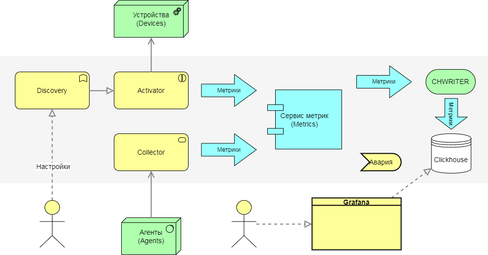


### Activator + Metric Discovery

[Activator](../services-reference/activator.md) взаимодействует с оборудованием по запросу
 [Discovery](../services-reference/discovery.md).
 За съёкм метрик отвечает скрипт [get_metrics](../scripts-reference/get_metrics.md) с параметром - список метрик. 
 Из коробки данный скрипт поддерживает стандартный набор метрик по `SNMP`, 
 а дополнительные описываются в профиле [Profile](../concepts/sa-profile/index.md).

* `IF-MIB` - все метрики интерфейсов
* `sysUptime` - аптайм
* `CPU | Usage`, `Memory | Usage` - метрики для некоторых профилей

Метрики описываются двумя путями:

* Папка `snmp_metrics` профиля, где находятся конфигурация сбора в виде файлов `JSON`
* Скрипт `get_metrics` профиля, в котором сбор реализован через код на `python`.
 Базовый `get_metrics` расположен в `sa/profiles/Generic`

!!! note

    Конфигурация для сбора метрик формируется на стороне `Discovery` и передаётся на активатор


### Сервис метрик (`Metric`)

Обрабатывает поступающие метрики:
1. Проводит проверку поступающих метрик на соответствие [MetricScope](../metrics-reference/index.md).
2. Нормализует полученные значения и вычисляет значения счётчиков
3. Применяет правила и вычисляет пороги
4. Отправляет метрики на запись в хранилище

### CHWRITER

Записывает метрики в соответствующие таблицы. Имена таблиц описаны в [MetricScope](../metrics-reference/index.md)

### ClickHouse (CH)

В качестве хранилища для метрик используется БД `Clickhouse` от **Yandex**.

### Grafana

Показывает собранные метрики в виде графиков. Для работы с хранилищем используется `clickhouse-plugin`.
 Графики доступны из форму устройства, кнопка Графики (`Graphs`), откроется общий дашборд по устройству:

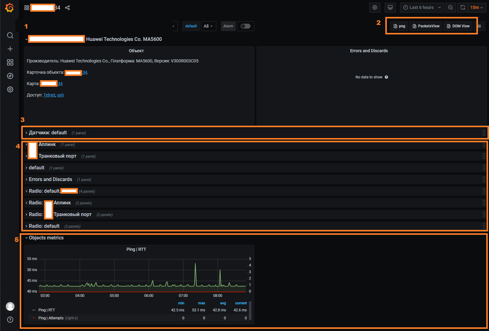

Дашборд по устройствам разделён на несколько облстей:

* **(1)** Карточка устройства - краткай информация об устройстве и кнопки перехода на другие дашборды
* **(3)** Область датчиков - графики по датчикам (`Sensor`) на устройстве
* **(4)** Область интерфейсов (портов) - выводятся графики загрузки интерфейсов 
* **(5)** Графики по метрикам устройства (`Object metrics`) - выводятся графики метрик, добавленных в настройках объекта (`Object Profile`)

Дополнительные дашборды выведены в виде ссылок в правом верхнем углу **(2)**:

* Графики загрузки интерфейсов пакетами `Packets`
* Графики оптических метрик `DOM`

!!! note

    Если по какому-либо интерфейсу отсутствует панель - необходимо проверить включён ли для него сбор метрик.


## Настройка сбора метрик

Для начала сбора метрик необходимо включить опрос `metrics` для этого в *профиле объекта* (`Managed Object Profile`)
 на вкладке *Метрики* (`Metrics`) необходимо выставить галочку `Enabled Metrics`.
 После этого начнётся сбор назначенных для устройства метрик.

!!! note

    Для сбора метрик должен быть доступ на устройства, т.е. система должна его успешно опрашивать.

Метрики для сбора назначаются в *групповых настройках* - Профилях (`Profile`) для этого на форме размещена панель метрик и настройки сбора:

* **Интервал по умолчанию** (`Metric Default Interval`) - интервал сбора метрик. Если 0 - используется интервал из профиля устройства [Managed Object Profile](../concepts/managed-object-profile/index.md)
* **Максимальное дробление интервала** (`Metrics Interval Buckets`) - число вложенных интервалов сбора,
 подробнее см. [Шардирование сбора](#шардирование-сбора)
* Метрики для сбора
    * **Тип метрики** (`MetricType`) - Тип собираемой метрики. Должна быть поддержка со стороны профиля [SA Profile](../concepts/sa-profile/index.md)
    * **Сохранять** (`Is Stored`) - Сохранять метрику в базу
    * **Интервал** (`Interval`) - Индивидуальный интервал сбора - перекрывает *интервал по умолчанию*


Для метрик устройств, назначаемых в *профиле объекта* (`Managed Object Profile`)
 график автоматически добавляется на панель с [Grafana](#Grafana).


### Профиль объекта

В групповых настройках объекта (`Managed Object Profile`) добавляются метрики устройства,
 это любые метрики за исключением интерфейсных и `SLA` (они настраиваются в собственных профилях).
  Профиль объекта расположен в `Управление объектами -> Настройки -> Профиль объекта -> Метрики (Service Activation -> Setup -> Managed Object Profile -> Metrics`, на вкладке Метрики. 

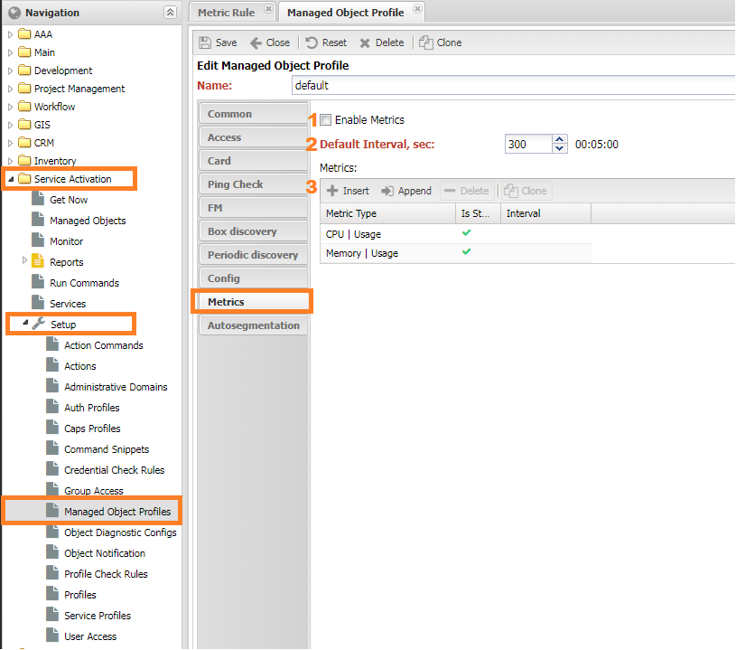


Настройка **(1)** `enable_metric` запускает опрос метрик на устройстве. Если не выставлена, то любые его метрики собираться не будут.


### Профиль интерфейса

В групповых настройках интерфейса [Interface Profile](../concepts/interface-profile/index.md)
 добавляются снимаемые с интерфейса метрики (в настройках `MetricType` выбран `Scope` Interface).
 Для удобства их имя начинается с `Interface | XXX`.
 Настройки расположены в меню `Учёт объектов -> Настройки -> Профили интерфейса (Inventory -> Setup -> Interface Profiles)`.
 Настройка *Политика сбора метрик* (`Metric Collected Policy`) содержит следующие настройки:

* Включить (`Enable`)
* Выключить если интерфейс отключён (`Disable if Admin Down`)
* Выключить, если интерфейс не активен (`Disable if Oper Down`)

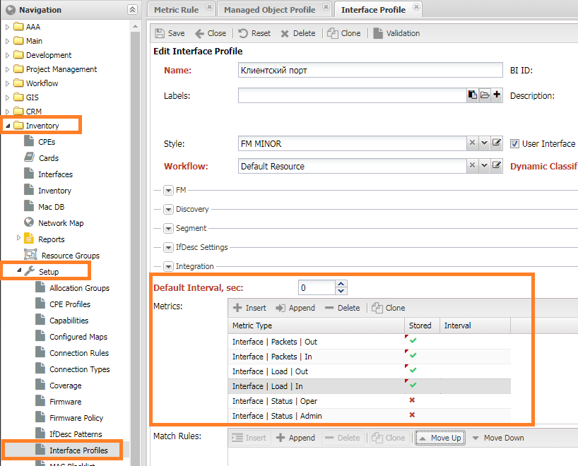

Сами интерфейсы расположены на кнопке `Управление объектами -> Список объектов -> Форма объекта -> Интерфейсы (Service Activation -> Managed Object -> <ManagedObject> -> Intefaces`.
 Для экономии времения рекомендуется использовать механим автоматического назначения профилей:
 [Dynamic Profile Classification](../concepts/dynamic-profile-classification/index.md)


### Профиль SLA

В групповых настройках *SLA пробы* добавляются метрики `SLA` (в настройках `MetricType` выбран `Scope` SLA).
 Для удобства их имя начинается с `SLA | XXX`. Настройки расположены в меню `SLA -> Настройки -> Профили SLA (SLA -> Setup -> SLA Profiles)`

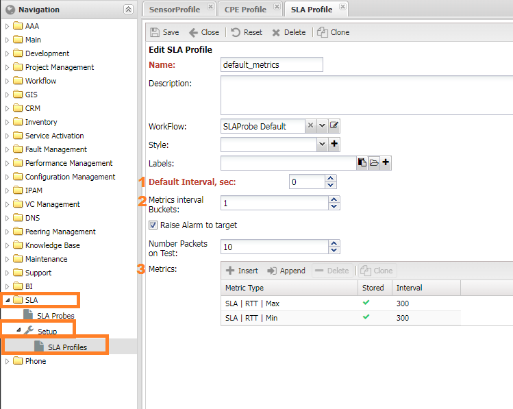


### Профиль CPE

В групповых настройках *CPE* добавляются метрики для сбора с `CPE`.
 Метрики аналогичны устройству, но снимаются с контроллера `Managed Object`.
 Настройки расположены в меню `Учёт объектов -> Настройки -> Профили CPE (Inventory -> Setup -> CPE Profiles)`

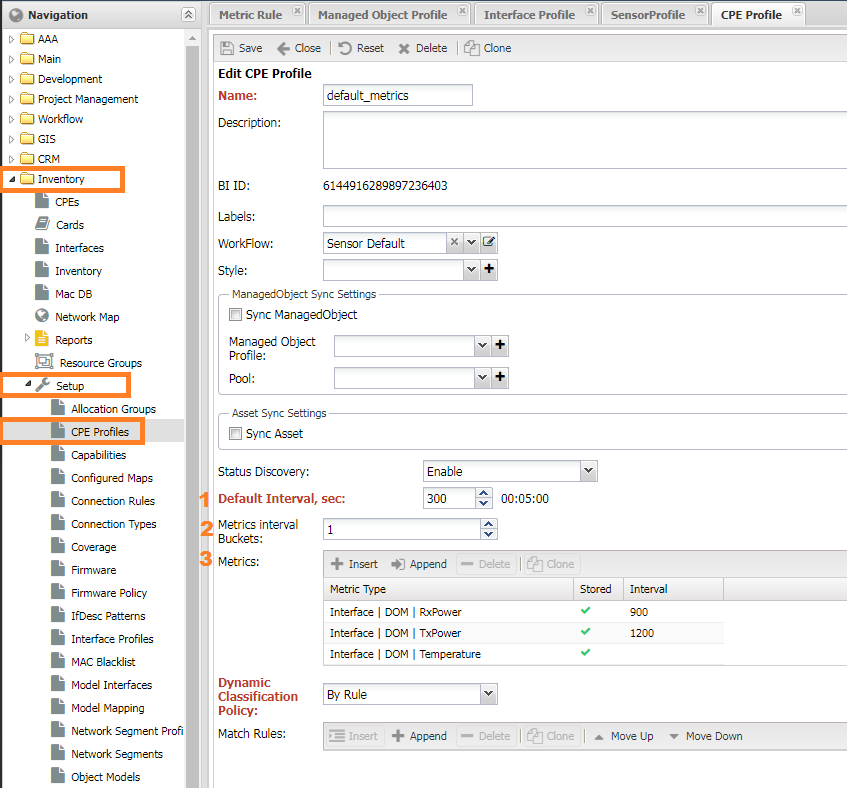

### Профиль Сенсора

Поскольку датчики снимают строго одну метрику `Sensor Value` *панели метрик* не предусмотрено,
 есть только настройка **(1)** *Включить сбор* (`Enable collect`).
 Настройки расположены в меню `Учёт объектов -> Настройки -> Профили Сенсора (Inventory -> Setup -> Sensor Profiles)`

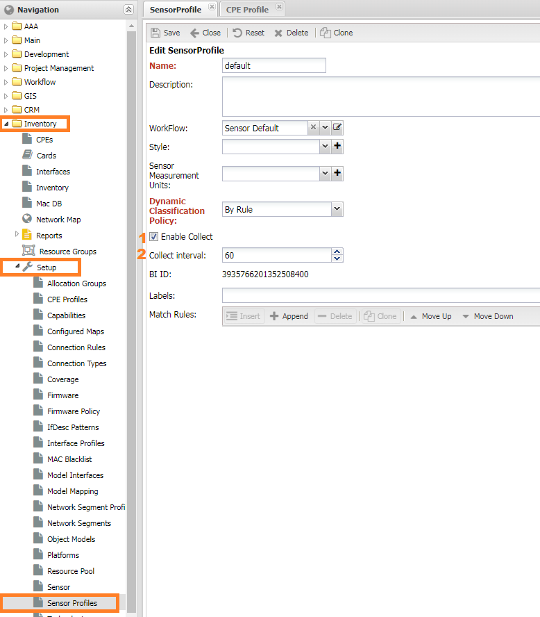

### Шардирование сбора

При большом числе источников метрик на одном устройстве: много SLA проб, CPE на контроллере.
 Возникает ситуация когда сбор метрик перестаёт укладываться в заданный интервал,
 в этом случае период сбора для метрик увеличивают - например, выставляют для метрик SLA вместо 5 минут - 15.
 Но метрики с интервалом 5 минут продолжают не укладываться в свой интервал.
 Для избежания этого в системе есть механизм разбиения *источников метрик* на *подинтервалы*
 чтобы размазать их сбор на полный интервал без влияния на другие метрики.

Контроллирует этот механизм настройка **Максимальное дробление интервала** (`Metrics Interval Buckets`),
 в которой задаётся число доступных подинтервалов:

* 0 - число подинтервалов рассчитывается автоматически
* 1 - отключить дробление - доступен 1 подинтервал
* 2 и больше - заданное вручную число подинтервалов

Механизм поддерживается для **SLA** и **CPE**

## Настройка порогов (Metric Rules)

Пороги настраиваются в *Управление производительностью -> Настройки -> Правила метрик* (`Performance Management -> Setup -> Metric Rules`).
 Представляется собой список действий для метрики и условий:

* **Включено** (`Active`) - правило в работе
* **Действия** (`Actions`) - список действий при совпадении условий.
    * `MetricAction` - манипуляци с метрикой (см. следующую главу). При выборе преобразования пункт `Metric Type` учитывается.
    * Тип метрики (`MetricType`) - тип метрики
    * Пороги (`Thresholds`) - список прогов, действия при превышении поднимется авария. Если класс аварии не указан, то используется по умолчанию
    * `Action Param` - настройки для `MetricAction`
* **Условия срабатывания** (`Match Condition`) - набор меток при наличии которых правило будет применено к метрике

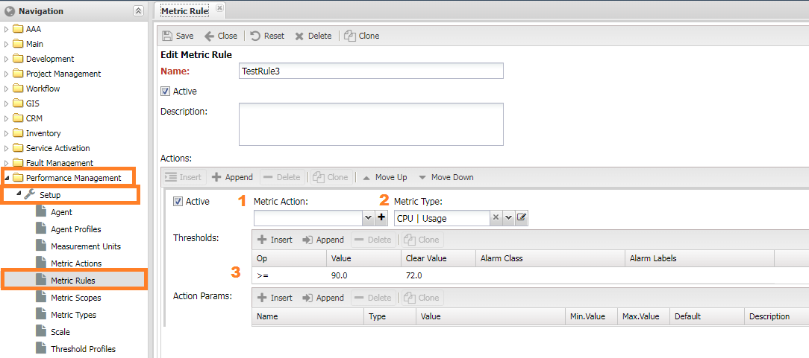

При задании *преобразования* (`Metric Action`) *тип метрики* (`Metric Type`) не учитывается и пороги применяются к
 результату преобразования. Для изменения *важности аварии* (`severity`) необходимо использовать метки (`Labels`)
 в соответствии с правилами (`Alarm Rules`).

>> Пример

### Metric Action

Для сложных манипуляций с метрикой предусмотрен `MetricAction`, он позволяет:

* Использование окна
* Применение функций
* Расчёт значение метрики через формулы

Находятся в `Управление производительностью -> Настройки -> Манипуляции с метрикой (Performance Management -> Setup -> Metric Action)`.
 Процесс обработки метрики выглядит следующим образом:

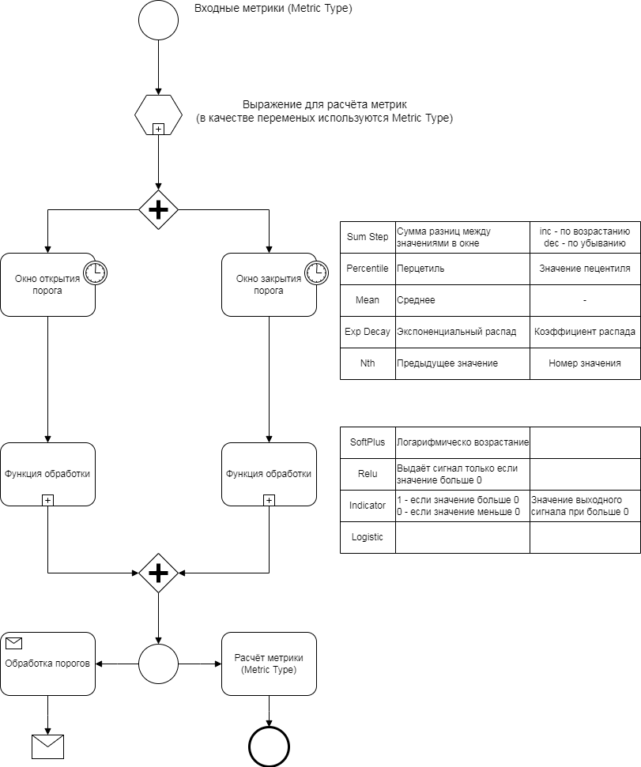


Метрики обозначенны в **(2)** `Input` поступают на обоработку. Отключённые этапы пропускаются:

* **(3,4)** **Activation/Deactivation Window** - оконные функции для значения. Настройки:
    * Оконная функция (`Window Function`) и её параметры
        * `Sum Step`
        * `Percentile`
        * `Mean`
        * `Exp decay`
        * `Nth`
    * Тип окна (`Window Type`) - принцип определения размера окна
        * `Tick` - число значений в окне
        * `Seconds` - время первого значения
    * `Min Window` - минимальный размер окна, при котором начнётся расчёт оконной функции. При `Tick` - число измерений, при `Seconds` - секунды с крайнего значения
    * `Max Window` - максмимальный размер окна, значения выше него удаляются.
    * Параметры оконной функции (зависят от выбранной функции)
* **Activation/Deactivation function** - функция [активации](https://en.wikipedia.org/wiki/Activation_function), на вход принимают значение метрики, на выходе единица или ноль
    * `SoftPlus`
    * `Relu`, `Rectifier` 
    * `Indicator`
    * `Logistic`
* **Compose Metric** - отправить метрику в базу, необходим заполненный `MetricType`
* **Alarm** - Поднять аварию, необходим заполненный `Alarm Class`

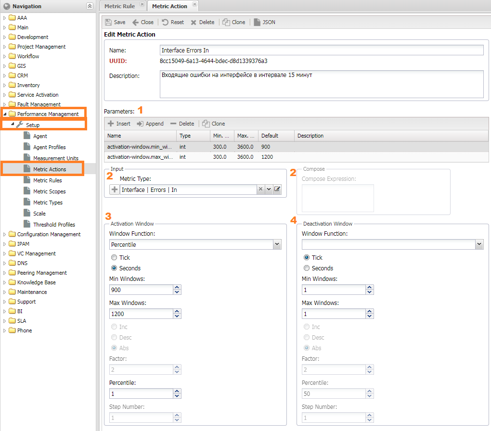


## Добавление своих метрик

Добавление новой метрики проходит в 2 шага:

1. Добавление в систему имени метрики [Metric Type](../metrics-reference/index.md)
2. Добавление сбора метрики в профиле [SA Profile](../profiles-reference/index.md)

!!! note

    Для случая когда имя метрики уже есть (н-р `CPU | Usage`), а сбор не реализован необходимо поправить профиль


### Добавление имени метрики (Metric Type)

Имя метрик (`Metric Type`) добавляется в меню `Управление производительностью -> Настройки -> Тип метрики (Performance Management -> Setup -> Metric Types)`.
 Для создания необходимо заполнить следующие настройки:

* **Пространство метрик** (`Metric Scope`) - таблица с метрикой. 
* **Имя колонки** (`Field Name`) - имя колонки с метрикой в таблице `Metric Scope`
* **Тип значения** (`Field Type`) - тип колонки с метрикой в таблице `Metric Scope`
* **Единица измерения** (`Measurement Units`)
    * *Единица измерения* (`Metric Measurement Units`) - единица измерения метрики (по умолчанию - `Scalar`)
    * *Множитель* (`Meric Scale`) - множитель для единицы измерения. По умолчанию - `1`
* **Расчётное выражение** (`Compose Expression`) - настройки расчётных метрик
    * *Метрики* (`Input`)
    * *Выражение* (`Expression`)
* **Delta Value** - Преобразование значения в `Delta` разница межда текущим и последним значениями

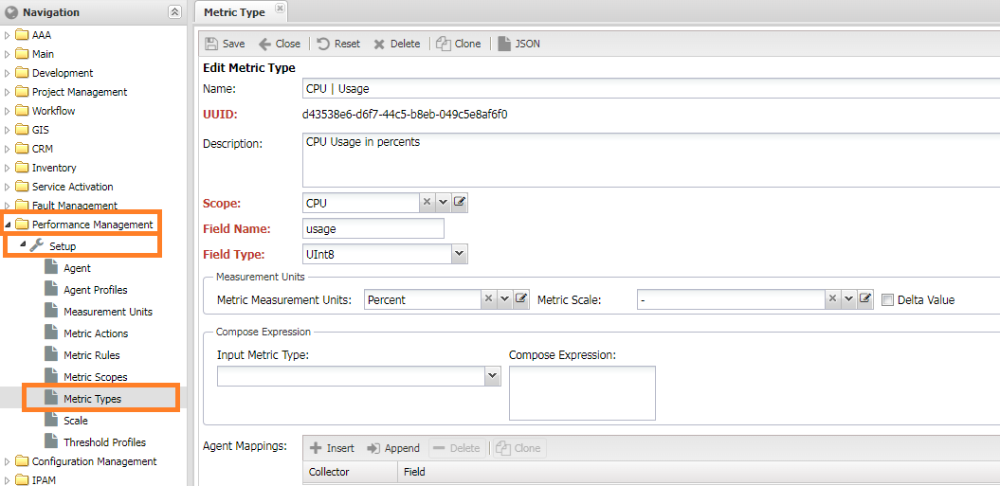

!!! attention

    После добавления MetricType необходим перезапуск сервиса `Меtric Type`


### Реализация сбора в профиле

Есть 2 пути для добавления метрики в профиль:

* Добавить конфигурацию для сбора: находится в папке `snmp_metrics`
* Описать функцию для сбора в скрипте `get_metris` профиля

Подробнее каждый из них описан в документе.


## Отладка сбора метрик (или Что-то пошло не так)

Процесс сбора метрик можно представить следующей схемой: `Настройки -> Опрос (Discovery) -> Activator -> Metrics -> Chwriter -> Grafana`.
 Конечным результатом можно считать отображением метрики на дашборде [Графаны](index.md#Grafana).
 Сигналом о каких-то сбоях при сборе метрик является отсутствие графиков либо панелей с графиками.

!!! attention

    График Ping/RTT можно не учитывать, поскольку он формируется отдельно (пингером)

Можно рассмотреть 2 ситуации:

1. Панели с графиками есть, но на них написано `No data`
2. Панели с графиками отсутствуют

### Отсутствие панелей с графиками

При добавлении метрики в профиле объектов (`Object Profile`) панель с графиком автоматически добавляется панель с графиком метрики.
 На графики по интерфейсам выводятся только метрики загрузки и статуса, метрики по пакетам и `DOM` доступны в отдельном дашборде.

Отсутствие панели с графиками для интерфейса обозначает что в настройках профиля интерфейса (`Interface Profile`) отключён сбор метрик.


### Отсутствуют данные по графикам

Если панель присутствует, но график не рисуется (надпись `No data`) значит есть ошибка при сборе данных.
 Для выяснения причин имеет смысл пройти по этапам сбора метрик и проверить корректность работы.


#### Проверка сбора метрик

За сбор метрик отвечает опрос (`Discovery`), его лог доступен на форме проблемного устройства: `Управление объектами -> Список объектов -> <объект> -> Опрос -> Interval (Service Activation -> ManagedObject -> Discovery -> interval)`. В логе должны присутствовать строки `Collected metrics: 25` с актуальным временем (не выше интервала сбора), где **25** - число собранных метрик с устройства. Если число метрик больше 0, значит сбор работает корретно и ошибка может быть на следующем этапе.

Если число метрик 0, либо запись отсутствует необходимо проверить доступ до оборудования и правильность выставленных настроек.
 Дополнительную информацию могут представить следущие записи в логе:

* `|metrics]  Collecting metrics` говорит о запуске запроса метрик с оборудования. Если строчка отсутствует необходимо активировать сбор метрик в *профиле объекта* (`ManagedObject Profile`), см главу *Настройка метрик*
* `|metrics]  No metrics found` в логе, говорит о том, что метрики не были считаны с устройства. Переходим к пункту проверки доступа до устройства
* `|metrics]  Interface metrics are not configured. Skipping` - необходимо проверить назначены ли метрики на *профиль интерфейсов* (`Inventory` -> `Setup` -> `Interface Profile`) и привязку профилей к интерфейсам (`ManagedObject` -> `Interfaces`)
* `|metrics]  SLA not configured, skipping SLA metrics` - для случая сбора метрик по `SLA`. Необходимо проверить настройки сбора `SLA` метрик (см. пункт)

!!! note

    Дополнительную информацию по работе опроса можно получить запустив его в режиме отладки `./noc discovery --debug run interval MONAME`. В конце вывода отобразятся собранные метрики

##### Проверка доступа до устройства

Для сбора метрик к устройство должно успешно опроситься системой: собраться версия, платформа и интерфейсы (`Interfaces`).
 Для интерфейсов должны собраться индексы (`ifindex`), также должна быть активна поддержка `SNMP` проверить это можно
  через соответствующие пункты меню:

1. Диангностики `CLI/SNMP` - они должны быть в нормальном состоянии (зелёном).
2. Возможности (`Capabilities`) - расположены снизу формы `ManagedObject`, выглядеть она должна как показано
 на скриншоте (зелёные галочки напротив `SNMP`, `SNMP | v1` или `SNMP | v2`)
3. Собранные интерфейсы с индексами. Проверить можно на вкладке *Интерфейсы* (`Interfaces`).

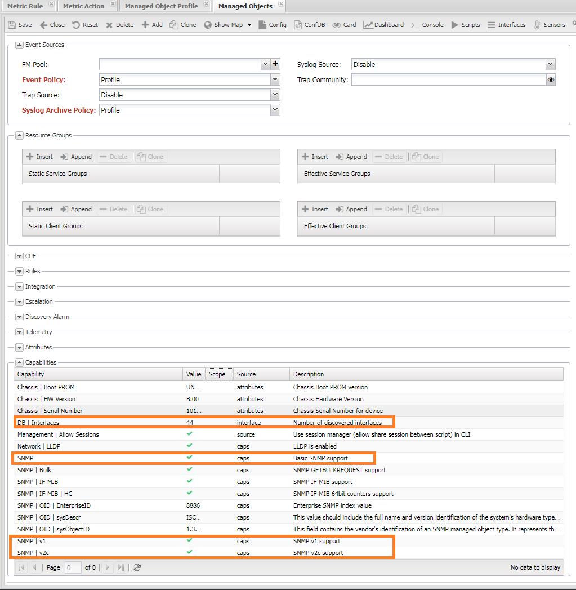

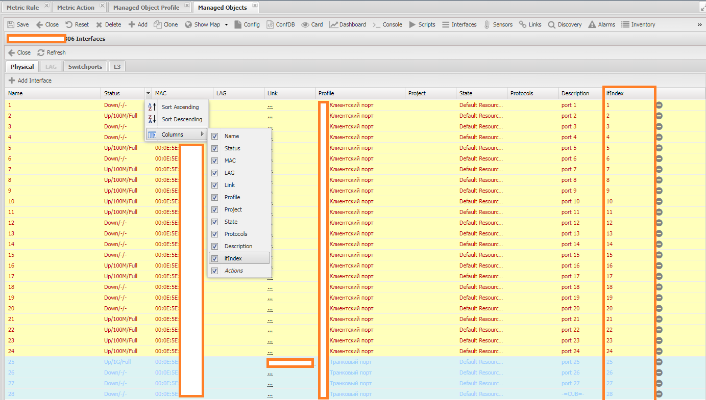

#### Проверка сервиса метрик (Metrics)

Проверить работоспособность сервиса метрик (`Metrics`) можно через лог: `/var/log/noc/metrics-0*.log`.
 В рабочем сервисе будут записи вида: `[noc.services.metrics.changelog] Compacted to 8 records (90459568 bytes). 0.06 ratio`.

Записи вида `All slots a busy, waiting` показывают, что сервис находится в ожидании свободных `слотов`,
 если она присутсвтует во всех запущенных сервисах, значит необходимо проверить настройку числа сервисов в башне.

#### Проверка записи метрик в базу (CHWriter)

Для проверки поступления метрик в логе *chwriter* (`/var/log/noc/chwriter-00.log`) должны присутствовать записи:

```
2023-04-23 18:58:36,676 [chwriter] [object] Sending 3 records
2023-04-23 18:58:36,679 [chwriter] [object] 3 records sent in 2.85ms
2023-04-23 18:58:38,663 [chwriter] [interface] Sending 98 records
2023-04-23 18:58:38,675 [chwriter] [interface] 98 records sent in 12.26ms
```

Если среди них есть строчки с ошибками `2023-04-23 07:09:36,847 [chwriter] [reboots] Failed to write records`,
 то необходимо провести повторную миграцию схемы.

### Разное

Возможно разное. Если проверки выше ничего не дали, а метрики по прежнему отсутствуют за помощью можно обратиться на трекер проекта или в группу. 

