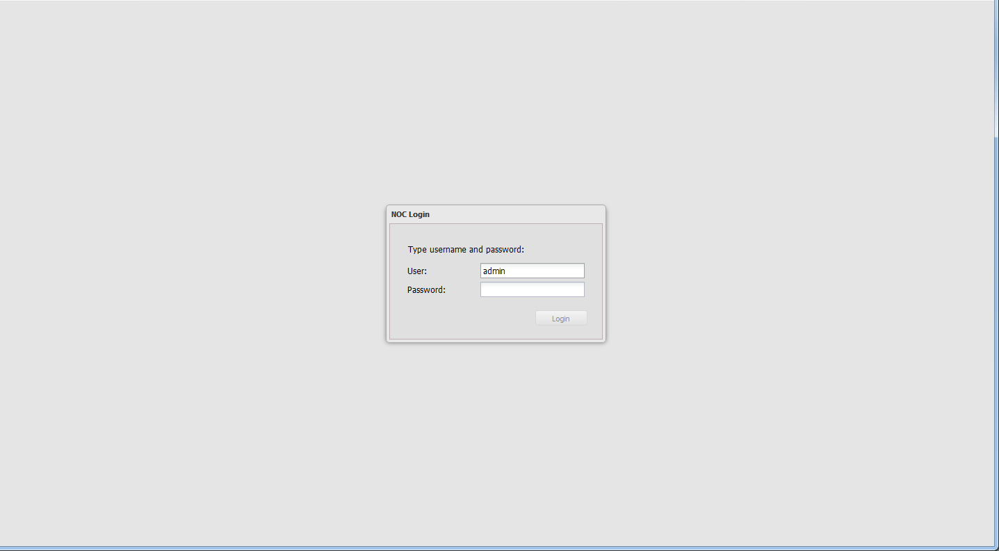
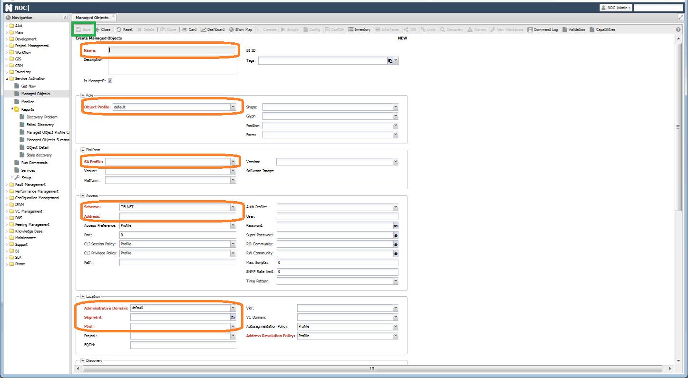

# Quick Start

NOC is a system for collecting network information and monitoring. Originally created as a tool for automating equipment management, it has grown to include modules for collecting information, monitoring, and working with metrics. Despite the complexity of operation and numerous settings, NOC offers advantages through its "Everything about the network in one place" approach.

Since it was developed from the beginning for network operation, many concepts and terminology are taken from it. To better understand the subject matter, we need to explain a few terms:

* [**ManagedObject**](../concepts/managed-object/index.md) (`Network Device`, `Managed Device`) - any equipment accessible via an IP address.
* **Pool** (`Pool`) - when working with devices that have the same IP address, they can be placed in different pools. Each pool has its own set of processes, which allows you to keep devices separate from each other.
* **Interfaces** (`Interfaces`, `Ports`) - hardware components designed for communication via links. In NOC, they exist separately from the devices, allowing you to work with them as an independent part of the system.
* **Links** (`Link`) - used to connect interfaces to each other. NOC supports `L2` topology, so links can only be established between physical ports.
* [**SA Profile**](../concepts/sa-profile/index.md) (or simply `Profile`, `Equipment Adapter`) - a set of scripts and equipment configuration settings. Included in the system's main code. Their combination determines how the system collects information from the device.
* **Profiles** (`Profiles`, `Group Settings`) - Most settings in the system are placed in profiles. This allows you to manage groups of similar objects through profiles, instead of configuring each device or interface individually. Examples of profiles include:
    * [**ManagedObject Profile**](../concepts/managed-object-profile/index.md)
    * [**Interface Profile**](../concepts/interface-profile/index.md)
    * [**NetworkSegment Profile**](../concepts/network-segment-profile/index.md)
* **Capabilities** (`Caps`, `Features`) - record additional knowledge about equipment (its capabilities). For example, whether `SNMP` is supported and which version. Included protocols, and so on.
* [**NetworkSegment**](../concepts/network-segment/index.md) (`Network Segment`) - a way of topologically grouping equipment. The segment's layout is displayed on the segment diagram, and it determines the upward direction.
* [**AdministrativeDomain**](../concepts/administrative-domain/index.md) (`Administrative Domain`) - used to separate access rights to equipment.
* [**Discovery**](../discovery-reference/index.md) - the procedure for collecting information from equipment using profile scripts (`SA Profile`).

## User Interface

The web interface of the system is accessible via the IP address `https://<installed_ip>`. The login credentials are as follows: username - **admin**, password - **admin**.

After logging in, you will see the main interface of the system, which consists of the following parts (highlighted by the green border in the image):
1) Navigation Panel
2) Window Header
3) Workspace

The navigation is structured as follows:
* `<System Component>`
    * `<Base Application>` - located at the root of the component and usually represents the core functionality.
    * `<Settings>` (number 3) - contains various settings.
    * `<Reports>` (number 2) - various reports are organized in this section and divided into categories:
        * `Summary` (number 5) - typically a table displaying aggregated data about the system.
        * `Details` (number 6) - data export in `Excel/CSV` format.
        * `Report` (number 4) - an `HTML` table with data corresponding to the report's title.

The top-level navigation includes the system's basic modules:
* **AAA** - user and group settings
* **Main** - system settings that do not fit into a separate section
* **Project Management** - project creation
* **Workflow** - creation and editing of workflows for system elements
* **Inventory** - inventory information about equipment, segments, and interfaces
* **Service Activation** - device addition and polling configuration
* **Fault Management** - working with faults and events
* **Performance Management** - adding/removing new metrics to the system
* **Configuration Management** - configuration validation settings for devices
* **IPAM** and **DNS** - IP address space management
* **VC Management** - VLAN management
* **Maintenance** - maintenance configuration
* **Phone** - phone number tracking

On the second level, you can access applications within each module:
* `AAA` -> `Setup`
    * **Users** - system users
    * **Groups** - user groups
* `Inventory`
    * **Mac DB** - MAC address database
    * **Network Map** - segment diagram
* `Service Activation`
    * **Managed Object** - list of devices (equipment)
    * **Run Commands** - running commands on devices (equipment)
* `Fault Management`
    * **Alarms** - list of alarms
* `IPAM`
    * **Assigned Address** - IPAM database
    * **VRF** - 

## Adding a Device

The primary application for working with devices is [**Managed Object**](../concepts/managed-object/index.md) (`Service Activation` -> `Managed Object`). The initial page displays a table `(3)`, with a filter panel on the right `(2)`. At the top of the screen, there is a search bar `(1)`.

To add a device, click the **Add** button (5), which opens an addition form. The required fields for completion are:

* **Name** - the device's name (must be unique)
* [**Object Profile**](../concepts/managed-object-profile/index.md) - polling settings. By default, it is set to `default`.
* [**SA Profile**](../concepts/sa-profile/index.md) - Profile for working with the device. By default, `Generic.Host` is used, but you need to set a more suitable profile that corresponds to the device's operating system.
* **Scheme** - the protocol for accessing the device. By default, `TELNET` is selected. Options include `SSH/HTTP/HTTPS`.
* **Address** - the device's IP address.
* [**Administrative Domain**](../concepts/administrative-domain/index.md) - the administrative domain. By default, it is set to `default`.
* [**Segment**](../concepts/network-segment/index.md) - the network segment where the device is located. By default, it is set to `ALL`.
* [**Pool**](../concepts/pool/index.md) - configured during installation, devices will be polled from it.
* **Address Resolution Policy** - used if the device has a dynamic IP address. When activated (`Enable`), fill in the `FQDN` field with the device's domain name (it must resolve from the system's host).

The fields `User`, `Password`, `Super Password`, and `RO Community` are not mandatory but are necessary for working with equipment via `CLI` (`User` and `Password`) and/or `SNMP` (`RO Community`). The **Auth Profile** is used for grouping identical access settings and is created in `Service Activation` -> `Setup` -> `Auth Profile`.

!!! note
    When the `Auth Profile` field is filled, individual settings are **ignored** on the device.

In the **Event Sources** section, settings for receiving `SNMP Trap`/`Syslog` from the equipment are located. If necessary, switch the `Event Policy` to `Disabled`.

!!! note
    The `Vendor`, `Platform`, and `Version` settings will be filled during polling.

The remaining settings can be left as default. If everything is filled in correctly, the `Save` button is activated in the top toolbar of the form.

Upon success, a line with the added device will appear in the device list. Remember that adding a device does not imply polling of the device. It will need to be configured separately in `ManagedObjectProfile`.

!!! note
    In the list of pools, you may encounter `P0001`. It is created during migration from older system versions, and for the device to work, you need to replace it with the working pool (usually, `default`).

### Mass Device Entry

Adding devices through the web interface works well when there are only a few. To add a large number of devices, you can use CSV import. It is located in the menu `Main` -> `Setup` -> `CSV Export/Import`. In the list, you need to select `sa.ManagedObject` and click `Export`. You will get a file with a list of all devices in the system. For importing, you need to keep the following columns in this file:

* **name**
* **is_managed**
* **administrative_domain**
* **segment**
* **pool**
* **profile**
* **object_profile**
* **address**
* **user**
* **password**
* **super_password**
* **trap_source_type**
* **syslog_source_type**
* **snmp_ro**

## Enabling Polling

In the device addition form, you specified the [**Object Profile**](../concepts/managed-object-profile/index.md). This is the main element for configuring the polling schedule and composition (`Discovery`). Usually, several profiles are created for groups of devices with different settings. Afterward, you assign them in the device form (`Managed Object`).

Go to `Service Activation` -> `Setup` -> `Managed Object Profile`. After installation, only one profile is available in the list - `default`.

!!! note
    When adding a new device profile, on the `Common` tab, set `Address Resolution Policy` to `Disabled`, or else the save button won't be activated.

Inside the form, it is divided into tabs by setting groups. The main ones are:

* [**Common**](../concepts/managed-object-profile/index.md#common)
* [**Ping Check**](../concepts/managed-object-profile/index.md#ping-) - settings for availability checks (via `ICMP`)
* [**Box discovery**](../concepts/managed-object-profile/index.md#box-) - settings for full discovery
* [**Periodic Discovery**](../concepts/managed-object-profile/index.md#periodic-) - settings for periodic polling (metrics and interface statuses)
* [**Metrics**](../concepts/managed-object-profile/index.md#metrics) - metrics collected from the device
* [**Config**](../concepts/managed-object-profile/index.md#config-) - settings for working with device configuration (text config)

Availability checks are activated on the **Ping Check** tab with the **Enable** checkbox. On this tab, you can also configure the interval and parameters of the sent `ICMP` packet. There are 2 policies for determining *recovery* of availability:

* `First Success` - considered available if the first packet in a series is returned.
* `All Success` - considered available if all packets in the series are returned.

Settings for collecting information from the equipment are configured on the **Box** tab. To enable, just check the **Enable** checkbox and check the required types of polling in the `Box` section:

* **Profile** - NOC will attempt to determine the device's **Profile**. Determination works via `SNMP` based on rules from `Service Activation` -> `Setup` -> `Profile Check Rules`.
* **Version** - collects the manufacturer (`Vendor`), platform (`Platform`), and version (`Version`) of the device. Optionally, you can add `image` and `Serial Number`.
* **Caps** - tests which functionality is currently working on the device, all of this is entered in `Capabilities`. You can see them in the device form's `Capabilities` menu. Testing includes `SNMP` and various protocols.
* **Interface** - collects ports (interfaces).
* **ID** - collects the chassis's `MAC` and `hostname` (for topology construction).
* **Config** - collects device configuration.
* **Asset** - collects inventory information (chassis, boards, modules).
* **VLAN** - populates the VLAN database from the equipment (appears in the `VC Management` -> `Vlan` menu).
* **MAC** - collects the MAC address table (accessible in `Inventory` -> `MacDB`).
* **Metrics** - collects configured metrics.

The **Topology** section includes polling neighbors from the device to collect topology. More on this later.

The **IPAM** section includes collecting address information from the device and synchronizing it with `IPAM`. It is displayed in the `IPAM` -> `Assigned Address` section.

**Housekeeping** allows you to expand collection with a custom Python handler.

When **Discovery Alarm** is activated, faults are created in `Fault Management` in case of polling errors.

After pressing `Save`, tasks (`Job`) will be created to poll the equipment according to the specified interval.

The outcome of the execution can be judged by the logs. They are available in the `Discovery` section of the device form (`Service Activation` -> `ManagedObject` -> `<device>` ->

## Configuring Metric Collection

In addition to enabling metric polling, you need to specify the list of collected metrics. You can divide metric configuration into several types:

* **Device Metrics**: Configured on the [`Metrics`](../concepts/managed-object-profile/index.md#metrics) tab (`Service Activation` -> `Setup` -> `ManagedObjectProfile`).
* **Interface Metrics**: Require collected interfaces (as part of `Interface Discovery`) and are configured in the interface profile [`Interface Profile`](../concepts/interface-profile/index.md) `Inventory` -> `Setup` -> `Interface Profile`. Interface metric names start with `Interface`.
* **SLA Metrics**: Similar to interface metrics, they require collected `SLA` probes from the device (as part of `SLA Discovery`).

!!! note
    If you assign interface metrics to the object, they will not be collected (and vice versa).

For example, settings for collecting device CPU and memory usage will look like this (image).

Settings for collecting interface utilization and packet counts (`Inventory` -> `Setup` -> `Interface Profile` -> `<interface_profile>`):

Since metrics are collected via SNMP, the device must have an `RO Community` configured, and its functionality must be successfully verified by the system (as part of `Caps Discovery`). You can check this in the `Capabilities` section of the device form (`Service Activation` -> `ManagedObject` -> `<device>`).

Also, to collect **interface metrics** from the device, the interfaces must be indexed with `ifindex`. You can verify this in the `Interfaces` section on the device form by enabling the `ifindex` column.

When metrics are successfully obtained, the discovery log will show a line like `[discovery|periodic|sw11|metrics] Spooling 154 metrics`, indicating that the metrics have been sent for database storage. Device graphs are available in the `Graphs` menu (`Dashboard`).

## Topology

In NOC, besides manual link creation, automatic `L2` link discovery is supported when supported by a device using a specific neighbor discovery protocol. Each protocol corresponds to its own method of discovery from the polling side. The complete list of supported methods can be found in the `Topology` section (`Service Activation` -> `Setup` -> `Managed Object Profile` -> `<managed_object_profile>` -> `Box`). The actual supported methods depend on the device model and its implementation in the profile.

To collect topology information from a device, you need to:

* Enable [`Caps Discovery`](../discovery-reference/box/caps.md) to determine the supported link discovery methods by the device.
* Enable [`ID Discovery`](../discovery-reference/box/id.md) to collect `Chassis MAC` and `hostname`. These are used as neighbor references in neighbor lists.
* In the `Topology` section, enable the methods for link discovery (you can enable all, but only available methods will work).

During polling, NOC will identify the available methods and collect neighbors from the device. Then, it will sequentially access each neighbor and verify whether the original device is present among its neighbors. If confirmed, a link is established, and a log entry is created.

You can view device links in the `Links` menu on the device form (`ManagedObject`). They will also appear on the segment map in the `Show Map` menu.

!!! note
    To create a link, access to the devices on both ends is required.

## Alarms

After enabling [`Ping Check`](../concepts/managed-object-profile/index.md#ping-) in the `Managed Object Profile`, NOC starts pinging devices and generates alarms in case of unavailability. Alarms can be viewed in `Fault Management` -> `Alarms`.

To receive `Syslog/SNMP Trap`, you need to configure the message sending address. This is done in the device form under `Syslog Source/Trap Source`. Several options are available:

* `Management Address` - Device messages come from the address specified in the `Address` field in the form.
* `Specify Address` - Device messages come from the address specified in the field below.
* `Loopback Address` - Device messages come from the `Loopback` address (requires filled `Interface` fields for the device).
* `All interface addresses` - All available addresses on the device, including those collected during `Interface Discovery`.

Configuring the [**Syslog Archive Policy**](../concepts/managed-object-profile/index.md#fm) enables the sending of raw Syslog messages to the database. They are available for searching in the `BI` interface.

## Reports, Graphs
