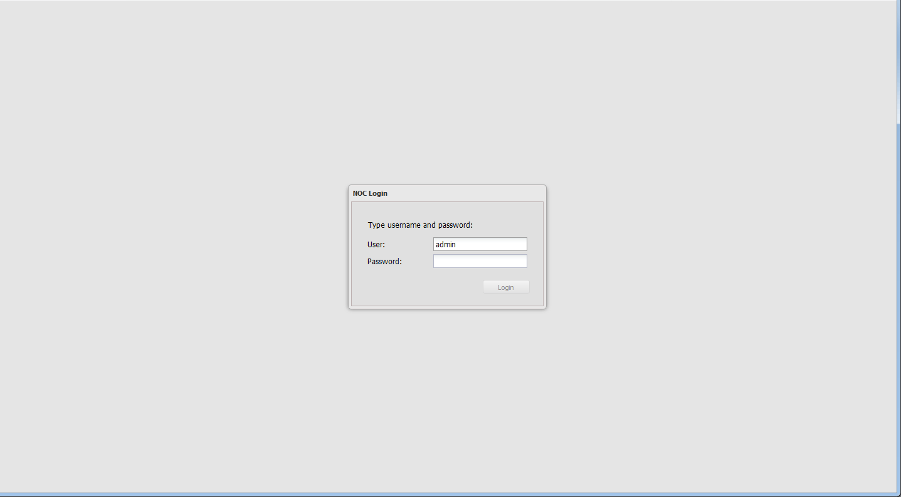
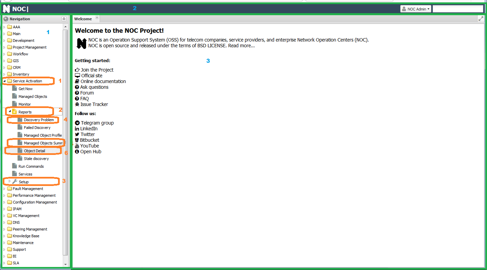
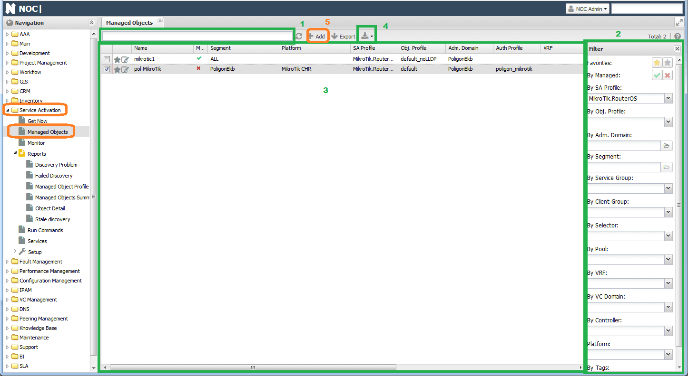
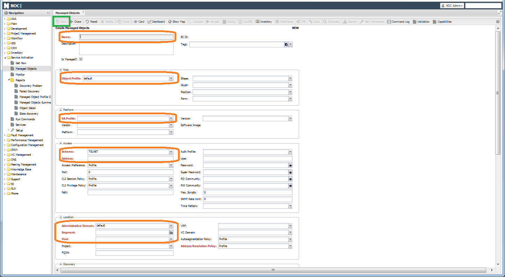
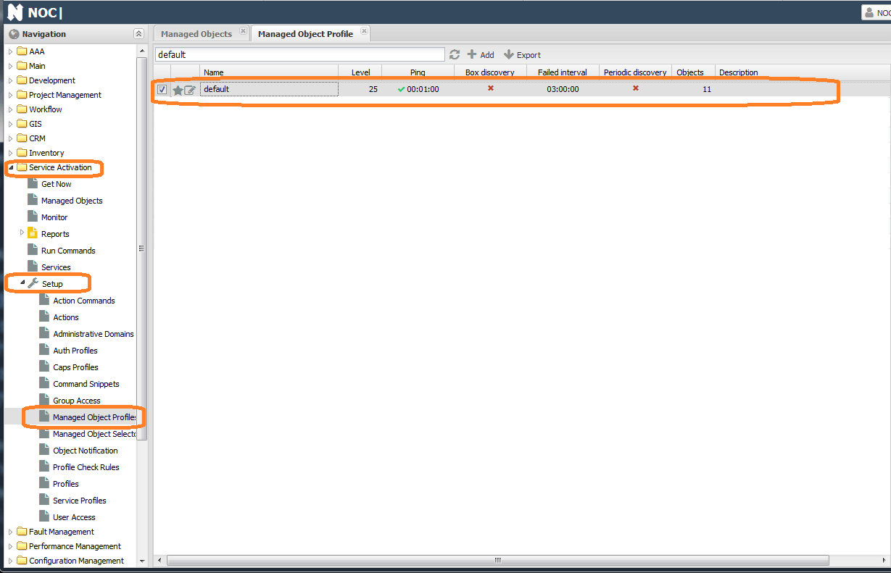
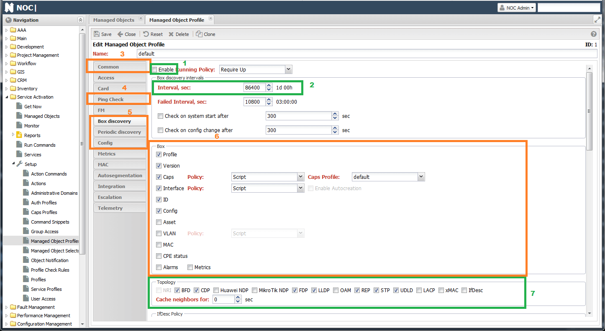

# Quick Start

NOC -- система для сбора информации и мониторинга сети. Изначально был создан как инструмент автоматизации работы с оборудованием, впоследствии прирастал модулями сбора информации, мониторинга и работы с метриками. Хотя издержками являются сложность в эксплуатации и многочисленность настроек, NOC, тем не менее, обладает своими преимуществами благодаря подходу `Всё о сети в одном месте`.

Поскольку с самого начала разрабатывался для эксплуатации сети, многие концепции и терминология взяты из неё. Поэтому для лучшего понимания, о чём идёт речь, необходимо пояснить несколько терминов:

* [**ManagedObject**](../concepts/managed-object/index.md) (`Сетевое устройство`, `Управляемое устройство`) любое оборудование доступное по IP адресу.
* [Пул **Pool**](../concepts/pool/index.md) - при необходимости работы с устройствами, имеющими одинаковые IP адреса, можно разместить их в разных пулах. У каждого пула отдельный набор процессов, что позволяет не смешивать устройства друг с другом.
* [Сетевые интерфейсы **Interfaces**](../concepts/interface/index.md) (`Интерфейсы`, `Порты`) - компоненты оборудования, предназначенные для связи посредством линков. В NOCе живут отдельно от устройств, что позволяет работать с ними как с самостоятельной частью системы.
* Линки **Link** (`Линки`, `Связи`) - используются для связи интерфейсов друг с другом. NOC поддерживает `L2` топологию, поэтому связи могут устанавливаться только между физическими портами.
* [**SA Profile**](../concepts/sa-profile/index.md) (или просто `Профиль`, `Адаптер оборудования`) - набор скриптов и настроек работы с оборудованием. Включены в основной код системы. Именно их набор определяет, каким способом система собирает информацию с устройства.
* **Profiles** (`Профили`, `групповые настройки`) - Большинство настроек в системе вынесено в профили. Это позволяет не настраивать каждое устройство или интерфейс индивидуально, а управлять группами сходных объектов через профили. Примеры профилей
    * [**ManagedObject Profile**](../concepts/managed-object-profile/index.md)
    * [**Interface Profile**](../concepts/interface-profile/index.md)
    * [**NetworkSegment Profile**](../concepts/network-segment-profile/index.md)
* **Capabilities** (`Caps`, `Капсы`, `Возможности`) - фиксируют дополнительные знания об оборудовании (его возможности). Например, поддерживается ли `SNMP` и какой версии. Включённые протоколы и т.д.
* [**NetworkSegment**](../concepts/network-segment/index.md) (`Сетевой сегмент`) - способ топологической группировки оборудования. По нему же отображается схема сегмента и строится направление вверх.
* [**AdministrativeDomain**](../concepts/administrative-domain/index.md) (`Зона ответственности`) - используется для разделения прав доступа на оборудование.
* [**Discovery**](../discovery-reference/index.md) (`Опрос`) - процедура забора информации с оборудования при помощи скриптов профиля  (`SA Profile`).

## Пользовательский интерфейс

Веб интерфейс системы доступен по IP адресу `https://<installed_ip>`. Реквизиты для входа: пользователь - **admin**, пароль - **admin**.

После входа мы видим основной интерфейс системы, состоящий из следующих частей (зелёная рамка на картинке):
1) Панель навигации
2) Заголовок окна
3) Рабочая область

Навигация представляет собой следующую структуру:
* `<Компонент системы>`
    * `<Базовое приложение>` - находится в корне компонента и обычно представляет собой основной функционал
    * `<Настройки>` (цифра 3) - расположены многочисленные настройки.
    * `<Отчёты>` (цифра 2) - в этом разделе расположены различные отчёты, разделённые на виды:
        * `Сводка` (`Summary`) (цифра 5) - обычно это таблица отображающая агрегированные данные по системе
        * `Детализация` (цифра 6) - выгрузка `Excel/CSV` файла с данными
        * `Отчёт` (цифра 4) - `HTML` табличка с данными по заголовку пункта

Верхний уровень навигации - это базовые модули системы:
* **AAA** - настройки пользователей и групп
* **Main** - настройки системы, не попавшие в отдельный раздел
* **Project Management** - Добавление проектов
* **Workflow** - создание и редактирование `Workflow` для элементов системы
* **Inventory** - инвентарная информация по оборудованию, сегменты, интерфейсы
* **Service Activation** - добавление устройств и настройка опроса
* **Fault Management** - работа с авариями и событиями
* **Performance Management** - добавление/удаление новых метрик в систему
* **Configuration Management** - настройки валидации конфигурации устройств
* **IPAM** и **DNS** - управление адресным пространством
* **VC Management** - работа с Вланами
* **Maintenance** - настройка ремонтно-наладочных работ
* **Phone** - учёт телефонных номеров

На втором уровне доступны приложения:
* `AAA` -> `Setup`
    * **Users** - пользователи системы
    * **Groups** - группы пользователей
* `Inventory`
    * **Mac DB** - база данных MAC адресов
    * **Network Map** - схема сегмента
* `Service Activation`
    * **Managed Object** - список устройств (оборудования)
    * **Run Commands** - запуск команд на устройствах (оборудовании)
* `Fault Management`
    * **Alarms** - список аварий
* `IPAM`
    * **Assigned Address** - база IPAM
    * **VRF** - 

## Добавление устройства

Основные приложение для работы с устройствами [**ManagedObject**](../concepts/managed-object/index.md) (`Service Activation` -> `ManagedObject`). Начальная страница представляет собой таблицу `(3)`, в правой части расположена панель фильтров `(2)`. А сверху экрана строка поиска `(1)`.

Для добавления устройства необходимо нажать кнопку **Add** (`Добавить`) (5), откроется форма для добавления. Обязательными для заполнения полями являются:

* **Name** - имя устройства (должно быть уникальным)
* [**ObjectProfile**](../concepts/managed-object-profile/index.md) - настройки опроса. По умолчанию выставлен `default`
* [**SA Profile**](../concepts/sa-profile/index.md) - Профиль (`Profile`) для работы с устройством. По умолчанию используется `Generic.Host`, но для работы необходимо выставить более подходящий, соответствующий для ОС устройства.
* **Scheme** - протокол для доступа к устройству. По умолчанию выбран `TELNET`. Доступны `SSH/HTTP/HTTPS`
* **Address** - IP адрес устройства.
* [**Administrative Domain**](../concepts/administrative-domain/index.md) - подразделение. По умолчанию `default`
* [**Segment**](../concepts/network-segment/index.md) - сетевой сегмент, в котором расположено устройство. По умолчанию `ALL`.
* [**Pool**](../concepts/pool/index.md) - настраивается при установке, из него будут опрашиваться устройства
* **Address Resolution Policy** - используется если у устройства динамический IP адрес, при его активации (`Enable`) необходимо заполнить поле `FQDN` доменными именем устройства (оно должно резолвится с хоста системы).

Поля `User`, `Password`, `Super Password` и `RO Community` не являются обязательными, но их заполнение необходимо для работы с оборудованием по `CLI` (`User` и `Password`) и/или `SNMP` (`RO Community`). **Auth Profile** используется при необходимости группировки одинаковых настроек доступа и создаётся в `Service Activation` -> `Setup` -> `Auth Profile`

!!! note
    При заполненном поле `Auth Profile` на устройстве индивидуальные настройки **игнорируются**

В разделе **Event Sources** расположены настройки приёма `SNMP Trap`/`Syslog` с оборудования. При необходимости необходимо переключить `Event Policy` с `Disabled`.

!!! note
    Настройки `Vendor`, `Platform`, `Version` заполнятся в ходе опроса. 

Остальные настройки можно оставить по умолчаниию. Если всё заполнено верно активируется кнопка `Save` (`Сохранить`) на инструментальной панели вверху формы.

В случае успеха в списке устройств появится строчка с добавленным устройством. При этом надо помнить что добавление не подразумевает опрос устройства. Его необходимо будет настроить отдельно в `ManagedObjectProfile`

!!! note
    В списке пулов `Pool` можно встретить `P0001`. Он создаётся при миграции со старых версий системы, для работы устройства необходимо заменить его на рабочий (обычно, `default`)

### Массовое занесение устройств

Добавление устройств через веб-интерфейс хорошо работает когда их немного. Для внесения большого числа устройств поддерживается импорт из `csv`. Он находится в меню `Main` -> `Setup` -> `CSV Export/Import`. В списке необходимо выбрать `sa.ManagedObject` и нажать `Export`. Мы получим файл со списком всех устройств в системе. Для импорта в этом файле необходимо оставить столбцы:
* **name**
* **is_managed**
* **administrative_domain**
* **segment**
* **pool**
* **profile**
* **object_profile**
* **address**
* **user**
* **password**
* **super_password**
* **trap_source_type**
* **syslog_source_type**
* **snmp_ro**

## Включение опроса

В форме добавления устройства указывался [**Object Profile**](../concepts/managed-object-profile/index.md). Это основной элемент настройки расписания и состава опроса (`Discovery`). Обычно, их создаётся несколько для групп устройств с разными настройками. После чего назначается в форме устройства (`Managed Object`).

Заходим в `Service Activation` -> `Setup` -> `Managed Object Profile`, после установки в списке доступен один профиль - `default`

!!! note
    При добавлении нового профиля устройства на вкладке `Common` необходимо выставить `Address Resolution Policy` в `Disabled`, иначе не активируется кнопка сохранения

Внутри форма разделена на вкладки по группам настроек. Основные это:

* [**Common**](../concepts/managed-object-profile/index.md#common)
* [**Ping Check**](../concepts/managed-object-profile/index.md#ping-) - настройки проверки доступности (по `ICMP`)
* [**Box discovery**](../concepts/managed-object-profile/index.md#box-) - настройки полного опроса
* [**Periodic Discovery**](../concepts/managed-object-profile/index.md#periodic-) - настройки периодического опроса (метрики и статусы интерфейсов)
* [**Metrics**](../concepts/managed-object-profile/index.md#metrics) - собираемые с устройства метрики
* [**Config**](../concepts/managed-object-profile/index.md#config-) - настройки работы с конфигурацией (текстового конфига) устройства

Проверка доступности активируется на вкладке **Ping Check** галочкой **Enable**. На ней же настраивается интервал и параметры отправляемого `ICMP` пакета. Есть 2 политики определения *восстановления* доступности:

* `First Success` - считаем доступным, если вернулся первый пакет в серии
* `All Success` - считаем доступным, если вернулись все пакеты из серии

Настройки сбора информации с оборудования настраиваются на вкладке **Box**. Для включения достаточно отметить галочку **Enable** и в разделе `Box` проставить галочки требуемых видов опроса:

* **Profile** - NOC попытается определить **Profile** профиль устройства. Определение будет работать по `SNMP` на основе правил из пункта `Service Activation` -> `Setup` -> `Profile Check Rules`.
* **Version** - собираем производителя (`Vendor`), Платформу (`Platform`) и Версию (`Version`) устройства. Опционально можно добавить `image` и `Serial Number`
* **Caps** - тестирует, какой функционал работает в данный момент на устройстве, всё это заносится в `Capabilities` (возможности), их можно увидеть в меню `Capabilities` формы устройства. Реализована проверка `SNMP` и различных протоколов.
* **Interface** - собирает порты (интерфейсы)
* **ID** - собирает `MAC` шасси и `hostname` (для целей построения топологии)
* **Config** - сбор конфигурации оборудования
* **Asset** - собирает инвентарную информацию (шасси, платы, модули)
* **VLAN** - наполняет базу вланами с оборудования (появляются в меню `VC Management` -> `Vlan`)
* **MAC** - сбор таблицы `MAC`ов (просмотр доступен в `Inventory` -> `MacDB`)
* **Metrics** - включается сбор настроенных метрик

Раздел `Topology` включает опрос соседей с устройства для сбора топологии, о нём подробнее дальше.

Раздел `IPAM` включает сбор адресной информации с устройства и синхронизацию её с `IPAM`. Она отображается в разделе `IPAM` -> `Assigned Address`.

**Housekeeping** позволяет расширить сбор собственным обработчиком на `Python`.

При активированных **Discovery Alarm** при ошибках опроса в `Fault Management` заводятся аварии.

После нажатия `Save` будут созданы задачи (`Job`) на опрос оборудования в соотстветствии с указанным интервалом.

Об итоге выполнения можно судить по логам. Они доступны в пункте `Discovery` формы устройства (`Service Activation` -> `ManagedObject` -> `<устройство>` -> `Discovery` -> `box`). В строчке будет содержаться время выполнения опроса, а в правом окне его лог. Если всё прошло успешно, то можно увидеть заполненные поля `vendor`, `platform`, `version` в форме и заполненные меню `Interfaces` и `Capabilities`.

На вкладке [**Periodic Discovery**](../concepts/managed-object-profile/index.md#periodic-) включается сбор:
* [метрик (`Metrics`)](../discovery-reference/periodic/metrics.md). запрашиваются настроенные метрики
* [аптайма (`Uptime`)](../discovery-reference/periodic/uptime.md). Используется OID `sysUptime`, также фиксируются перезагрузки устройства (при переходе счётчика через 0)
* [статусов интерфейсов (`Interface status`)](../discovery-reference/periodic/interfacestatus.md).
* [`MAC`](../discovery-reference/periodic/mac.md) - сбор `MAC` адресов. 

!!! note
    Информация в рамках периодического опроса собирается по `SNMP`, кроме таблицы MAC адресов.

## Настройка сбора метрик

Помимо включения опроса `Metrics`, необходимо указать перечень собираемых метрик. По способу настройки метрики можно подразделить на несколько видов:
  * **Метрики устройства**. Добавляются во вкладке [`Metrics`](../concepts/managed-object-profile/index.md#metrics) (`Service Activation` -> `Setup` -> `ManagedObjectProfile`)
  * **Метрики интерфейсов**. Требуют собранных интерфейсов (в рамках `Interface Discovery`) и настраиваются в профиле интерфейсов [(`Interface Profile`)](../concepts/interface-profile/index.md) `Inventory` -> `Setup` -> `Interface Profile`. Названия интерфейсных метрик начинается с `Interface`
  * **Метрики SLA**. Аналогично для интерфейсов. Требуют для работы собранных с устройства `SLA` проб (в рамках `SLA Discovery`)

!!! note
    Если метрики интерфейса назначить в объекте, то собираться они не будут! (и наоборот)

Например, настройки для сбора загрузки процессора и памяти на устройстве будут выглядеть так: (картинка)

Настройки для сбора загрузки интерфейса и числа пакетов (`Inventory` -> `Setup` -> `Interface Profile` -> `<interface_profile>`):

Поскольку метрики собираются по `SNMP`, поэтому для устройства должен быть прописан `RO Comminuty` и его работоспособность должна быть успешно проверена системой (в рамках `Caps Discovery`). Это можно увидеть в разделе `Capabilities` формы устройства (`Service Activation` -> `ManagedObject` -> `<устройство>`)

Также для сбора **интерфейсных метрик** с устройства должны считаться интерфейсы с `ifindex`. В этом можно убедиться в разделе интерфейсы (`Interfaces`) на форме устройства, включив столбец `ifindex`.

При успешном получении метрик в логе опроса можно наблюдать строчку `[discovery|periodic|sw11|metrics]  Spooling 154 metrics`. Значит что метрики отправились для записи в базу. Графики по устройству доступны в меню `Графики` (`Dashboard`).

## Топология

В NOCе, помимо ручного, поддерживается автоматическое построение `L2` линков, при поддержке устройством одного из протоколов определения соседства. Со стороны опроса каждому протоколу соотвествует свой метод. Полный перечень поддерживаемых методов можно увидеть в разделе `Topology` (`Service Activation` -> `Setup` -> `Managed Object Profile` -> `<managed_object_profile>` -> `Box`). Фактически поддерживаемые методы зависят от модели устройства и реализации в его профиле.

Для сбора топологии с устройства необходимо:

* Включить [`Caps Discovery`](../discovery-reference/box/caps.md) для определения поддерживаемых устройством методов построения линков
* Включить [`ID Discovery`](../discovery-reference/box/id.md) для сбора `Chassis MAC` и `hostname`. Они используются как указатель соседа в списках соседей.
* В разделе `Topology` включить методы, для построения линков (можно включить все, работать будут только доступные).

В ходе опроса NOC определит доступные методы и соберёт соседей с устройства. Дальше он поочерёдно зайдёт на каждого соседа и посмотрит, есть ли в соседях исходное устройство. В случае подтверждения строится линк. В логе при этом появляется запись.

Линки устройства можно увидеть в меню `Links` формы устройства (`ManagedObject`). Также они появляются на схеме сегмента меню `Show Map`.

!!! note
    Для построения линка необходим доступ к устройствам с обоих его концов

## Аварии

После включения [`Ping Check`](../concepts/managed-object-profile/index.md#ping-) в `Managed Object Profile` NOC начинает пинговать устройства и по недоступности заводить аварии. Аварии можно увидеть в `Fault Management` -> `Alarms`.

Для приёма `Syslog/SNMP Trap` необходимо настроить адрес отправки сообщений. Это делается в форме устройства в пунктах `Syslog Source/Trap Source`, Доступно несколько вариантов:

* `Management Address` - сообщения устройства приходят с адреса, указанного в поле `Address` формы
* `Specify Address` - сообщения устройства приходят с адреса, указанного в поле ниже
* `Loopback Address` - сообщения устройства приходят с адреса `Loopback` (требуется заполненные интерфейсы `Interface` устройства)
* `All interface addresses` - все доступные адреса на устройстве (в том числе собранные в ходе `Interface Discovery`)

Настройка [**Syslog Archive Policy**](../concepts/managed-object-profile/index.md#fm) включает отправку сырых `raw` Syslog сообщений в базу. Они доступны для поиска в интерфейсе `BI`

## Отчёты, графики
