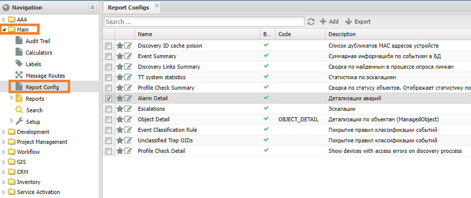
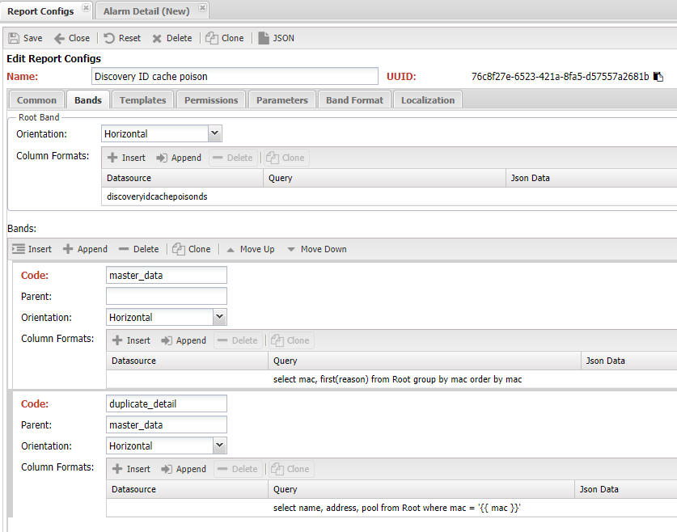
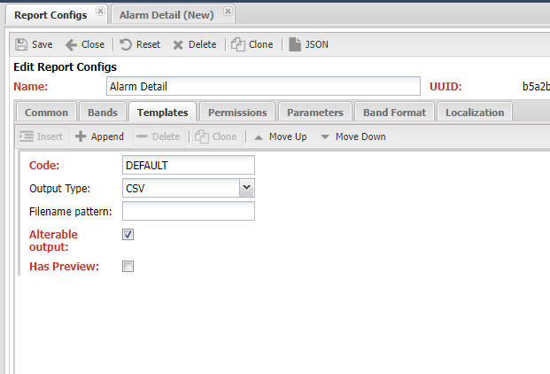
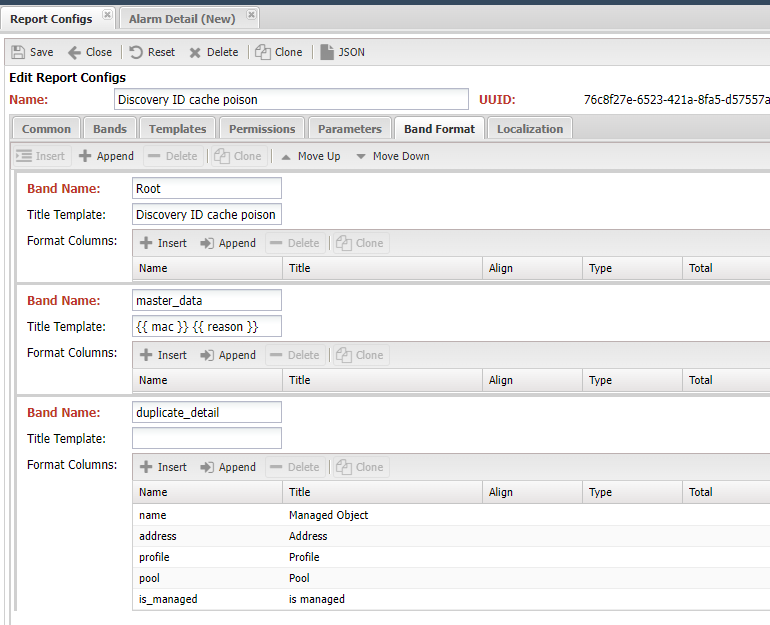
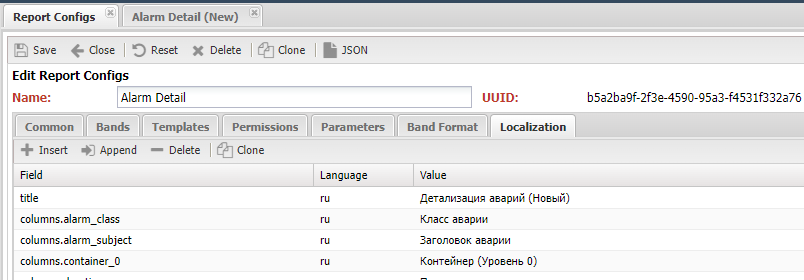
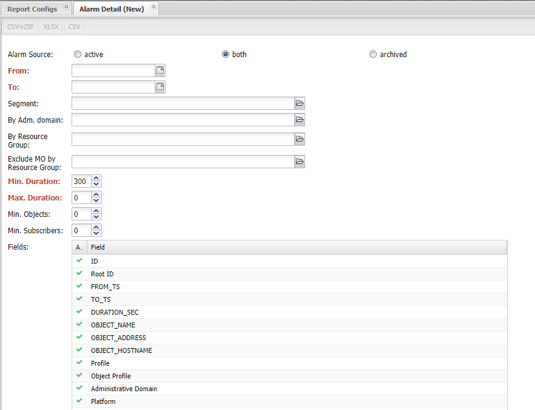

# Выполнение отчётов в НОКе

Отчёты являются основным инструментом для пользователей в работе с системой. Поскольку они позволяют добывать интересующую информацию из системы и представлять её в читаемом виде. Поэтому состав доступных отчётов и формирование новых хорошо характеризуют какого рода задачи могут быть решены системой.

В НОКе, исторически, отчёты являются частью сервиса `Web`, отвечающего за взаимодействие с пользователями. На текущий момент есть 2 вида отчётов:

* Простые отчёты (*SimpleReport*). Делаются на базе кода, расположенного в веб-приложении *Application* и формируют *HTML* страницу с данными
* На основе настроек (*Configured Report*) - отчёты на базе конфигурации, расположенной в `Основные (Main) -> Report Config`

Отчёты на основе настроек менее гибкие, чем `Simple Report`, но позволяют не писать код, если есть доступный источник (*Datasource*) для данных. Ниже будет идти речь именно о *Configured Report*, по Simple Report документация доступна [В разделе про web](../dev/web/index.ru.md#simplereport) .

## Структура отчёта

* **Отчётная область** (*Report Band*) - область документа, в которой размещаются данные для отчёта. Таких областей может быть несколько и они могут включать друг друга с некоторыми ограничениями. В рамках такой области доступны для использования данные отчёта
* **Родительская область** (*Parent Band*) - вышестоящая область
* **Root**  - имя корневой области отчёта, все остальные области так или иначе включены в неё.
* *header* - имя области, содержащей данные для формирования заголовка отчёта, *не печатается в случае табличного вывода*
* *Область данных* (*Data Band*) - данные для размещения в области отчёта. Содержит в себе **наборы данных** (*Data Set*) для вывода. При выводе отчёте, области с данными копируются в `Report Band`
* **Набор данных** (*DataSet*) области (*Band*). Содержит данные для вывода. Область может содержать несколько наборов данных. Один набор данных привязывается к одному `datasource`
* *Тип набора данных* (*Data Set Type*) 
* **Направление** (*Orientation*) - направление копирования области с данными (*Data Band*)
  * *Горизонтальное* (*Horizontal*) - копирование происходит сверху вниз. Может содержать встроенные области
  * *Вертикальное* (*Vertical*) - копирование происходит слева направо. Не может содержать встроенные области (*Band*)
  * *Матричное* (*CrossBand*) - копирование происходит по столбцам и строкам. Не может содержать встроенные данные
* *Шаблон отчёта* (*Report Template*) - документ с размеченными областями (*Report Band*) и указанными местами размещений данных.
* *Автоматический шаблон* (*Auto Template*) - формирование документа на основе настроек области (*Band Format*)

При работе с областями (*Band*) необходимо учитывать следующие особенности:

* Отчёт в своём составе содержит корневую (*Root*) область, остальные являются включённой в неё 
* Каждая *область* (*Band*) может содержать один и больше *наборов данных* (*Data Set*) с присвоенными им именами
* Имя базового набор данных (*Data Set*) совпадает с названием области (*Band*)
* В момент обращения к данным наборы (*DataSet*) преобразуются в список строк (*row*), представляющих собой набор `column -> value` 
*  При выводе отчёта вложенные (*Nested*) области с данными, содержащими строки (*row*) 

Любой отчёт имеет в своём составе корневую область (*Root*), в ней могут быть описаны данные (*Data Set*)

## Источники данных (Datasource)

НОК собирает достаточно разнообразные по различным аспектам работы сети, дабы сделать удобной работу с ними в отчётах они сводятся в **датасурсы** (*DataSource*). Они представляют собой модули подготовки данных, в работе которых используется библиотека [polars](https://pola.rs/) (аналог *Pandas*), результатом работы является структура *DataFrame*, поддерживающая различные манипуляции с данным, в том числе  выполнение запросов `SQL`.

!!! info

    Посмотреть доступные **источники** (*Datasource*) в системе можно командой `./noc report ds list`. Выполнить запрос к нему можно командой `./noc report ds-query <QUERY>`

Существующие *Datasource* доступны для использования при построении отчёта, они выбираются в меню *Report Config* на вкладке *Области* (*Bands*), там же можно задать SQL запрос в поле *query*.

#### Ручное использование Datasource

Помимо отчётов `DataSource` можно использовать для собственных нужд, например аналитики. Это доступно в *консоли разработчика*:

```python
from noc.core.mongo.connection import connect
from noc.core.datasources.loader import loader

connect()
ds = loader["managedobjectds"]
r = ds.query_sync()
q.sql("select * from self")
```

#### Расширение доступных Datasource

Модули с источниками данных (*Datasoure*) расположены в папке `core/datasources`, поддерживается подключение собственных источников из `custom`, для этого необходимо выполнение следующих требований:

1. Класс должен наследоваться от `noc.core.datasources.base.BaseDataSource`
2. должен быть реализован метод `iter_query`
3. Необходимо расположить модуль в папке `<noc_custom>/core/datasources`
4. Имя должно быть уникальным и совпадать с названием модуля.

После выполнения условий источники (*Datasource*) доступен в `./noc shell` через обращение `loader[<name>]`

## Механизм построения отчёта

Сам процесс построение отчёта состоит из нескольких шагов, на вход первого шага поступает **конфигурация отчёта** (*Report Config*):

1. **Band** - на базе конфигурации создаётся *структура областей* (*Band*)
2. **Data Set** - созданная структура наполняется данными (*Data Set*)
3. **Document** - на базе шаблона (*Template*) и данных (*Data Band*) формируется документа
4. **File** - на базе документа создаётся файл выбранного формата

На выходе получаем *печатную копию* (файл) с заполненными данными. В зависимости от реализации *функции-редактора* файл может быть сформирован автоматически (на базе настроек), либо использовать предварительно загруженные шаблон с размеченными переменными.

### Конфигурация отчёта



* **Имя** (*name*) - имя отчёта
* *Категория* (*Category*) - категория отчёта, используется для группировки
* (*uuid*) - глобальный идентификатор
* **Описание** (*Description*) - текстовое описание отчёта
* *Код* (**Code**) - уникальный текстовый код (для интеграции)
* *Скрыть* (*Hide*) - скрыть отчёт из списка пользователя. Используется для отчётов доступных по API
* Заголовок (*Title*) - название отчёта в меню. Если не заполнено, то используется имя
* (*allow_rest*) - разрешить выполнение по запросу через API. Отображается в списке доступных отчётов по API
* **Параметры** (*Parameters*) - набор параметров отчётов
  * *name* - имя параметра. Под ним значение передаётся в отчёт
  * *description* - описание параметра
  * *label* - название на форме
  * *type* - тип параметра
    * *integer* - целочисленное значение
    * *string* - строка
    * *date* - дата (день)
    * *model* - единичное значение из справочника
    * *model_multi* - множественное значение из справочника
    * *choice* - выбор из списка
    * *bool* - логическое значение
    * *fields_selector* - набор имён колонок
  * *required* - обязательный для заполнения
  * *hide* - скрыть с формы
  * *model_id* - идентификатор справочника
  * *choices* - список доступных значений
  * *default* - значение по умолчанию
* **Шаблоны** (*Template*) - набор шаблонов для формирования отчёта
  * *output_type* - формат итогового документа
    * *html*
    * *csv*
    * *csv+zip*
    * *xlsx*
  * *code* - код шаблона
  * *content* - файл шаблона
  * *output_name_pattern* - шаблон имени файла
  * *is_alterable_output* - доступны дополнительный форматы итогового документа (помимо указанного в *output_type*)
  * *has_preview* - доступен предварительный просмотр отчёта
  * *handler* - ссылка на собственную функцию для формирования файла отчёта
* **Области** (*Bands*) - список областей шаблона
  * *name* - имя области
  * *parent* - имя родительской область
  * *orientation* - направление
  * *queries* - данные для области
    * *datasource* - указатель на источник данных (*datasource*)
    * *ds_query* - SQL запрос к данным
    * *json* - данные в формате JSON
* **Формат областей** (**Bands Format*) - используется для автоматического формирования шаблона
  * *name* - имя области
  * *title_template* - шаблон заголовка
  * *column_format* - формат колонок
    * *name* - название колонки (совпадет с band)
    * *title* - название колонки
    * *align* - выравнивание
    * *format_type* - тип значения
    * *total* - подсчитать сумму
    * *total_label* - название колонки с суммой
* *Локализация* (*Localization*) - перевод полей шаблона

#### Code-based report

В некоторых случаях возможностей конфигурации (*Report Config*) недостаточно чтобы описать структуру отчёта, тогда можно вернуться к описанию на базе кода. Для этого реализован механизм *источники для отчёта* (*ReportSource*).

Для его использования пишется модуль со следующим требованиями:

1. Класс должен наследоваться от `noc.core.reporter.reportsource.ReportSource`
2. должен быть реализован метод `get_data`, который формирует области с данными *Data Band*
3. Метод `get_format`, который возвращает настройки форматирования для областей
4. Модуль располагается папке `main/reportsources`
5. Имя должно быть уникальным и совпадать с названием модуля.

Если требования соблюдены, в *настройках отчёта* (*Report Config*) в выпадающем меню *Report source* можно будет выбрать добавленный источник.

### Подготовка документа

Создание документа на базе данных (*Band*) реализует  *функцию-редактор* . Ей на вход передаётся **корневая область** (*Root Band*) и выбранных **шаблон** (*Template*). В процессе работы, переданные области размещаются в итоговом *документе* (*Document*).

В базовом наборе есть несколько *функций-редакторов* (*Formatter*) и возможно добавлять собственные:

1. Класс должен наследоваться от `noc.core.reporter.formatter.base.DataFormatter`
2. должен быть реализован метод `render_document`, который формирует документ
3. Модуль располагается папке `core/reporter/formatters`
4. Имя должно быть уникальным и совпадать с названием модуля.

#### SimpleReport

Редактор повторяет текущий механизм отчётов в НОК. Оформляет полученные данные в виде *HTML* страницы, аналогично виду текущих отчётов НОКа. Также, помимо *HTML* позволяет выводить в *CSV*.

Документ строится на базе информации из (*Band Format*).

* Область **header** выводятся в шапку документа
* Если в *Band Format* заполнен шаблон заголовка (*Title Template*), выведется заголовок таблицы
* Если в *Band Format* заполнены колонки таблицы (*Columns Fomat*), то выводится таблица с перечисленными столбцами

Для *Simple Report* доступны дополнительные форматы: `CSV` и `XLSX`

#### Custom

Собственный функции можно разместить в *custom* в папке `<noc_custom>/core/reporter/formatters`


## Добавление отчёта в интерфейс пользователя

Добавление отчёта производится в интерфейсе пользователя *Основные (Main) -> Конфигурация отчёта (Report Config)*. На вкладке областей (*Band*) заполняется структура и указываются источники данных (*Datasource*).



На вкладке **Template** выбирается шаблон отчёта, по умолчанию используется *Simple Report* для него не требуется указывать файл с разметкой, он строится на данных из раздела *Band Format*



На вкладке **Band Formats** описывается формат выводимых таблиц в области. Это позволяет автоматически формировать оформление без необходимости загрузки шаблона. *Имя* (*Name*) должно совпадать с таковым на вкладке **Bands**.



На вкладке *разрешения* **Permissions** настраиваются права пользователей и групп для отчёта. Доступны права на исполнение (*Launch*) и редактирование (*Edit*).

#### Локализация отчёта

На вкладке **Localization** задаются варианты строк для других языков. Доступны следующие варианты для перевода:

* `title` - заголовок отчёта
* `columns.<name>`, где `<name>` - имя колонки из *Bands Format*
* `parameters.<name>`, где `<name>` - имя параметра



### Форма отчёта

!!! warning

    После добавления (нового) отчёта необходимо перезапустить НОК, для его регистрации в меню навигации пользователя.

При открытии отчёта на экран выводится форма отчёта. На ней доступны действия и выбор параметров (*Params Form*). Набор действия зависит от настроек шаблона (доступных форматов файлов) и может быть следующим:

* *Preview* - вывести отчёт как *HTML* на экран. Доступна при отметке (*Preview*) в 
* *CSV* - получить отчёт в виде *CSV* файла
* *XLSX* - получить отчёт в виде файла *Excel*



При настроенных параметрах отчёта (*Report Params*) на форме отображаются следующие элементы:

* *integer* - поле выбора номера
* *string* - текстовая строка
* *date* - выбор даты (с календарём)
* *model* - комбо-бокс со списком значений справочника
* *model_multi* - комбо-бокс со списком значений из справочника
* *choice* - радиокнопки, расположенные в строку
* *bool* - галочка
* *fields_selector* - таблица с перечнем колонок и отметкой выбора

## API

!!! info

    На текущий момент REST API для работы с отчётами не реализован

Для запуска отчётов из командной строки применяется команда `./noc report run`.

## Примеры отчётов

В составе системы есть встроенные отчёты, они описаны в меню  *Основные (Main) -> Конфигурация отчёта (Report Config)*. В них можно подглядывать в качестве примера.
