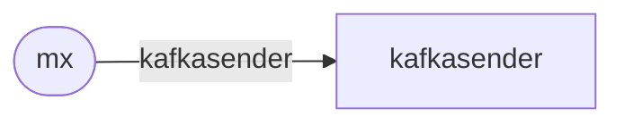

# kafkasender Service

`kafkasender` service receives messages from [mx](mx.md) service
and performs safe delivery to outside Kafka cluster. Messages are
delivered as-is according to `To` header.
`kafkasender` is the part
of Generic Message Exchange (GMX) system.

## Service Properties

Sharded
: {{ yes }}

Pooled
: {{ no }}

Databases
: {{ no }}

## Processed Streams

### Input Streams

| Stream                                                       | Description                       |
| ------------------------------------------------------------ | --------------------------------- |
| [kafkasender](../../../dev/reference/streams/kafkasender.md) | Messages received from mx service |

## Configuration

`kafkasender` service may be configured via [[kafkasender]](../config/kafkasender.md)
config section.
