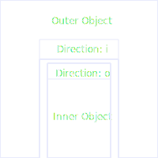

---
tags:
  - background
---
# Connection Restrictions

Real world does not allow connecting anything to anything. So inventory
_MUST_ enforce as many restrictions as possible. Connection restrictions
may be expressed in several complimentary ways:

- [Type](#type)
- [Direction](#direction)
- [Gender](#gender)
- [Protocols](#protocols)
- [Crossing](#crossing)

The connection may be established only when all five kinds of restrictions are met.

## Type

[Connection Type](connection-type.md) restricts a physical type of
connection. I.e. meaningless to connect RJ-45 jack to C14 electrical socket.
The connection may be established only with the same or compatible types.

Connection type examples:

- [RJ45](connection-type.md)
- [C13](connection-type.md)
- [C14](connection-type.md)
- [LC](connection-type.md)

Type may be considered as mechanical form-factor, something like the form, size,
and patterns of pins and holes.

Connection type compatibility may be complex.
See [Connection Type Restrictions discussion](connection-type-restrictions.md)
for explanation.

## Gender

Connections of same [Connection Type](#type) may be symmetrical, or **genderless**;
or be of two mutual fitting sides (**male** and **female**). NOC supports 3 genders:

- `s` - genderless, or side connection.
- `m` - male connection.
- `f` - female connection.

Genders may be mated according the table:

|     | `s`       | `m`       | `f`       |
| --- | --------- | --------- | --------- |
| `s` | {{ yes }} | {{ no }}  | {{ no }}  |
| `m` | {{ no }}  | {{ no }}  | {{ yes }} |
| `f` | {{ no }}  | {{ yes }} | {{ no }}  |

Or mnemonically: side-to-side, male-to-female, female-to-male.
Unlike real life, NOC doesn't support advanced combinations of relations.

Males and females are equal in rights and the division is very arbitrary.

Possible genders on connections may be additionally restricted by Connection Types.
See [Genders Restriction Discussion](connection-type-restrictions.md#gender-restrictions) for
additional explanation.

## Direction

Connection direction determines the hierarchy of the connected object. NOC supports
three directions:

- `i` - Inwards: The connected object will be put inside the current one.
- `o` - Outwards: The current object will be put inside the connected one.
- `s` - Side: Objects will be connected but neither object will be put inside the peer one.

`i` connections are usually slots for various extension modules, line cards, PSU e.t.c.
They allow the gaining of additional features by putting something inside.

`o` connections are usually extension modules themselves. They should be put
into something to became valuable.

`s` connections are neither previous cases. They are used to connect the object
with the outer world. Various cables, patch cords, power cables are good examples
of `s` connections.

`s` connections utilize genders, while the gender of `i` and `o` connections
is only conventional. `i` connections are usually females, while `o` are male ones.

Directions can be connected by following way:

|     | `s`       | `i`       | `o`       |
| --- | --------- | --------- | --------- |
| `s` | {{ yes }} | {{ no }}  | {{ no }}  |
| `i` | {{ no }}  | {{ no }}  | {{ yes }} |
| `o` | {{ no }}  | {{ yes }} | {{ no }}  |

Or mnemonically: side-to-side, inwards-to-outwards, outwards-to-inwards. Following
chart explains inwards-to-outwards kind of relation:

{: width=300px }

Unlike the genders, directions are rarely misused.

## Protocols

While types, genders, and directions are merely physical properties, which
can easily be observed with the naked eye, protocols define agreements on
electrical, optical, and other kinds of signals. Connection is the physical
media, while protocols are the logical use of it.

Consider example: RJ-45 port (Connection type `Electrical | RJ45`, gender `female`, direction `side`)
is only the hole in the box. It may serve as an ethernet port: maybe 10Mbit/s, or 100Mbit/s,
or gigabit one. It may provide or consume power over PoE. It may be a console port, utilizing RS-232 serial protocol.
It may support 2 or 4-wire RS-485 serial protocol. It may be dumb passive cross-panel
entry, leading floors away. You still may plug RJ-45 jack anyway, but will be any use of that?

So the protocols define possible usage of connection.
Refer to the [Inventory Protocols](inventory-protocols.md) for
the full list of protocols, provided by NOC. Protocols may be symmetric,
when both peers utilizing the same configuration, like autoconfigured ethernet ports.
Protocols may be asymmetric, like PoE consumer and PoE provider, RS-232 DTU and DCU.

Asymmetric protocols are denoted by `>` and `<` prefix, like '>RS-232' and '<RS-232'.
`>` leads inside the protocol, meaning that it will be consumed.
i.e. '>POE' means that the device may consume power over PoE over the given connection.
`<` leads outside the protocol, meaning that it will be provided.
i.e. '<POE' means that the device can provide power over PoE over the given connection.
The protocol without `>` and `<` can be provided and consumed as well.

Protocols are gender-agnostic. i.e. RS-232 DCU may use DB-9 male or female sockets
as well.

The connection may support several protocols, i.e. ethernet may be coupled with PoE,
and so on.

`i` and `o` directions enforce strict protocol match. `i` connection may
provide at least one protocol which peer's `o` connection may consume or vise versa.
`s` connections may provide protocols, or be protocol-agnostic with empty protocols list.
Protocol-agnostic connections dependency will be described later.

Protocol compatibility matrix:

|      | Both      | `>`       | `<`       |
| ---- | --------- | --------- | --------- |
| Both | {{ yes }} | {{ yes }} | {{ yes }} |
| `>`  | {{ yes }} | {{ no }}  | {{ yes }} |
| `<`  | {{ yes }} | {{yes }}  | {{ no }}  |

Mnemonic rules: Pure providers shall not be mated with pure providers,
pure consumers shall not be mated with pure consumers.

Protocol-agnostic connections are the proxies or the media. They cannot
deal with the protocol itself, but they can transport protocol to a connection,
which can handle it. The best example of protocol-agnostic connections
is the cable. It has two ends, and it can transport signal to the other end.
Transport capabilities and restrictions are discussed in the [Crossing](#crossing) section.

Protocol-agnostic connections are traced to the other ends and cannot be
connected only in one of two cases:

- Provided or consumed protocol can be traced to compatible endpoint (`s` port with compatible protocol).
- Provided or consumed protocol cannot be traced to the endpoint with any other protocol. (dark fibre principe).

## Crossing

The crossing is the additional set of rules which can be applied to protocol-agnostic
`s` connections within the same object to define the possible protocol flow.
Without the crossing restriction signal incoming to genderless `s` connection
will flow to each other genderless `s` connections of the object.
Consider the picture:

{: width=300px }

<!-- prettier-ignore -->
!!! note
    Unlike other restrictions, which defines the object's communications
    with the outer world (extravertive nature), crossing defines an object's
    internals (introvertive nature).

Note that the incoming path on slot `1` may be continued via outgoing slots `2`, `3`
and `4`, as protocol-agnostic and having `s` direction. The path cannot
be continued over `out` slot, as having `o` direction.

### Groups

To apply additional restrictions on crossing paths, slots can be assigned
to different groups. The path can stay only within the same connection groups.
Consider the picture.

{: width=300px }

Note that the incoming path on slot `1` is restricted by connection group `1`,
so it can be propagated only to slots `3` and `4`. The path via the slot '2'
is prohibited, as leaving outside the group.

### Cross

Cross applies explicit restrictions on internal connections. Cross may contain
the name of the peer connection and the behavior depends on the peer connection
crossing settings:

- If the peer connection defines crossing back to the starting, the direct
  crossing is considered.
- If the peer connection defines no crossing, peer considered to be the source,
  and the signal power applied to the source will be divided between
  all referring connections.

### Examples

<!-- prettier-ignore -->
!!! example "Example: Patch Cord"
    Simple patch-cord terminated by two connectors, named `0` and `1`.

    | Name | Direction | Group | Cross |
    | ---- | --------- | ----- | ----: |
    | 0    | `s`       |       | 1     |
    | 1    | `s`       |       | 0     |

    Note that connectors are crossed together and the `group` is not used.
    This case doesn't apply any additional restrictions, as two `s` connections
    will be interconnected by default.

<!-- prettier-ignore -->
!!! example "Example: Optical duplex cable"
    The two-fiber cable is terminated by four connectors, two per end.
    The first end is named `0` and contains two connectors, named `0-0` and `0-1`.
    The other end is named `1` and contains two connectors, named `1-0` and `1-1`.

    | Name | Direction | Group | Cross |
    | ---- | --------- | ----- | ----: |
    | 0-0  | `s`       |       | 1-0   |
    | 0-1  | `s`       |       | 1-1   |
    | 1-0  | `s`       |       | 0-0   |
    | 1-1  | `s`       |       | 0-1   |

    Note that connectors are crossed to the corresponding connector on the other end.

<!-- prettier-ignore -->
!!! example "Example: Splitter 1x4"
    The incoming signal from the input `in` is distributed equally to outputs
    `out0`, `out1`, `out2`, and `out3`.

    | Name | Direction | Group | Cross |
    | ---- | --------- | ----: | ----: |
    | in   | `s`       | 1     |       |
    | out0 | `s`       | 1     | in    |
    | out1 | `s`       | 1     | in    |
    | out2 | `s`       | 1     | in    |
    | out3 | `s`       | 1     | in    |

    Note that all connectors are placed and the same group and output connectors
    are crossed to input one.
