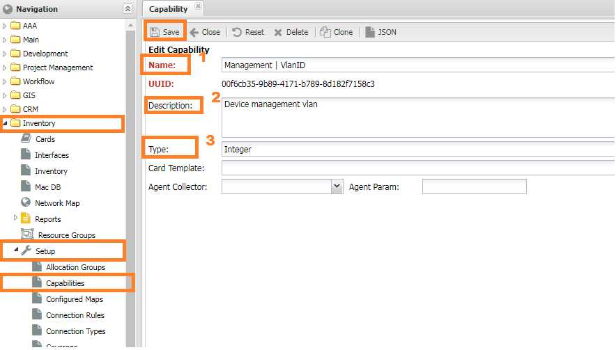

# Использование Housekeeper для сбора данных с устройства

## Задача

Время от времени требуется собирать данные с оборудования, отсутствующие в системе.
После сбора необходимо заполнить кастомное поле (`custom field`) или отправить уведомление по доступному каналу: почта, телегам и т.д.


## Решение

Для подобных случаев хорошо подходит механизм `Housekeeper`.
Он позволяет в конце полного опроса (`box discovery`) запустить пользовательскую функцию (`handler`) в которую будет передано устройство,
что позволит выполнять разнообразные действия.

Ограничения:
* Если в ходе опроса произойдёт фатальная ошибка и он будет остановлен, то функция запущена на будет
* Расширения схемы данных не предусмотрено - если какого-либо поля нет в схеме данных (модели), то заполнить его всё равно не получится.

## Инструкция

### Реализация функций-обработчиков

#### Реализация 

```python
import re
from noc.core.mx import send_message, MX_LABELS, MX_H_VALUE_SPLITTER
from noc.sa.models.managedobject import ManagedObject
from noc.inv.models.subinterface import SubInterface
from noc.core.comp import DEFAULT_ENCODING

MGMT_VLAN_CAPS = "Management | VlanID"


def handler_mgmt_vlan(object: "ManagedObect"):
    """
    Ищем IP адрес управления в сабинтерфейсах устройства.
    Если находим - смотрим поле vlan_ids, указанный в нём влан
    считаем вланом управления и сохраняем его в 'Management | VlanID'
    """
    re_addr = re.compile(f"{object.address}.+")

    msub = SubInterface.objects.filter(ipv4_addresses=re_addr, managed_object=object, enabled_afi="IPv4", vlan_ids__exists=True).first()
    if not msub or not msub.vlan_ids:
        #
        return
    mgmt = object.get_caps(MGMT_VLAN_CAPS)
    if mgmt == msub.vlan_ids[0]:
        return
    object.set_caps(MGMT_VLAN_CAPS, msub.vlan_ids[0], source="manual")


def handler_vlans_script(object: "ManagedObect"):
    """
    Функция для отправки результата выполнения скрипта сообщением
    Запускаем на выполнение скипт `get_vlans`.
    Результат его выполнения отправляем в качестве сообщения
    """
    r = object.scripts.get_vlans()

    if not r:
        #
        return None
    send_message(
            r,
            message_type="event",
            headers={
                MX_LABELS: MX_H_VALUE_SPLITTER.join(object.effective_labels + ["custom_data"]).encode(
                            encoding=DEFAULT_ENCODING
                        ),
            },
        )

def hk_handler(djob):
    """
    Housekeeper Caps
    """
    mo: "ManagedObject" = djob.object
    handler_mgmt_vlan(mo)
    handler_vlans_script(mo)
    
```

### Регистрация обработчика в системе

Регистрация [обработчиков](../reference/concepts/handler/index.md) производится в меню Главное (`Main`) -> Настройки (`Setup`) -> Обработчики (`Handlers`).

 
1. В *панели навигации* преходим в меню (`Main`) -> Настройки (`Setup`) -> Обработчики (`Handlers`)
2. Нажимем кнопку добавить (`Add`) справа от строки поиска
3. В форме добавления заполняем:
    * Имя (`Name`) - может быть любым понятным пользователю
    * Ссылка (`Handler`) ссылку на функцию-обработчик
    * Отмечаем галочку `Allow housekeeping` для разрешения использовать как `Housekeeper`


### Добавление кастомного поля

Добавление собственных полея производится в меню Учёт объектов (`Inventory`) -> Настройки (`Setup`) -> Свойства (`Capabilities`)


1. В *панели навигации* переходим в меню (`Inventory`) -> Настройки (`Setup`) -> Свойства (`Capabilities`)
2. Нажимем кнопку добавить (`Add`) справа от строки поиска
3. В форме добавления заполняем:
    * Имя (`Name`) - `Management | VlanID` в нашем случае
    * Описание (`Description`) - *Device management vlan*
    * Тип (`Type`) - `Integer`


### Настройка запуска

Настройки запуска находятся в [профиле объекта](../reference/concepts/managed-object-profile/index.md)
Управление объектами (`Managed Object`) -> Настройки (`Setup`) -> Профили объекта (`Object Profile`)


1. Выбираем соответствующий профиль обеъекта или добавляем новый
2. Переходим на вкладку `Box`
3. Снизу формы в выпадающем меню `HouseKeeper` выбираем соответствующий обработчик
4. Нажимаем кнопку Сохранить

### Настройка маршрутизации сообщения

Правила пересылки сообщений настраиваются в меню Главное (`Main`) -> Настройки (`Setup`) -> Маршрутизация сообщений (`Message Route`)


1. В *панели навигации* переходим в меню Главное (`Main`) -> Настройки (`Setup`) -> Маршрутизация сообщений (`Message Route`)
2. Нажимем кнопку добавить (`Add`) справа от строки поиска
3. Заполняем форму
   * Имя может быть любое
   * Тип сообщения - Notification
   * Match 

## Проверка работы

Проверить работу `Housekeeper` можно запуском опроса - `./noc discovery run -c hk box MONAME`, где 
`MONAME` имя устройства в системе.