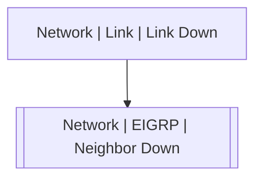

# Network | EIGRP | Neighbor Down

## Symptoms

Routing table changes and possible lost of connectivity

## Probable Causes

Link failure or protocol misconfiguration

## Recommended Actions

Check links and local and neighbor router configuration

## Variables

Variable | Description | Default
--- | --- | ---
as | EIGRP autonomus system | {{ no }}
interface | Interface | {{ no }}
neighbor | Neighbor's Router ID | {{ no }}
reason | Adjacency lost reason | {{ no }}
description | Interface description | `=InterfaceDS.description`

## Alarm Correlation

Scheme of correlation of `Network | EIGRP | Neighbor Down` alarms with other alarms is on the chart. 
Arrows are directed from root cause to consequences.

### Root Causes
`Network | EIGRP | Neighbor Down` alarm may be consequence of

Alarm Class | Description
--- | ---
[Network \| Link \| Link Down](../link/link-down.md) | Link Down

## Events

### Opening Events
`Network | EIGRP | Neighbor Down` may be raised by events

Event Class | Description
--- | ---
[Network \| EIGRP \| Neighbor Down](../../../event-classes/network/eigrp/neighbor-down.md) | dispose

### Closing Events
`Network | EIGRP | Neighbor Down` may be cleared by events

Event Class | Description
--- | ---
[Network \| EIGRP \| Neighbor Up](../../../event-classes/network/eigrp/neighbor-up.md) | dispose
