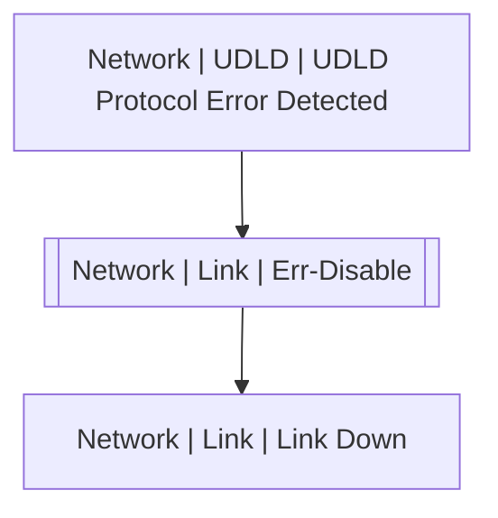

# Network | Link | Err-Disable

## Symptoms

## Probable Causes

## Recommended Actions

## Variables

Variable | Description | Default
--- | --- | ---
interface | interface name | {{ no }}
reason | err-disable reason | {{ no }}
description | Interface description | `=InterfaceDS.description`

## Alarm Correlation

Scheme of correlation of `Network | Link | Err-Disable` alarms with other alarms is on the chart. 
Arrows are directed from root cause to consequences.

### Root Causes
`Network | Link | Err-Disable` alarm may be consequence of

Alarm Class | Description
--- | ---
[Network \| UDLD \| UDLD Protocol Error Detected](../udld/udld-protocol-error-detected.md) | UDLD

### Consequences
`Network | Link | Err-Disable` alarm may be root cause of

Alarm Class | Description
--- | ---
[Network \| Link \| Link Down](link-down.md) | err-disable

## Events

### Opening Events
`Network | Link | Err-Disable` may be raised by events

Event Class | Description
--- | ---
[Network \| Link \| Err-Disable](../../../event-classes/network/link/err-disable.md) | dispose
[Network \| Link \| Link Flap Error Detected](../../../event-classes/network/link/link-flap-error-detected.md) | dispose

### Closing Events
`Network | Link | Err-Disable` may be cleared by events

Event Class | Description
--- | ---
[Network \| Link \| Link Flap Error Recovery](../../../event-classes/network/link/link-flap-error-recovery.md) | dispose
[Network \| Link \| Link Up](../../../event-classes/network/link/link-up.md) | Clear Err-Disable
