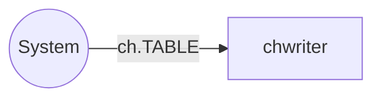

# chwriter service

`chwriter` aggregates incoming data from data producers on per-table basis
and performs bulk writes to ClickHouse database.

## Service Properties

Sharded
: {{ no }}

Pooled
: {{ no }}

Databases
: ClickHouse

## Processed Streams

## Input Streams

| Stream                                       | Description                                    |
| -------------------------------------------- | ---------------------------------------------- |
| [ch.TABLE](../streams-reference/ch.md) | Incoming ClickHouse data in JSONEachRow format |

## Configuration

`chwriter` service is configured via [chwriter configuration section](../config-reference/chwriter.md).
