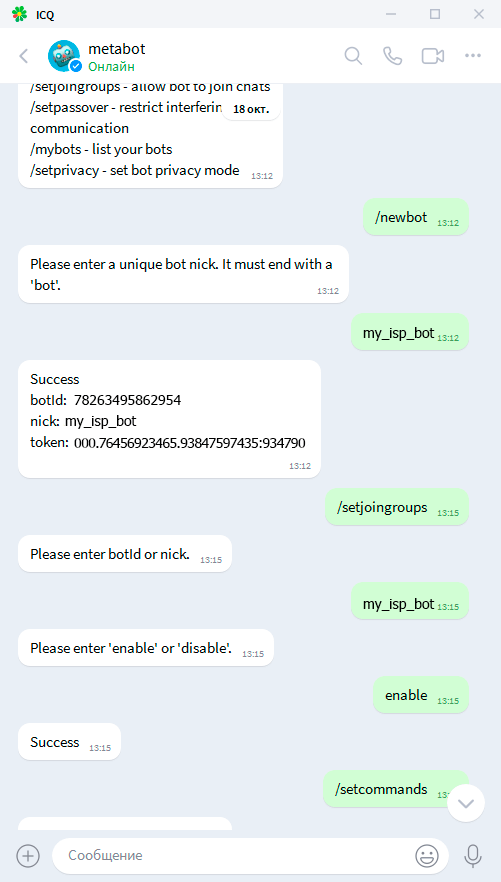
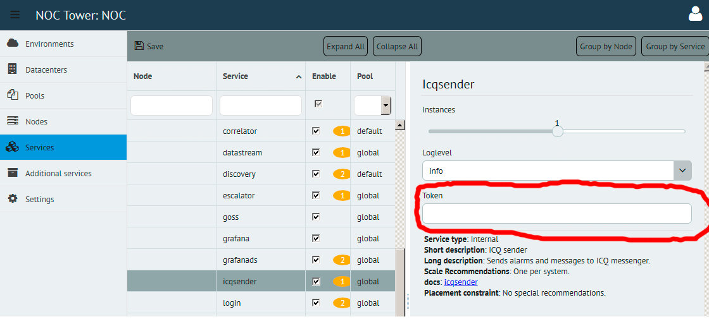
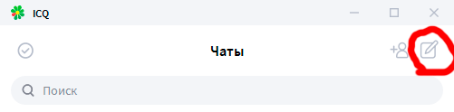
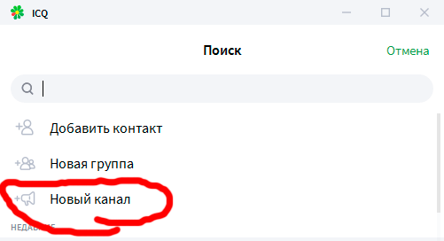
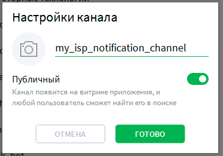
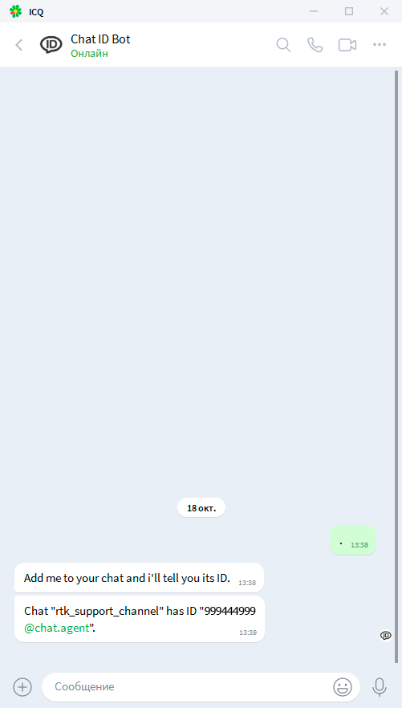
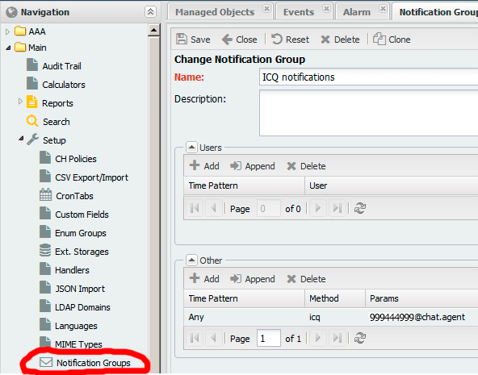
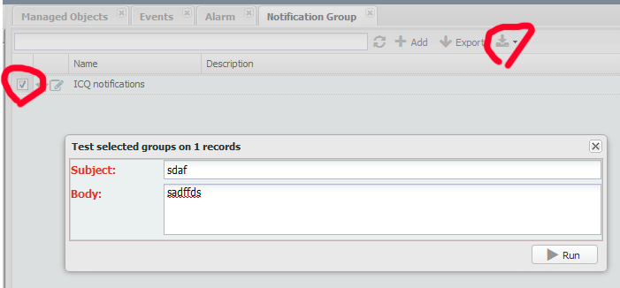
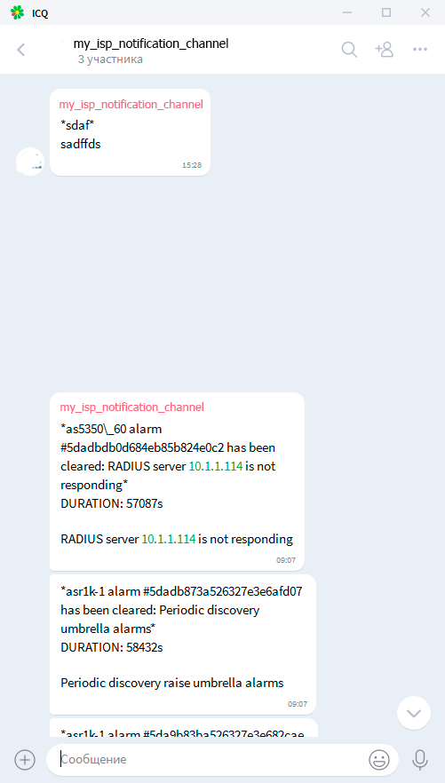

# icqsender service

# Create bot
To add ICQ sender service, first of all create your ICQ bot. To do this, add to your ICQ
contact list `@metabot` contact, send him `/newbot` command and follow 
instructions. For example, name is `my_isp_bot`. In the end you will receive token. 

# Enter bot token to tower

Then in Tower `Services / <node> / icqsender` enter this token to `Token` 
field. 

Deploy. 

# Prepare channel

While deploying prepare your channel. In ICQ go to Chats, press "Write", choose "New 
channel", enter name of channel, for example `my_isp_notification_channel`,
make it public for now. 

Then you have to get your channel ID, that you will enter in NOC Notification 
Group as a param. To do this, add @ChatIDBot to your contact list and to your 
channel. After this @ChatIDBot will tell you your channel's chatID in form 
`Chat "my_isp_notification_channel" has ID "999444999@chat.agent"`. 

Then add to your channel your bot `my_isp_bot` as admin. Then go to your channel 
properties and uncheck "Public". 

# NOC notification configuration

After deploy login to NOC, go to Main / Setup / Notification Groups, add new 
group `ICQ Notifications`, in `Other` press `+Add`, Time Pattern = Any, Method = 
ICQ, params = 999444999@chat.agent. 

Save, check your newly created Notification Group, in `Group Actions / Test selected 
groups` enter subject andbody, press `Run`. If all is fine, `my_isp_bot` will 
send to `my_isp_notification_channel` this message. 

