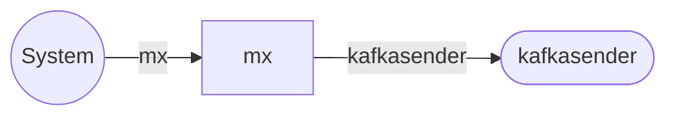

# mx service

`mx` service accepts the messages addressed to
outside the system, performs routing basing on message headers, and,
possibly, passing it to one of the `sender` services. `mx` is the part
of Generic Message Exchange (GMX) system.

## Service Properties

Sharded
: {{ yes }}

Pooled
: {{ no }}

Databases
: Mongo, Postgres

## Processed Streams

### Input Streams

| Stream                                 | Description       |
| -------------------------------------- | ----------------- |
| [mx](../streams-reference/mx.md) | Incoming messages |

### Output Streams

| Stream                                                   | Description                                 |
| -------------------------------------------------------- | ------------------------------------------- |
| [kafkasender](../streams-reference/kafkasender.md) | Messages addressed to outside Kafka cluster |

## Configuration

`mx` service requires no additional configuration.
