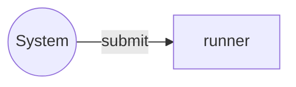

# runner service

The `runner` service acts as the orchestrator, 
responsible for executing a groups of jobs in a predictable and reliable manner.

## Service Properties

Sharded
: {{ no }}

Pooled
: {{ no }}

Databases
: mongo

## Processed streams

### Input Streams

| Stream                                 | Description            |
| -------------------------------------- | ---------------------- |
| [jobs](../streams-reference/submit.md) | Incoming jobs requests |

## Configuration

`runner` service may be configured via [runner](../config-reference/runner.md) config section.
