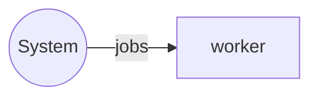

# worker service

`worker` service is a dedicated executor for deferred background tasks.

## Service Properties

Sharded
: {{ yes }}

Pooled
: {{ no }}

Databases
: Mongo, Postgres

## Processed Streams

### Input Streams

| Stream                                     | Description   |
| ------------------------------------------ | ------------- |
| [jobs](../streams-reference/jobs.md) | Incoming jobs |

### Output Streams

None

## Configuration

`worker` service requires no additional configuration.
