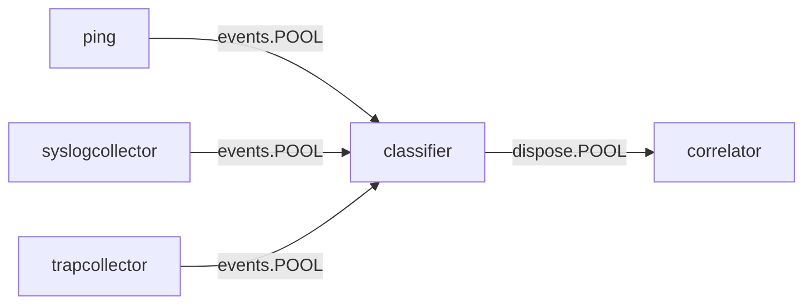
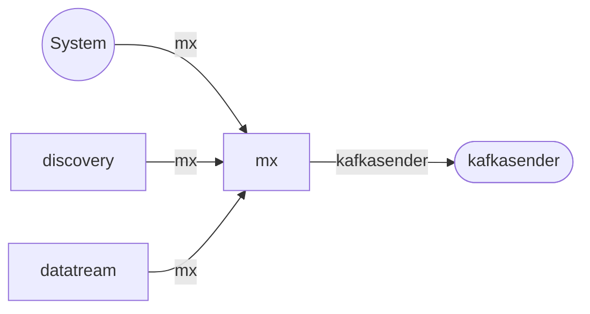
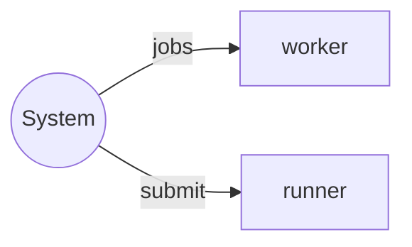

# Liftbridge Streams

Liftbridge streams are the one of ways of inter-process communications
inside NOC cluster.

## Events Pipeline
Main `Fault Management` pipeline. Events pipeline registers various events
either by active (pinging and probing) or by passive (various collectors)
means. Then, [classifier](../services-reference/classifier.md) processes events, assigns them
[Event Classes](../event-classes-reference/index.md)
and detects events which may signal the raising or clearing alarm conditions.
Selected events are passed to [correlator](../services-reference/correlator.md)
for further alarm state processing. 

## Generic Message Exchange Pipeline
Generic Message Exchange Pipeline processes notifications of various system
events which may be delivered to outside system. Messages are sent
to [mx](../services-reference/mx.md) service, which performs translation
and templating for messages and routes them to one of `*sender` services,
which perform delivery to outside endpoints.

## Orchestration Pipeline
Orchestration pipeline processes requests for short and long-termed
jobs.

