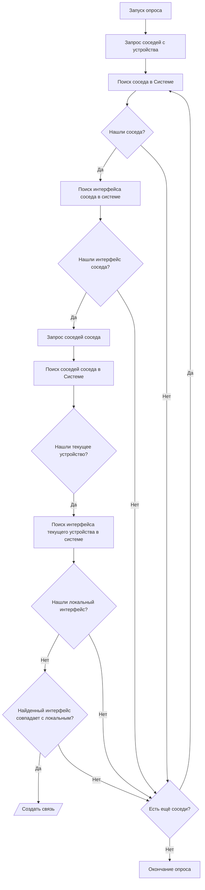

# Возможности работы НОКа с топологией

Одним из ключевых компонентов НОКа это топология сети. Она представлена в виде графа связности оборудования (`ManagedObject`). 
На его основе можно менять поведение системы, это предоставляет следующие возможности:  

* Строить L2 топологию по данным с оборудования и внешних систем (`Remote System`)
* Строить L2 связи между интерфейсами [Interface](../concepts/interface/index.md) устройства [ManagedObject](../concepts/managed-object/index.md).
* Показывать топологию на карте сети
* Определять причины аварии по топологии
* Производить поиск пути по топологии
* Строить отчёты на основании данных по топологии
* Предоставлять топологическую информацию через `API` - [Datastream](../datastream-api-reference/managedobject.md)


L2 топология (`L2 Topology`) строится между интерфейсами [Interface](../concepts/interface/index.md) устройства [ManagedObject](../concepts/managed-object/index.md). 
Помимо ручного создания связей (`Link`), через интерфейс пользователя, система может выстраивать связи на основе данных с оборудования. Можно выделить следующие этапы работы с топологией:

* Построение связей между устройствами (вручную или по итогам опроса)
* Расчёт направления вверх (`Uplink`)
* Отображение схемы сети
* Построение пути по топологии  


## Построение топологии

При построении топологии важно помнить термины:

* **Связь** (`Link`) - групп (традиционно 2) 
* **Текущее устройство** - это устройство (`ManagedObject`) на котором запущен опрос
* **Соседнее устройство** (сосед) - устройства, соединенённые с текущим напрямую (не через иные устройства уровня L2). Они отображаются в таблице соседей устройства
* **Идентификатор устройства** - свойство, позволяющее найти соседнее устройство. В топологических протоколах используются следующие идентификаторы
    * MAC адреса устройства (`Chassis ID`)
    * Hostname устройства
    * IP адес (`IP address`)
    * Серийный номер (`Serial`)
* **Идентификатор порта устройства** - позволяется определить порт соседа к которому идёт связь. Например:
    * Имя интерфейса (`Interface Name`)
    * Описание (`Description`)
    * MAC адрес интерфейса
    * SNMP индекс (`ifindex`)
    * Номер интерфейса 
    * Иные
* **Топологический метод** (`Topology Method`) - это способ с помощью которого система строит связь. Помимо обычных, совпадающих с топологическими протоколами, в системе присутствует несколько дополнительных.

Для создания связи (`Link`) обязательно наличие интерфейса [Interface](../concepts/interface/index.md) на всех связанных устройствах.
Дальнейший список требования отличается в завимости от метода создания связи (`Link`). Рассмотри доступные.

### Создание связи вручную

Производится через панель инфтерфейс в форме устройства [ManagedObject](). Для этого выбираем интерфей текущего устройство и указываем интерфейс соседа, с которым будет создана связь.


### Создание связи на основе протоколов соседства

Для автоматического построения связи можно воспользоваться информацией о соседях с устройства. 
В НОКе поддерживается достаточное большое число протоколов соседства - `LLDP`, `CDP`, ... но основные подходы в их работе не меняются:

* Устройство должно поддерживать возможность показать список соседей с указанием их интерфейсов
* Идентификатор соседа из списка должен позволять найти устройство в системе
* Идентификатор порта соседа должен позволять найти порт соседа в системе
* В профилях [SA Profile](../concepts/sa-profile/index.md) устройств должны быть реализованы скрипты для получения информации о соседях

### Процедура построений связи



#### Запрос соседей с устройства

На первом этапе запускается опрос устройства по одному из методов. Система получает список соседей `текущего устройства` (на котором запускается опрос). В списке присутствуют:

* `Идентификатор соседа` - зависит от протокола. Для случая `LLDP`, это может быть `MAC` адрес или `hostname`.
* `Локальный порт` - порт `текущего устройства`, за которым виден сосед
* `Порт соседа`. Указание за каким портом соседнего устройства видно текущее. Может приходить в виде имени, MAC адреса, или некоторого локального идентификатора (обычно `snmp_index`)

Пример вывода на примере `LLDP` (для других протоколов он будет другой):

```json
[
    {
        "local_interface": "GigabitEthernet0/0/1",
        "neighbors": [
            {
                "remote_chassis_id_subtype": 4,
                "remote_chassis_id": "00:0E:5E:11:22:77",
                "remote_port_subtype": 5,
                "remote_port": "port 25",
                "remote_port_description": "TRUNK",
                "remote_system_name": "782-swc1",
                "remote_system_description": "ISCOM2128EA-MA-AC ROS_4.15.1365_20171229(Compiled Dec 29 2017, 15:40:31)",
                "remote_capabilities": 4
            }
        ]
    },
    {
        "local_interface": "XGigabitEthernet0/1/1",
        "neighbors": [
            {
                "remote_chassis_id_subtype": 4,
                "remote_chassis_id": "08:19:A6:11:22:88",
                "remote_port_subtype": 5,
                "remote_port": "XGigabitEthernet0/1/2",
                "remote_port_description": "\"link to WAN\"",
                "remote_system_name": "70-swc71",
                "remote_system_description": "S5328C-EI-24S",
                "remote_capabilities": 20
            }
        ]
    }
]
```

<!-- prettier-ignore -->
!!! note
    Для уменьшения частоты захода на устройства есть возможность настроить кэш соседства

#### Формирование списка кандидатов

По полученному списку идентификаторов происходит поиск соседнего устройства [ManagedObject](../concepts/managed-object/index.md) 
и его порта [Interface](../concepts/interface/index.md). 
При успехе пара `текущее устройство -> порт,  соседнее устройство -> соседний порт` добавляются в список кандидатов. 
После формирования списка кандидатов начинается его проверка - система запрашивает таблицу соседей *соседнего устройства* 
и проверяет что за указанным *соседним портом* находится *текущее устройство*.


В данном случае возможны следующие ошибки: ...

#### Построение связи

В случае подтверждения начинается процедура создания связи (`Link`). 
Она регулируется настройкой `Политика при опросе` [Discovery Policy](../concepts/interface-profile/index.md) в профиле интерфейса (`Interface Profile`). Доступны опции:

* `Ignored` (Игнорировать) - не создавать связь (`Link`) с этим портом
* `Create New` (Создавать новый) - не создавать связь, если таковая уже есть
* `Replace` (Заменять) - создать связь с портом
* `Cloud` (Облако) - добавть порт к существующей связи (образуется облако)

Для самой процедуры могут быть следующие варианты:

* **Новый связь** - когда на обоих интерфейсах отсутствуют линки. Просто создаётся (если не выставлена опция `Ignored`) и заполняется поле `first_discovered` временем создания.
* **Существующая связь** - между интерфейсами уже есть построенный линк. В этом случае происходит обновление поля `last_seen` (время когда система видела линк последний раз) 
* **Другой линк** - когда на интерфейсе есть линк и новый ведёт в другую сторону. Если выставлена опция `Create New`, то линк разрываться не будет. Если же перелинковка (`Replace`) разрешена, поведение регулируется `приоритетом метода`. Если линк нашёл более приоритетный метод - он его перестраивает. Если менее, то остаётся построенный более высоким приоритетом. Приоритет выставляется на сегмент в `Профиле сегмента` (`Segment Profile`)

<!-- prettier-ignore -->
!!! note
    При создании линка поле `first_discovered` заполняется временем создания. При повторном нахождении обновляется поле `last_seen`.


<!-- prettier-ignore -->
!!! note
    Удаление существующей связи производится если она не обнаружена на соседнем устройстве

#### Удаление связей 

Если при проверке соседнего устройства текущее не обнаруживается в соседях и между ними есть связь (`Link`), то она разрывается. 
При этом, если устройство выведено из эксплуатации или порты перестали быть задействованы, то связь становится *вечной*, 
поскольку опрос не может обнаружить её отсутствие: по причине его отключения или отсутствия соседа. Не всегда это может быть удобным. 

Если требуются очищать связи не обновляемые в течении какого-то времени, можно воспользоваться аргументом `ttl_policy` 
команды [./noc link](../man/link.md).

### Методы построения связи

Доступные методы построения линков:

* Метод - метод построения связи
* Протокол (`Protocol`) - используемый методом протокол определения соседей
* Скрипт (`Script`) - необходимый скрипт в профиле для работы метода
* Возможность (`Capabilities`) необходимая для запуска опроса


| Метод                                                         | Протокол   | Скрипт                                                                       | Caps            |
| ------------------------------------------------------------- | ---------- | ---------------------------------------------------------------------------- | --------------- |
| [CDP](../discovery-reference/box/cdp.md)                      | CDP        | [get_cdp_neighbors](../scripts-reference/get_cdp_neighbors.md)               | `Network  CDP`  |
| [REP](../discovery-reference/box/rep.md)                      | REP        | [get_rep_topology](../scripts-reference/get_rep_topology.md)                 | `Network  REP`  |
| [LLDP](../discovery-reference/box/lldp.md)                    | LLDP       | [get_lldp_neighbors](../scripts-reference/get_lldp_neighbors.md)             | `Network  LLDP` |
| [STP](../discovery-reference/box/stp.md)                      | STP        | [get_spanning_tree](../scripts-reference/get_spanning_tree.md)               | `Network  STP`  |
| [UDLD](../discovery-reference/box/udld.md)                    | UDLD       | [get_udld_neighbors](../scripts-reference/get_udld_neighbors.md)             | `Network  UDLD` |
| [OAM](../discovery-reference/box/oam.md)                      | OAM        | [get_oam_status](../scripts-reference/get_oam_status.md)                     | `Network  OAM`  |
| [BFD](../discovery-reference/box/bfd.md)                      | BFD        | [get_bfd_sessions](../scripts-reference/get_bfd_sessions.md)                 | `Network  BFD`  |
| [FDP](../discovery-reference/box/fdp.md)                      | FDP        | [get_fdp_neighbors](../scripts-reference/get_fdp_neighbors.md)               | `Network  FDP`  |
| [Huawei NDP (NTDP)](../discovery-reference/box/huawei_ndp.md) | Huawei NDP | [get_huawei_ndp_neighbors](../scripts-reference/get_huawei_ndp_neighbors.md) | `Network  FDP`  |
| [LACP](../discovery-reference/box/lacp.md)                    | LACP       | [get_lacp_neighbors](../scripts-reference/get_lacp_neighbors.md)             | `Network  LACP` |
| [NRI](../discovery-reference/box/nri.md)                      | -          | -                                                                            | -               |
| [ifDesc](../discovery-reference/box/ifdesc.md)                | -          | -                                                                            | -               |
| [xMAC](../discovery-reference/box/xmac.md)                    | -          | [get_mac_address_table](../scripts-reference/get_mac_address_table.md)       | -               |

[Segment](../discovery-reference/segment/mac.md) - отдельный метод построения связей на основе таблицы MAC адресов (`FDB`). 
В отличие от перечисленных в таблице он строит связи между устройствами одного сегмента и работает по расписанию сегмента.


## Расчёт направления вверх

Обычный граф связности является ненаправленным: все узлы графа разнозначны друг другу. 
Но в реальных условиях сети делятся на слабосвязанные между собой кластеры - сегменты [Network Segment](../concepts/network-segment/index.md). 
Связь между кластерами осуществляется через выделенные узлы (обзываются агрегаторы, концентраторы и т.д.). 
Информацию важно знать для правильной работы [RCA](../glossary/index.md#rca) - определения причины аварии по топологии. 
Если связность кластера проходит через один узел, то её недоступность вызовет недоступность всех узлов кластера.

В системе есть несколько подходов к вычислению направления вверх (`Uplink`) связи. Рассмотри их подробнее

### Level

Положение устройства по отношению к другим. Чем выше уровень, тем важнее устройство для сети. 
Устройство выше уровнем текущего является вышестоящим и направление вверх считается через него. 
В качестве примера можно указать уровни устройство сети в зависимости от их роли.

| Role                   | Level     |
| ---------------------- | --------- |
| **Client's Equipment** | **10-19** |
| CPE                    | 15        |
| **Access Level**       | **20-29** |
| VPN Server             | 22        |
| WiFi Access Point      | 22        |
| Media Gateway          | 23        |
| Access Switch          | 25        |
| **Aggregation Level**  | **30-39** |
| WiFi Controller        | 35        |
| Aggregation Switch     | 38        |
| **City Core**          | **40-49** |
| L3 switch/router       | 42        |
| BRAS                   | 44        |
| MPLS PE                | 44        |
| MPLS P                 | 46        |
| ASBR                   | 48        |
| **Regional Core**      | **50-59** |
| L3 switch/router       | 52        |
| MPLS PE                | 54        |
| MPLS P                 | 56        |
| ASBR                   | 58        |
| **Macroregional Core** | **60-69** |
| L3 switch/router       | 62        |
| MPLS PE                | 64        |
| MPLS P                 | 66        |
| ASBR                   | 68        |
| **National-wide Core** | **70-79** |
| L3 switch/router       | 72        |
| MPLS PE                | 74        |
| MPLS P                 | 76        |
| ASBR                   | 78        |
| **World-wide Core**    | **70-79** |
| L3 switch/router       | 82        |
| MPLS PE                | 84        |
| MPLS P                 | 86        |
| ASBR                   | 88        |

### Иерархия сегментов

В НОКе для устройства обязательно задаётся его сегмент [Network Segment](../concepts/network-segment/index.md). 
Устройства, находящиеся в родительском сегменте по отношению к сегменту устройства, являются вышестоящими и направление вверх считается через них. 

### IP Адрес

В качестве критерия можно использовать IP адрес устройства. Зачастую, вышестоящим устройствам (шлюзам) 
назначают младший или старший IP адрес из диапазона IP сети. Это можно использовать 

## Настройки 

Настройки опроса по методам находятся на вкладке `Box` в разделe топология [Managed Object Profile](../concepts/managed-object-profile/index.md#Box(Полный_опрос)). 
Для активации метода необходимо поставить напротив него галочку.

Требования по каждому из методов указаны в разделе. Необходимо учитывать следующие требования:

* L2 связь строится между интерфейсами, по этой причине у устройства должен быть включён опрос инетерфейсов [Interface](../discovery-reference/box/interface.md)
* Для запуска методов он должен поддерживаться на устройстве, так что необходимо включить опрос возможностей [Capabilities](../discovery-reference/box/caps.md). Для методов `ifDesc`, `xMAC` и `NRI` не требуется.
* Часть методов производят поиск устройств по идентификатору, для них необходимо включить опрос [ID](../discovery-reference/box/id.md)

Помимо настройки опроса необходимо включить метод в приоритете методов.

### Приоритет методов

Настройка приоритетов расположена в Профиле сегмента [Network Segment Profile](../concepts/network-segment-profile/index.md) - `Методы построения топологии`. 
Если устройство поддерживает несколько методов построения связи может возникнуть ситуация когда информация 
от разных методов отличается. Например по описанию интерфейса (`ifDesc`) связь строится с одним устройством, а по `LLDP` с другим. 
В это случае победит метод, расположенный выше по приоритету.

<!-- prettier-ignore -->
!!! note
  Если метод отсутствует в списке приоритетов - опрос по нему не проводится


После прохождения опроса должны построиться связи. При возникновении ошибок они напишутся в лог.


### Кэш соседей

Для построение связи обязательным условием является её подтверждение с двух сторон. Если у устройства достаточно большое число соседей 
процедура подтверждения может привести к повышенной нагрузке (при опросе каждого соседа НОК будет заходить на устройство). 
Для облегчения ситуации предусмотрен *Кэш соседей* (`Neighbor cache`). При его включении на указанное время (`TTL`) система 
запоминает соседей устройства и при не заходит на него. По истечении времени кэш очищается и при опросе потребуется заход на устройство.

Настройка расположена в Профиле объекта [Managed Object Profile](../concepts/managed-object-profile/index.md#Box(Полный_опрос)) 
`Управление объектами` (`Service Activation`) -> `Настройки` (`Setup`) -> `Профиль объекта` (`ManagedObject Profile`) на вкладке `Box`. 
По умолчанию выставлена в 0, т.е. отключено. Значение больше 0 определяет время в течении которого система **запоминает полученную с устройства информацию** и при поиске соседа обращается к ней, а не к устройству. 
Использование соседей из кэша можно увидеть в логе опроса по записи: ` [discovery|box|<MONAME>|lldp] Use neighbors cache`.

<!-- prettier-ignore -->
!!! warning
    При включённом кэше соседей новые соседи устройства будут увидены системой только после истечения времени запоминания. Это может вводить в заблуждение.


## Работа с топологией

* Схема сегмента 
* Ттрассировка пути на верх из карточки
* Расчёт пути [path](../nbi-api-reference/path.md)
* Расчёт RCA в авариях [Корреляция по топологии](../fault-management/index.md#Корреляция%20по%20топологии)
* Отчёты по метрикам с учётом топологии

