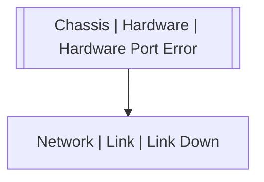

# Chassis | Hardware | Hardware Port Error

## Symptoms

Link becomes unstable or is not responding

## Probable Causes

## Recommended Actions

## Variables

Variable | Description | Default
--- | --- | ---
interface | Hardware port | {{ no }}

## Alarm Correlation

Scheme of correlation of `Chassis | Hardware | Hardware Port Error` alarms with other alarms is on the chart. 
Arrows are directed from root cause to consequences.

### Consequences
`Chassis | Hardware | Hardware Port Error` alarm may be root cause of

Alarm Class | Description
--- | ---
[Network \| Link \| Link Down](../../network/link/link-down.md) | Hardware Port Error

## Events

### Opening Events
`Chassis | Hardware | Hardware Port Error` may be raised by events

Event Class | Description
--- | ---
[Chassis \| Hardware \| Hardware Port Error](../../../event-classes/chassis/hardware/hardware-port-error.md) | dispose

### Closing Events
`Chassis | Hardware | Hardware Port Error` may be cleared by events

Event Class | Description
--- | ---
[Chassis \| Hardware \| Hardware Port Error Recover](../../../event-classes/chassis/hardware/hardware-port-error-recover.md) | dispose
