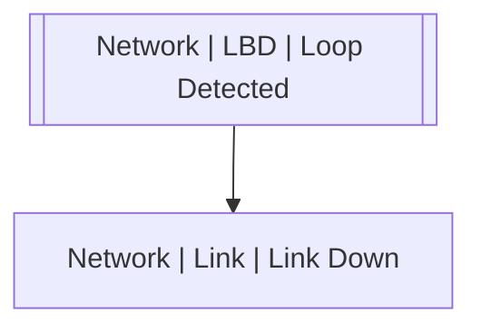

# Network | LBD | Loop Detected

## Symptoms

## Probable Causes

## Recommended Actions

Check hardware link and topology

## Variables

Variable | Description | Default
--- | --- | ---
interface | interface | {{ no }}
description | Interface description | `=InterfaceDS.description`

## Alarm Correlation

Scheme of correlation of `Network | LBD | Loop Detected` alarms with other alarms is on the chart. 
Arrows are directed from root cause to consequences.

### Consequences
`Network | LBD | Loop Detected` alarm may be root cause of

Alarm Class | Description
--- | ---
[Network \| Link \| Link Down](../link/link-down.md) | LBD Loop

## Events

### Opening Events
`Network | LBD | Loop Detected` may be raised by events

Event Class | Description
--- | ---
[Network \| LBD \| Loop Detected](../../../event-classes/network/lbd/loop-detected.md) | dispose

### Closing Events
`Network | LBD | Loop Detected` may be cleared by events

Event Class | Description
--- | ---
[Network \| LBD \| Loop Cleared](../../../event-classes/network/lbd/loop-cleared.md) | dispose
