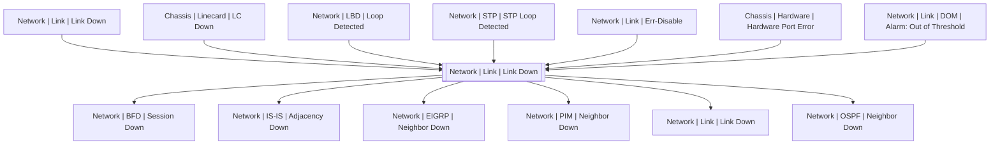

# Network | Link | Link Down

## Symptoms

Connection lost

## Probable Causes

Administrative action, cable damage, hardware or software error either from this or from another side

## Recommended Actions

Check configuration, both sides of links and hardware

## Variables

Variable | Description | Default
--- | --- | ---
interface | interface name | {{ no }}
description | Interface description | `=InterfaceDS.description`
link | Link ID | `=InterfaceDS.link`

## Alarm Correlation

Scheme of correlation of `Network | Link | Link Down` alarms with other alarms is on the chart. 
Arrows are directed from root cause to consequences.

### Root Causes
`Network | Link | Link Down` alarm may be consequence of

Alarm Class | Description
--- | ---
[Network \| Link \| Link Down](link-down.md) | Other side link down
[Chassis \| Linecard \| LC Down](../../chassis/linecard/lc-down.md) | Linecard Down
[Network \| LBD \| Loop Detected](../lbd/loop-detected.md) | LBD Loop
[Network \| STP \| STP Loop Detected](../stp/stp-loop-detected.md) | STP Loop Detected
[Network \| Link \| Err-Disable](err-disable.md) | err-disable
[Chassis \| Hardware \| Hardware Port Error](../../chassis/hardware/hardware-port-error.md) | Hardware Port Error
[Network \| Link \| DOM \| Alarm: Out of Threshold](dom/alarm-out-of-threshold.md) | DOM Out of Threshold

### Consequences
`Network | Link | Link Down` alarm may be root cause of

Alarm Class | Description
--- | ---
[Network \| BFD \| Session Down](../bfd/session-down.md) | Link Down
[Network \| IS-IS \| Adjacency Down](../is-is/adjacency-down.md) | Link Down
[Network \| EIGRP \| Neighbor Down](../eigrp/neighbor-down.md) | Link Down
[Network \| PIM \| Neighbor Down](../pim/neighbor-down.md) | Link Down
[Network \| Link \| Link Down](link-down.md) | Other side link down
[Network \| OSPF \| Neighbor Down](../ospf/neighbor-down.md) | Link Down

## Events

### Opening Events
`Network | Link | Link Down` may be raised by events

Event Class | Description
--- | ---
[Network \| Link \| Link Down](../../../event-classes/network/link/link-down.md) | dispose

### Closing Events
`Network | Link | Link Down` may be cleared by events

Event Class | Description
--- | ---
[Network \| Link \| Link Up](../../../event-classes/network/link/link-up.md) | Clear Link Down
