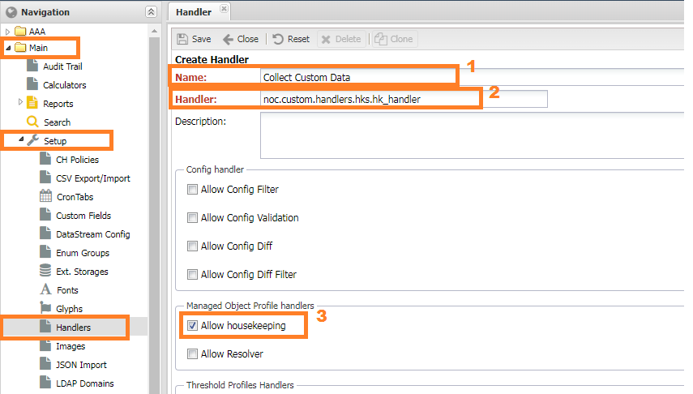
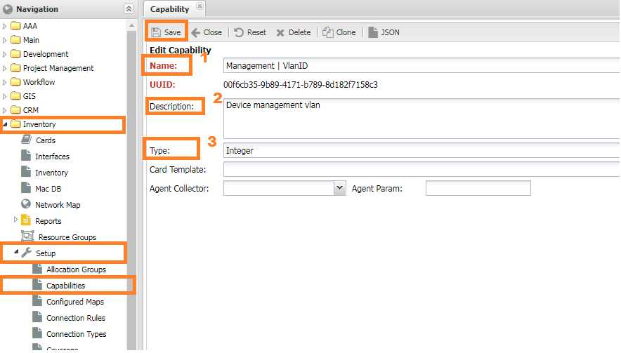
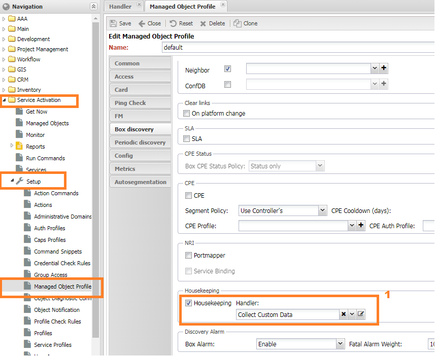
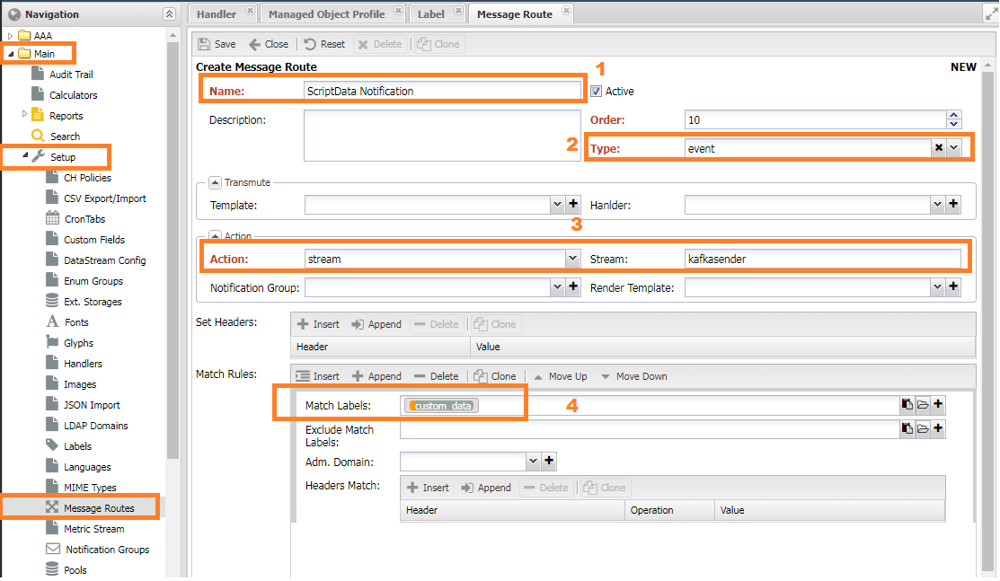

# Using Housekeeper to Collect Device Data Howto

Sometimes it's required to collect and store additional data from equipment
beyond those provided by basic functionality. We can store collected data
in the custom fields or send notifications via any available channel,
like email or telegram.

## Solution

The `Housekeeper` comes to the resque. It executed in the very end of the
box discovery process and allows to run the user function, wrapped in
handler.

Though some known restrictions exists and should be kept in mind:

* The fatal error during box discovery will stop whole box process
  and the function will not be run.
* Housekeeper doesn't extend the data model and cannot introduce
  new fields in the data model by itself.

## Implementing handler

```  py title="/opt/noc_custom/handlers/hks.py" linenums="1"
--8<-- "examples/handlers/hk/handler.py"
```

Place the resulting code into `/opt/noc_custom/handlers/hks.py`.

## Registering the Handler



1. Go to `Main` > `Setup` > `Handlers` menu.
2. Press `Add` button.
3. Fill the fields:
   
    * `Name` - any human-readable name which will be seen to the user.
    * `Handler` - full path to the handler (`noc.custom.handlers.hks.hk_handler`).
    * Check `Allow Housekeeping` checkbox

## Creating Capability

We will use capabilities to store the result.



1. Go to `Inventory` > `Setup` -> `Capabilities` menu.
2. Press `Add` button.
3. Fill the fields:
   
  * `Name`: Fill `Management | VlanID`. Name must match the `MGMT_VLAN_CAPS` value
     in the script.
  * `Description`: Let it be a _Device management vlan_
  * `Type`: Select `Integer`

## Setting up Discovery



1. Go to `Managed Object` > `Setup` > `Object Profiles`
2. Select proper profile for your managed object
3. Select tab `Box`
4. Select our handler in the `HouseKeeping` combo box.
5. Press `Save` button.

## Setting up a Notification Routing



1. Go to `Main` > `Setup` > `Message Route` menu
2. Press `Add` button.
3. Fill the form:
   * `Name`: any meaningful name for user.
   * `Message Type`: Notification
   * Match

## Checking up

In the command line run

```
./noc discovery run -c hk box <name>
```

where `<name>` is the managed object's name or id.
