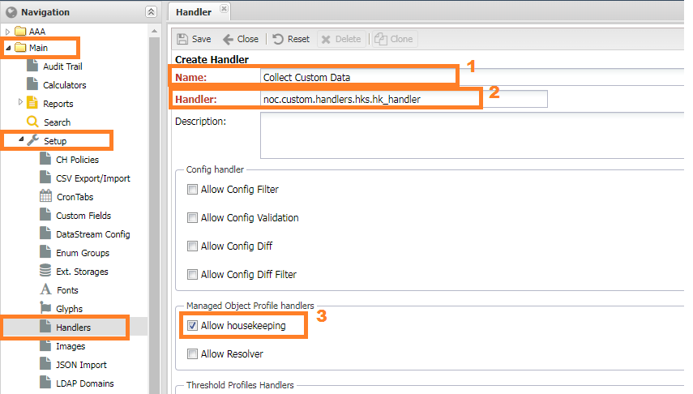
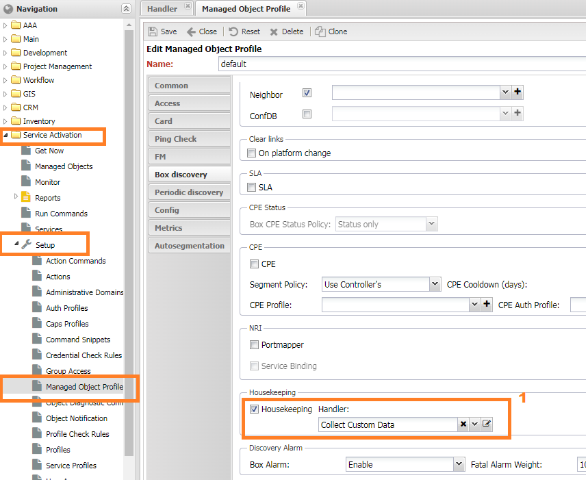
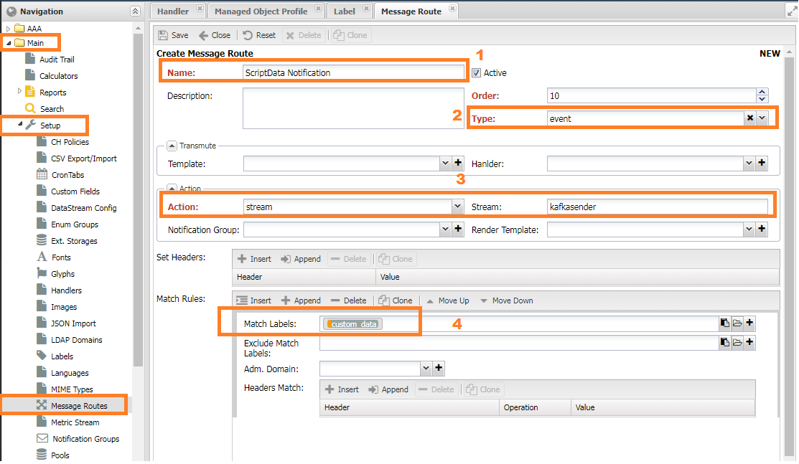

# Использование Housekeeper для сбора данных с устройства

Время от времени требуется собирать данные с оборудования, отсутствующие в системе.
После сбора необходимо заполнить кастомное поле (`custom field`) или отправить уведомление по доступному каналу: почта, телегам и т.д.


## Решение

Для подобных случаев хорошо подходит механизм `Housekeeper`.
Он позволяет в конце полного опроса (`box discovery`) запустить пользовательскую функцию (`handler`) в которую будет передано устройство,
что позволит выполнять разнообразные действия.

Ограничения:

* Если в ходе опроса произойдёт фатальная ошибка и он будет остановлен, то функция запущена не будет
* Расширения схемы данных не предусмотрено - если какого-либо поля нет в схеме данных (модели), то заполнить его всё равно не получится.

## Реализация функций-обработчиков

```  py title="/opt/noc_custom/handlers/hks.py" linenums="1"
--8<-- "examples/handlers/hk/handler.py"
```


Код необходимо расположить в `/opt/noc_custom/handlers/hks.py`

## Регистрация обработчика в системе

Регистрация [обработчиков](../concepts/handler/index.md) производится в меню Главное (`Main`) -> Настройки (`Setup`) -> Обработчики (`Handlers`).

 
1. В *панели навигации* преходим в меню (`Main`) -> Настройки (`Setup`) -> Обработчики (`Handlers`)
2. Нажимем кнопку добавить (`Add`) справа от строки поиска
3. В форме добавления заполняем:

    * Имя (`Name`) - может быть любым понятным пользователю
    * Ссылка (`Handler`) ссылку на функцию-обработчик (расположен в папке `/opt/noc_custom/handlers/hks.py`)
    * Отмечаем галочку `Allow housekeeping` для разрешения использовать как `Housekeeper`

## Добавление кастомного поля

Добавление собственных полей производится в меню `Учёт объектов (Inventory) -> Настройки (Setup) -> Свойства (Capabilities)`


1. В *панели навигации* переходим в меню (`Inventory`) -> Настройки (`Setup`) -> Свойства (`Capabilities`)
2. Нажимаем кнопку добавить (`Add`) справа от строки поиска
3. В форме добавления заполняем:

    * Имя (`Name`) - `Management | VlanID` в нашем случае
    * Описание (`Description`) - *Device management vlan*
    * Тип (`Type`) - `Integer`


## Настройка запуска

Настройки запуска находятся в [профиле объекта](../concepts/managed-object-profile/index.md)
Управление объектами (`Managed Object`) -> Настройки (`Setup`) -> Профили объекта (`Object Profile`)


1. Выбираем соответствующий профиль обеъекта или добавляем новый
2. Переходим на вкладку `Box`
3. Снизу формы в выпадающем меню `HouseKeeper` выбираем соответствующий обработчик
4. Нажимаем кнопку Сохранить

## Настройка маршрутизации сообщения

Правила пересылки сообщений настраиваются в меню `Главное (Main) -> Настройки (Setup) -> Маршрутизация сообщений (Message Route)`


1. В *панели навигации* переходим в меню `Главное (Main) -> Настройки (Setup) -> Маршрутизация сообщений (Message Route)`
2. Нажимаем кнопку добавить (`Add`) справа от строки поиска
3. Заполняем форму:

   * Имя может быть любое
   * Тип сообщения - Notification
   * Match 

## Проверка работы

Проверить работу `Housekeeper` можно запуском опроса 

```
./noc discovery run -c hk box MONAME
```

где `MONAME` имя устройства в системе.
