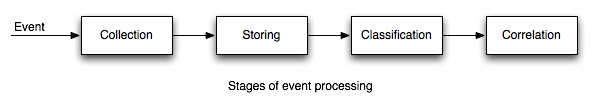
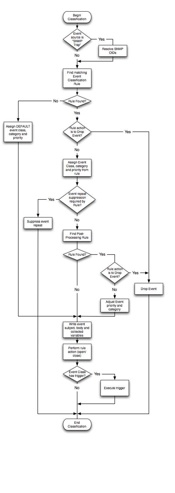

****************
Fault Management
****************
Overview
========
Primary task of the Fault Management is to collect and process events.
Events are created as result of network activity, user operations, clients activity, equipment faults etc.
Working network can generate thousands of events every minute. FM module allows to collect them, classify, assign priorities,
correlate events and automatically determine root cause of failure. System supports life cycle
of events ensuring no important events left unnoticed or unhandled.

Terminology
============
* Event Class - Meaning of event
* Event Category - Zone of interest. 
* Event Classification - A process of analyzing event and assigning Event Class
* Event Correlation 
* Root-cause analysys

Stages of event processing
==========================

Collection
----------
Event collection performed by Activator.
Events are generated by Managed Object and transmitted to Activator encapsulated in Message.
Supported message protocols are:

* SNMP Trap
* Syslog

Activator check did message arrived from valid Managed Object, collects message, converts
it to protocol-independed message format and transmits it to the SAE via SAE RPC stream.

Events are represented as two-column tables. Left column represents *key* or *parameter name*.
Right column represents *value*. Each parameter represented by one row (both *kwy* and *value* parts).

Examples:

======== =============
source   syslog
message  -- MARK --
severity 6
facility 5
======== =============

or

===================== =========================
source                SNMP Trap
1.3.6.1.6.3.1.1.4.1.0 1.3.6.1.6.3.1.1.5.1
1.3.6.1.2.1.1.3.0     7
1.3.6.1.6.3.1.1.4.3.0 1.3.6.1.4.1.4413.2.10
===================== =========================

Storing
-------
Protocol-independed messages are received by SAE. SAE does not perform
additional message processing and stores messages into Database as soon as possible.

Classification
--------------
The task of Event Classification is to determine Event Class and retrieve all Class Variables
from the given message. Event Classification helps to understand the very meaning of event.
All further event processing based of Event Class and fetched Class Variables.

Events classified by passing via set of Event Classification Rules. Event Classification Rule
consist of a set of pairs of regular expressions. Rules are evaluated in order of *preference*.

Event classification performed by *noc-classifier* (Classifier daemon). *Classifier* periodically queries
database for the unclassified event and performs classification process, each event in separate transaction.
Classification results are written back to database.

Overview of event classification process given in flowchart below:

Correlation
-----------
Correlation performed by noc-correlator (Correlator) daemon. Correlator works with Event Window (last 10 minutes by default)
and Event Correlation Rules to perform corellation.

During correlation process following decisions made:

* Should Event be silently discarded?
* Should Event be automatically closed or dropped?
* Does event automatically close known event in the Event Window?
* Does event repeat already known event in the Event Window?
* Does event caused by already known event in the Event Window (Has root cause)?
* Does event cause already known event in the Event Window (Event is root cause)?

Decisions are made considering Event Variables, extracted by Correlator.
Root cause decisions are not permanent. Event may become a Root Cause or receive Root Cause with new events.

Message Status
==============
* Unclassified
* Active
* Closed

Event Classification Rules
==========================

Event Correlation Rules
=======================

Forms
=====
Events
------
Permissions
^^^^^^^^^^^
======= ========================================
add     fm | Event | Can add Event
change  fm | Event | Can change Event
delete  fm | Event | Can delete Event
======= ========================================

Setup
=====
MIBs
----
Permissions
^^^^^^^^^^^
======= ========================================
add     fm | MIB | Can add MIB
change  fm | MIB | Can change MIB
delete  fm | MIB | Can delete MIB
======= ========================================

MIB Data
--------
Permissions
^^^^^^^^^^^
======= ========================================
add     fm | MIB Data | Can add MIB Data
change  fm | MIB Data | Can change MIB Data
delete  fm | MIB Data | Can delete MIB Data
======= ========================================

Event Classes
-------------
Permissions
^^^^^^^^^^^
======= ========================================
add     fm | Event Class | Can add Event Class
change  fm | Event Class | Can change Event Class
delete  fm | Event Class | Can delete Event Class
======= ========================================

Event Categories
----------------
Permissions
^^^^^^^^^^^
======= ========================================
add     fm | Event Category | Can add Event Category
change  fm | Event Category | Can change Event Category
delete  fm | Event Category | Can delete Event Category
======= ========================================

Event Priorities
----------------
Permissions
^^^^^^^^^^^
======= ========================================
add     fm | Event Priority | Can add Event Priority
change  fm | Event Priority | Can change Event Priority
delete  fm | Event Priority | Can delete Event Priority
======= ========================================

Classification Rules
--------------------
Permissions
^^^^^^^^^^^
======= ========================================
add     fm | Event Classification Rule | Can add Event Classification Rule
change  fm | Event Classification Rule | Can change Event Classification Rule
delete  fm | Event Classification Rule | Can delete Event Classification Rule
======= ========================================

Post-Processing Rules
---------------------
Permissions
^^^^^^^^^^^
======= ========================================
add     fm | Event Post-Processing Rule | Can add Event Post-Processing Rule
change  fm | Event Post-Processing Rule | Can change Event Post-Processing Rule
delete  fm | Event Post-Processing Rule | Can delete Event Post-Processing Rule
======= ========================================

Correlation Rules
-----------------
Permissions
^^^^^^^^^^^
======= ========================================
add     fm | Event Correlation Rule | Can add Event Correlation Rule
change  fm | Event Correlation Rule | Can change Event Correlation Rule
delete  fm | Event Correlation Rule | Can delete Event Correlation Rule
======= ========================================

Archivation Rules
-----------------
Permissions
^^^^^^^^^^^
======= ===============================================================
add     fm | Event Archivation Rule | Can add Event Archivation Rule
change  fm | Event Archivation Rule | Can change Event Archivation Rule
delete  fm | Event Archivation Rule | Can delete Event Archivation Rule
======= ===============================================================

Reports
=======
Loaded MIBs
-----------
Permissions
^^^^^^^^^^^
======= ========================================
preview ANY
======= ========================================

Event Priority Summary
----------------------
Permissions
^^^^^^^^^^^
======= ========================================
preview ANY
======= ========================================

Managed Object Summary
----------------------
Permissions
^^^^^^^^^^^
======= ========================================
preview ANY
======= ========================================

Event Classification Quality
----------------------------
Permissions
^^^^^^^^^^^
======= ========================================
preview ANY
======= ========================================

Profile Summary
---------------
Permissions
^^^^^^^^^^^
======= ========================================
preview ANY
======= ========================================

Event Class Summary
-------------------
Permissions
^^^^^^^^^^^
======= ========================================
preview ANY
======= ========================================

Unclassified Trap OIDs
----------------------
Permissions
^^^^^^^^^^^
======= ========================================
preview ANY
======= ========================================

Permissions
^^^^^^^^^^^
======= ========================================
preview ANY
======= ========================================

