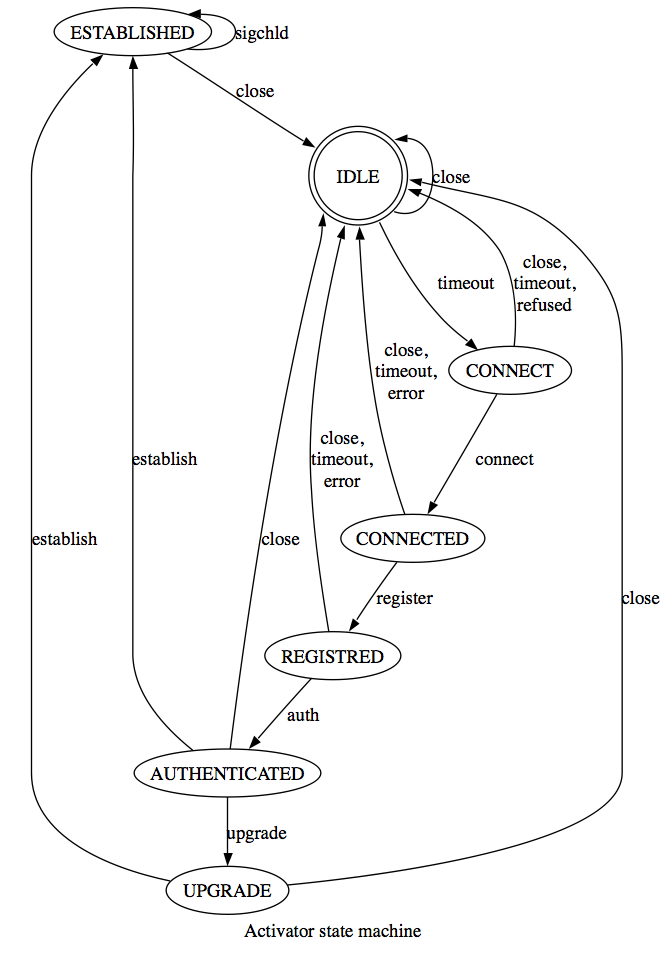

Activator
*********

Overview
========
State Machine
-------------
From start up activator follows state machine:

* Just after startup activator waits for 5 seconds, then tries to connect to SAE.
* When 10 second timeout expired or connection refused activator sleeps fo 10 seconds and retries connection
* On connection activator performs registration
* When started in stand-alone mode (see later) activator performs self-upgrade from SAE and restarts, when possible
* Then activator passes to ESTABLISHED state and ready to perform tasks

Registration
------------
Activator uses ''activator name'' and ''secret'' to authenticate. Digest authentication method used.
Activator should be created in database to pass authentication (See 'Creating Activator in Database' for details)

in-bundle and stand-alone mode
------------------------------
Activator can be started from two modes:

* in-bundle - Activator started from common NOC distribution. No self-update necessary.
* stand-alone - Activator started from special lightweight stand-alone distribution with minimal dependencies.
 
stand-alone mode
----------------
Stand-alone distribution is stripped NOC distribution with minimum files and dependencies.
Stand-alone distribution can be created from full NOC distribution by::

    $ cd /opt/noc
    $ ./scripts/clone-activator /tmp
    $ cd /tmp
    $ tar cf - noc | gzip > noc-activator.tgz

Distribute and unpack noc-activator.tgz to target host.

Activator performs self-upgrade on startup when launched in stand-alone mode, so it must have write permissions to own directory (including etc/noc-activator.defaults one)

Running Activator
=================

From noc-launcher
-----------------
Set up etc/noc-launcher.conf::

    [noc-activator]
    enabled = true

to run activator from noc-launcher

Daemon mode
-----------
To run activator in daemon mode::

    $ cd /opt/noc
    $ ./scripts/noc-activator.py start

Foreground mode
---------------
When started in foreground mode activator do not detaches from terminal and enforces full debug output directed to current terminal.
To run SAE in foreground mode::

    $ cd /opt/noc
    $ ./scripts/noc-activator.py -f start

Stopping Activator
==================
To stop Activator runing in daemon mode::

    $ cd /opt/noc
    $ ./scripts/noc-activator.py stop

Enabling collectors
===================

Syslog
------
To enable syslog collector set ''listen_syslog'' variable in [activator] section of etc/noc-activator.conf to IP address or name of interface of syslog collector

SNMP Traps
----------
To enable SNMP Trap collector set ''listen_traps'' variable in [activator] section of etc/noc-activator.conf to IP address or name of interface of SNMP trap collector
