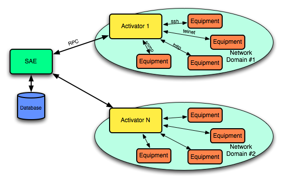

Architecture
************

Top level overview of **sa** architecture in a chart.

Roles of the participants:

* SAE - dispatches tasks between activators, maintains common connectivity and initiates periodic tasks
* Activator - Connects to SAE on startup, passes authentication phase, accepts RPC messages from SAE, mediates with equipment using different ''access schemas'' (ssh, telnet, http, etc), collects SNMP Traps and syslog messages from Equipment and passes them to SAE
* Equipment - Managed Equipment. Equipment Specifics stored into ''profile''. Central profile repository stored at SAE and distributed to activators during self-update processes.

Strict separation between SAE and Activators has several benefits:

* Activators can be placed as close to equipment as possible:
* SAE and Activator uses bulk data exchange. All commands packed together to reduce delay impact and maximize throughoutput.  Though interactive protocols like telnet and ssh use short packets for communications all communications between SAE and Activator remains bulk. Data exchanged only when ready. Data chunks from several transactions are merged together into single packet when possible. Increased performance and stability on long links with high delay (think about sattelite), high packet loss (WiFi and Radio) or low bandwith (up to GPRS modem) immediately follow.
* SAE RPC protocol uses compression. All messages compressed before transmission which grealty reduce requirements to bandwidth and delays (Up to x4 on common equipment configuration fetching)
* SAE RPC protocol supports SSL encryption which greatly improve security even when using unenctypted protocols like telnet, http, snmp or syslog.
* Different activator can be maintained by different administrative departments, follow organizational structure, while remain centralized service
* Activator has low disk and memory footprint and can operate without writing to disk. Cheap controllers like Soekris Net series can be used as platform for Activator.
* Load offloaded from SAE to Activators. Scalability can be accepted by increasing number of activators.
* Activators can remain in physically or logically separated parts of network:
* SAE RPC interface uses TCP as transport. Connection initialized by Activator. So the protocol is transparent to NAT and firewalls. Activator could remain behind NAT still retaining operational state.
* Activator and SAE could be placed in different VRFs. Only one route per VRF must be leaked to maintain connectivity. This allows centralized management over several management VRFs. CPEs in MPLS L3VPN can be managed as well
